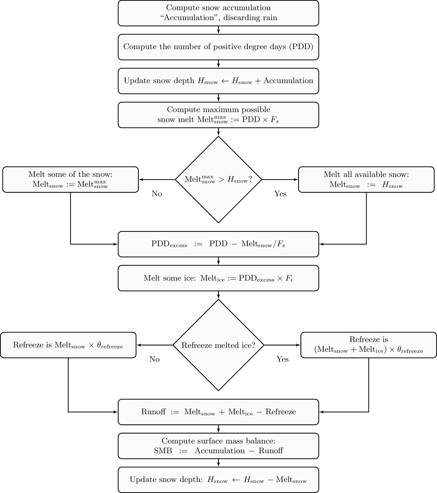

.. include:: shortcuts.txt

Surface mass and energy process model components
------------------------------------------------

.. contents::

.. _sec-surface-simple:

The "invisible" model
+++++++++++++++++++++

:|options|: ``-surface simple``
:|variables|: none
:|implementation|: ``pism::surface::Simple``

This is the simplest "surface model" available in PISM, enabled using ``-surface simple``.
Its job is to re-interpret precipitation as climatic mass balance, and to re-interpret
mean annual near-surface (2m) air temperature as the temperature of the ice at the depth
at which firn processes cease to change the temperature of the ice. (I.e. the temperature
*below* the firn.) This implies that there is no melt. Though primitive, this model
component may be desired in cold environments (e.g. East Antarctic ice sheet) in which
melt is negligible and heat from firn processes is ignored.

.. _sec-surface-given:

Reading top-surface boundary conditions from a file
+++++++++++++++++++++++++++++++++++++++++++++++++++

:|options|: ``-surface given``
:|variables|: :var:`ice_surface_temp`, :var:`climatic_mass_balance` |flux|
:|implementation|: ``pism::surface::Given``

.. note::

   This is the default choice.

This model component was created to force PISM with sampled (possibly periodic) climate
data by reading ice upper surface boundary conditions from a file. These fields are
provided directly to the ice dynamics code (see :ref:`sec-climate-inputs` for details).

PISM will stop if variables :var:`ice_surface_temp` (ice temperature at the ice surface
but below firn) and :var:`climatic_mass_balance` (top surface mass flux into the ice) are
not present in the input file.

Command-line options:

- :opt:`-surface_given_file` prescribes an input file
- :opt:`-surface_given_period` (*years*) makes PISM interpret data in
  ``-surface_given_file`` as periodic. See :ref:`sec-periodic-forcing`.
- :opt:`-surface_given_reference_year` sets the reference model year; see
  :ref:`sec-periodic-forcing`.

A file ``foo.nc`` used with ``-surface given -surface_given_file foo.nc`` should contain
several records. If this file contains one record (i.e. fields corresponding to one time
value only), provided forcing data is interpreted as time-independent. The :var:`time`
variable should describe what model time these records correspond to; see
:ref:`sec-model-time` for details.

For example, to use monthly records and period of 1 year, create a file (say,
"``foo.nc``") with 12 records. The :var:`time` variable may contain `0, 1, 2, 3,
\dots, 11` and have the units of "month" [#]_. Then, run

.. code-block:: none

    pismr -surface given -surface_given_file foo.nc -surface_given_period 1

.. note::

   - This surface model *ignores* the atmosphere model selection made using the option
     :opt:`-atmosphere`.
   - PISM can handle files with virtually any number of records: it will read and store in
     memory at most :config:`climate_forcing.buffer_size` records at any given time
     (default: 60, or 5 years' worth of monthly fields).
   - when preparing a file for use with this model, it is best to use the ``t,y,x``
     variable storage order: files using this order can be read in faster than ones using
     the ``t,x,y`` order, for reasons :ref:`explained in the User's Manual
     <sec-pism-io-performance>`.
   
     To change the storage order in a NetCDF file, use ``ncpdq``:
   
     .. code-block:: none
   
       ncpdq -a t,y,x input.nc output.nc
   
     will copy data from ``input.nc`` into ``output.nc``, changing the storage order to
     ``t,y,x`` at the same time.

.. _sec-surface-elevation:

Elevation-dependent temperature and mass balance
++++++++++++++++++++++++++++++++++++++++++++++++

:|options|: ``-surface elevation``
:|variables|: none
:|implementation|: ``pism::surface::Elevation``

.. include:: ../math-definitions.txt

This surface model component parameterizes the ice surface temperature `T_{h}` =
:var:`ice_surface_temp` and the mass balance `m` = :var:`climatic_mass_balance` as
*piecewise-linear* functions of surface elevation `h`.

The option :opt:`-ice_surface_temp` (*list of 4 numbers*) determines the surface
temperature using the 4 parameters `\T{min}`, `\T{max}`, `\h{min}`,
`\h{max}`. Let

.. math::

  \diff{T}{h} = (\T{max} - \T{min}) / (\h{max} - \h{min})

be the temperature gradient. Then

.. math::

  T(x,y) =
  \begin{cases}
    \T{min}, & h(x,y) \le \h{min}, \\
    \T{min} + \diff{T}{h} \, (h(x,y) - \h{min}), & \h{min} < h(x,y) < \h{max}, \\
    \T{max}, & \h{max} \le h(x,y).
  \end{cases}

The option :opt:`-climatic_mass_balance` (*list of 5 numbers*) determines the surface mass
balance using the 5 parameters `\m{min}`, `\m{max}`, `\h{min}`,
`\h{ELA}`, `\h{max}`. Let

.. math::

   \diff{\m{abl}}{h} = -\m{min} / (\h{max} - \h{min})

and

.. math::

   \diff{\m{acl}}{h} = \m{max} / (\h{max} - \h{min})

be the mass balance gradient in the ablation and in the accumulation area, respectively.
Then

.. math::

   m(x,y) =
   \begin{cases}
    \m{min}, & h(x,y) \le \h{min}, \\
    \diff{\m{abl}}{h} \, (h(x,y) - h_{\text{ELA}}), &  \h{min} < h(x,y) < \h{max}, \\
    \diff{\m{acl}}{h} \, (h(x,y) - h_{\text{ELA}}), & \h{min} < h(x,y) < \h{max}, \\
    \m{max}, & \h{max} \le h(x,y).
   \end{cases}

The option :opt:`-climatic_mass_balance_limits` (*list of 2 numbers*) limits the mass
balance below `\h{min}` to `\ms{min}` and above `\h{max}` to
`\ms{max}`, thus

.. math::

   m(x,y) =
   \begin{cases}
    m^{*}_{\text{min}}, & h(x,y) \le \h{min}, \\
    \diff{\m{abl}}{h} \, (h(x,y) - h_{\text{ELA}}), & \h{min} < h(x,y) < \h{max}, \\
    \diff{\m{acl}}{h} \, (h(x,y) - h_{\text{ELA}}), & \h{min} < h(x,y) < \h{max}, \\
    m^{*}_{\text{max}}, & \h{max} \le h(x,y).
   \end{cases}

Note: this surface model *ignores* the atmosphere model selection made using the
:opt:`-atmosphere` option.

.. _sec-surface-pdd:

Temperature-index scheme
++++++++++++++++++++++++

:|options|: ``-surface pdd``
:|variables|: :var:`air_temp_sd`, :var:`snow_depth`
:|implementation|: ``pism::surface::TemperatureIndex``
                   
The default PDD model used by PISM, turned on by option :opt:`-surface pdd`, is based on
:cite:`CalovGreve05` and EISMINT-Greenland intercomparison (see :cite:`RitzEISMINT`).

Our model computes the solid (snow) precipitation rate using the air temperature threshold
with a linear transition. All precipitation during periods with air temperatures above
:config:`surface.pdd.air_temp_all_precip_as_rain` (default of `2^\circ C`) is interpreted as
rain; all precipitation during periods with air temperatures below
:config:`surface.pdd.air_temp_all_precip_as_snow` (default of `0^\circ C`) is interpreted as
snow.

For long-term simulations, a PDD model generally uses an idealized seasonal temperature
cycle. "White noise" is added to this cycle to simulate additional daily variability
associated to the vagaries of weather. This additional random variation is quite
significant, as the seasonal cycle may never reach the melting point but that point may be
reached with some probability, in the presence of the daily variability, and thus melt may
occur. Concretely, a normally-distributed, mean zero random temperature increment is added
to the seasonal cycle. There is no assumed spatial correlation of daily variability. The
standard deviation of the daily variability is controlled by command-line options:

- :opt:`-pdd_sd_file`, which prescribes an input file containing :var:`air_temp_sd`
- :opt:`-pdd_sd_period` (*years*), which interprets its data as periodic; see
  :ref:`sec-periodic-forcing`.
- :opt:`-pdd_sd_reference_year`, which sets the reference model year; see
  :ref:`sec-periodic-forcing`.

A file ``foo.nc`` used with ``-surface pdd -pdd_sd_file foo.nc`` should contain standard
deviation of near-surface air temperature in variable :var:`air_temp_sd`, and the
corresponding time coordinate in variable :var:`time`. If ``-pdd_sd_file`` is not set,
PISM uses a constant value for standard deviation, which is set by the
configuration parameter :config:`surface.pdd.std_dev`. The default value is `5.0` degrees
:cite:`RitzEISMINT`. However, this approach is not recommended as it induces significant
errors in modeled surface mass balance in both ice-covered and ice-free regions
:cite:`RogozhinaRau2014`, :cite:`Seguinot2013`.

Over ice-covered grid cells, daily variability can also be parameterized as a linear
function of near-surface air temperature `\sigma = a \cdot T + b` using the
:config:`surface.pdd.std_dev_use_param` configuration flag, and the corresponding
parameters :config:`surface.pdd.std_dev_param_a` and
:config:`surface.pdd.std_dev_param_b`. This parametrization replaces prescribed standard
deviation values over glacierized grid cells as defined by the :var:`mask` variable (see
:config:`geometry.ice_free_thickness_standard`). Default values for the slope `a` and
intercept `b` were derived from the ERA-40 reanalysis over the Greenland ice sheet
:cite:`SeguinotRogozhina2014`.

The number of positive degree days is computed as the magnitude of the temperature
excursion above `0\!\phantom{|}^\circ \text{C}` multiplied by the duration (in days)
when it is above zero.

In PISM there are two methods for computing the number of positive degree days. The first
computes only the expected value, by the method described in :cite:`CalovGreve05`. This is
the default when a PDD is chosen (i.e. option :opt:`-surface pdd`). The second is a Monte
Carlo simulation of the white noise itself, chosen by adding the option :opt:`-pdd_method
random_process`. This Monte Carlo simulation adds the same daily variation at every point,
though the seasonal cycle is (generally) location dependent. If repeatable randomness is
desired use :opt:`-pdd_method repeatable_random_process` instead.

   PISM's positive degree day model. `F_s` and `F_i` are PDD factors for snow
   and ice, respectively; `\theta_{\text{refreeze}}` is the refreeze fraction.

By default, the computation summarized in :numref:`fig-pdd-model` is performed every week.
(This frequency is controlled by the parameter :config:`surface.pdd.max_evals_per_year`.)
To compute mass balance during each week-long time-step, PISM keeps track of the current
snow depth (using units of ice-equivalent thickness). This is necessary to determine if
melt should be computed using the degree day factor for snow
(:config:`surface.pdd.factor_snow`) or the corresponding factor for ice
(:config:`surface.pdd.factor_ice`).

A fraction of the melt controlled by the configuration parameter :config:`surface.pdd.refreeze`
(`\theta_{\text{refreeze}}` in :numref:`fig-pdd-model`, default: `0.6`)
refreezes. The user can select whether melted ice should be allowed to refreeze using the
configuration flag :config:`surface.pdd.refreeze_ice_melt`.

Since PISM does not have a principled firn model, the snow depth is set to zero at the
beginning of the balance year. See :config:`surface.pdd.balance_year_start_day`. Default is
`274`, corresponding to October 1\ :superscript:`st`.

Our PDD implementation is meant to be used with an atmosphere model implementing a cosine
yearly cycle such as ``searise_greenland`` (section
:ref:`sec-atmosphere-searise-greenland`), but it is not restricted to parameterizations
like these.

This code also implements latitude- and mean July temperature dependent ice and snow
factors using formulas (6) and (7) in :cite:`Faustoetal2009`; set :opt:`-pdd_fausto` to enable.
The default standard deviation of the daily variability (option :opt:`-pdd_std_dev`) is
2.53 degrees when :opt:`-pdd_fausto` is set :cite:`Faustoetal2009`. See also configuration
parameters with the ``surface.pdd.fausto`` prefix.

Note that when used with periodic climate data (air temperature and precipitation) that is
read from a file (see section :ref:`sec-atmosphere-given`), use of
:opt:`-timestep_hit_multiplies X` is recommended. (Here `X` is the length of the climate
data period in years.)

This model provides the following scalar:

- :var:`surface_accumulation_rate`
- :var:`surface_melt_rate`
- :var:`surface_runoff_rate`

and these 2D diagnostic quantities (averaged over reporting intervals; positive flux
corresponds to ice gain):

- :var:`surface_accumulation_flux`
- :var:`surface_melt_flux`
- :var:`surface_runoff_flux`

This makes it easy to compare the surface mass balance computed by the model to its
individual components:

.. code::

   SMB = surface_accumulation_flux - surface_runoff_flux

.. _sec-surface-pik:

PIK
+++

:|options|: ``-surface pik``
:|variables|: :var:`climatic_mass_balance` |flux|,
              :var:`lat` (latitude), (degrees north)
:|implementation|: ``pism::surface::PIK``

This surface model component implements the setup used in :cite:`Martinetal2011`. The
:var:`climatic_mass_balance` is read from an input (``-i``) file; the ice surface
temperature is computed as a function of latitude (variable :var:`lat`) and surface
elevation (dynamically updated by PISM). See equation (1) in :cite:`Martinetal2011`.

.. _sec-surface-delta-t:

Scalar temperature offsets
++++++++++++++++++++++++++

:|options|: ``-surface ...,delta_T``
:|variables|: :var:`delta_T`
:|implementation|: ``pism::surface::Delta_T``

Command-line options:

- :opt:`-surface_delta_T_file` sets the name of the file PISM will read :var:`delta_T`
  from.
- :opt:`-surface_delta_T_period` (*years*) sets the period of the forcing data (section
  :ref:`sec-periodic-forcing`)
- :opt:`-surface_delta_T_reference_year` sets the reference year (section
  :ref:`sec-periodic-forcing`).

The time-dependent scalar offsets :var:`delta_T` are added to :var:`ice_surface_temp`
computed by a surface model.

Please make sure that :var:`delta_T` has the units of "``Kelvin``".

This modifier is identical to the corresponding atmosphere modifier, but applies offsets
at a different stage in the computation of top-surface boundary conditions needed by the
ice dynamics core.

.. _sec-surface-lapse-rate:

Lapse rate corrections
++++++++++++++++++++++

:|options|: ``-surface ...,lapse_rate``
:|variables|: :var:`surface_altitude` (CF standard name),
:|implementation|: ``pism::surface::LapseRates``

The ``lapse_rate`` modifier allows correcting ice-surface temperature and surface mass
balance using elevation lapse rates. It uses the following options.

- :opt:`-temp_lapse_rate` gives the temperature lapse rate, in `K/km`. Note that we
  use the following definition of the temperature lapse rate:

  .. math::

    \gamma = -\frac{dT}{dz}.

- :opt:`-smb_lapse_rate` gives the surface mass balance lapse rate, in `m/year/km`.
  Here, `\gamma=-\frac{dM}{dz}`.
- :opt:`-surface_lapse_rate_file` specifies the file containing the reference surface
  elevation field (standard name: :var:`surface_altitude`). This file can contain several
  surface elevation records to use lapse rate corrections relative to time-dependent
  surface. If one record is provided, the reference surface elevation is assumed to be
  time-independent.
- :opt:`-surface_lapse_rate_period` gives the period, in model years, to use when
  interpreting data in the file given with ``-surface_given_file``,
- :opt:`-surface_lapse_rate_reference_year` takes the time `T` in model years. The
  record for `t` years in ``-surface_given_file`` is interpreted as corresponding to
  `t` years since `T`.

.. _sec-surface-forcing:

Mass flux adjustment
++++++++++++++++++++
    
:|options|: ``-surface ...,forcing``
:|variables|: :var:`thk` (ice thickness), :var:`ftt_mask` (mask of zeros and ones; 1 where
              surface mass flux is adjusted and 0 elsewhere)
:|implementation|: ``pism::surface::ForceThickness``

The ``forcing`` modifier implements a surface mass balance adjustment mechanism which
forces the thickness of grounded ice to a target thickness distribution at the end of the
run. The idea behind this mechanism is that spinup of ice sheet models frequently requires
the surface elevation to come close to measured values at the end of a run. A simpler
alternative to accomplish this, namely option ``-no_mass``, represents an unmodeled,
frequently large, violation of the mass continuity equation.

In more detail, let `H_{\text{tar}}` be the target thickness. Let `H` be the
time-dependent model thickness. The surface model component described here produces the
term `M` in the mass continuity equation:

.. math::

   \frac{\partial H}{\partial t} = M - S - \nabla\cdot \mathbf{q}.

(Other details of this equation do not concern us here.) The ``forcing`` modifier causes
`M` to be adjusted by a multiple of the difference between the target thickness and
the current thickness,

.. math::

   \Delta M = \alpha (H_{\text{tar}} - H)

where `\alpha>0`. We are adding mass (`\Delta M>0`) where
`H_{\text{tar}} > H` and ablating where `H_{\text{tar}} < H`.

Option :opt:`-force_to_thickness_file` identifies the file containing the target ice
thickness field ``thk`` and the mask ``ftt_mask``. A basic run modifying surface model
``given`` would look like

.. code-block:: none

    pismr -i foo.nc -surface given,forcing -force_to_thickness_file bar.nc

In this case ``foo.nc`` contains fields :var:`climatic_mass_balance` and
:var:`ice_surface_temp`, as normal for ``-surface given``, and ``bar.nc`` contains fields
:var:`thk` which will serve as the target thickness and :var:`ftt_mask` which defines the
map plane area where this adjustment is applied. Option :opt:`-force_to_thickness_alpha`
adjusts the value of `\alpha`, which has a default value specified in the
:ref:`sec-parameter-list`.

In addition to this one can specify a multiplicative factor `C` used in areas where
the target thickness field has less than
:opt:`-force_to_thickness_ice_free_thickness_threshold` meters of ice;
`\alpha_{\text{ice free}} = C \times \alpha`. Use the
:opt:`-force_to_thickness_ice_free_alpha_factor` option to set `C`.

.. _sec-surface-anomaly:

Using climate data anomalies
++++++++++++++++++++++++++++
    
:|options|: :opt:`-surface ...,anomaly`
:|variables|: :var:`ice_surface_temp_anomaly`,
              :var:`climatic_mass_balance_anomaly` |flux|
:|implementation|: ``pism::surface::Anomaly``

This modifier implements a spatially-variable version of ``-surface ...,delta_T`` which
also applies time-dependent climatic mass balance anomalies.

It takes the following options:

- :opt:`-surface_anomaly_file` specifies a file containing variables
  :var:`ice_surface_temp_anomaly` and :var:`climatic_mass_balance_anomaly`.
- :opt:`-surface_anomaly_period` (years) specifies the period of the forcing data, in
  model years; see :ref:`sec-periodic-forcing`
- :opt:`-surface_anomaly_reference_year` specifies the reference year; see
  :ref:`sec-periodic-forcing`

See also to ``-atmosphere ...,anomaly`` (section :ref:`sec-atmosphere-anomaly`), which is
similar, but applies anomalies at the atmosphere level.

.. _sec-surface-cache:

The caching modifier
++++++++++++++++++++

:|options|: ``-surface ...,cache``
:|implementation|: ``pism::surface::Cache``
:|seealso|: :ref:`sec-ocean-cache`
    
This modifier skips surface model updates, so that a surface model is called no more than
every :opt:`-surface.cache.update_interval` years. A time-step of `1` year is used every
time a surface model is updated.

This is useful in cases when inter-annual climate variability is important, but one year
differs little from the next. (Coarse-grid paleo-climate runs, for example.)

It takes the following options:

- :opt:`-surface.cache.update_interval` (*years*) Specifies the minimum interval between
  updates. PISM may take longer time-steps if the adaptive scheme allows it, though.

.. rubric:: Footnotes

.. [#] You can use other time units supported by UDUNITS_.
