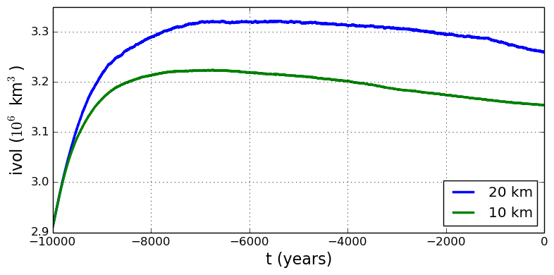
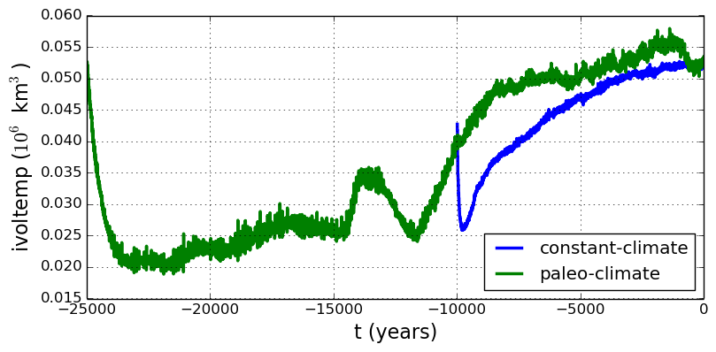

.. default-role:: math

.. _sec-start:

Getting started
===============

This introduction is intended to be interactive and participatory, and it should work on
*your personal machine* as well as on a supercomputer. Please try the commands and view
the resulting files. Do the runs with your own values for the options. We can't hide the
fact that PISM has lots of "control knobs," but fiddling with them will help you get
going. Give it a try!

To install PISM see the *Getting PISM* tab on the `PISM website <PISM_>`_. Once PISM is
installed, the executable ``pismr`` should be available on your system's "path"; confirm
this with "``which pismr``". The instructions below assume you are using a ``bash`` shell
or one that accepts ``bash`` syntax. They also assume you have the PISM source code in the
directory "``pism/``".

A Greenland ice sheet example
-----------------------------

We get started with an extended example showing how to generate initial states for
prognostic model experiments on the Greenland ice sheet. Ice sheet and glacier model
studies often involve modeling present and past states using actions like the ones
demonstrated here. Our particular choices made here are motivated by the evaluation of
initialization methods in :cite:`AschwandenAdalgeirsdottirKhroulev`.

We use data assembled by the `Sea-level Response to Ice Sheet Evolution (SeaRISE)
<searise_>`_ assessment process :cite:`Bindschadler2013SeaRISE`. SeaRISE is a
community-organized assessment process providing an upper bound on ice sheet contributions
to sea level in the next 100--200 years, especially for the IPCC AR5 report in 2013.

This example is a hands-on first look at PISM. It is not an in-depth tutorial, and some
details of what is happening are only explained later in this Manual, which thoroughly
discusses PISM options, nontrivial modeling choices, and how to preprocess input data.

The basic runs here, mostly on coarse `20` and `10\,\textrm{km}` grids, can be
done on a typical workstation or laptop. PISM is, however, designed to make high
resolution (e.g. `5\,\textrm{km}` to `\sim 500\,\textrm{m}` grids for
whole-Greenland ice sheet modeling) possible by exploiting large-scale parallel
processing. See :cite:`AschwandenAdalgeirsdottirKhroulev`, :cite:`Golledgeetal2012`,
:cite:`Golledgeetal2013`, among other published high-resolution PISM examples.

Input data
----------

The NetCDF data used to initialize SeaRISE runs is `freely-available online
<searise-greenland_>`_.

To download the specific file we want, namely ``Greenland_5km_v1.1.nc``, and preprocess it
for PISM, do:

.. code-block:: none

   cd pism/examples/std-greenland
   ./preprocess.sh

The script ``preprocess.sh`` requires ``wget`` and also the `NetCDF Operators <NCO_>`_. It
downloads the version 1.1 of the SeaRISE "master" present-day data set, which contains ice
thickness and bedrock topography from BEDMAP :cite:`BamberLayberryGogenini`, and modeled
precipitation and surface mass balance rates from RACMO :cite:`Ettemaetal2009`, among
other fields.

In particular, it creates three new NetCDF files which can be read by PISM. The
spatially-varying fields, with adjusted metadata, go in ``pism_Greenland_5km_v1.1.nc``.
The other two new files contain famous time-dependent paleo-climate records from ice and
seabed cores: ``pism_dT.nc`` has the GRIP temperature record :cite:`JohnsenetalGRIP` and
``pism_dSL.nc`` has the SPECMAP sea level record :cite:`Imbrieetal1984`.

Any of these NetCDF files can be viewed with ``ncview`` or other NetCDF visualization
tools; see Table :numref:`tab-NetCDFview` below. An application of IDV to the master data
set produced :numref:`fig-sr-input`, for example. Use ``ncdump -h`` to see the metadata
and history of the files.

.. figure:: figures/sr-greenland-input.png
   :name: fig-sr-input

   The input file contains present-day ice thickness (left; m), bedrock elevation (center;
   m), and present-day precipitation (right; `m / a` ice equivalent) for
   SeaRISE-Greenland. These are fields :var:`thk`, :var:`topg`, and :var:`precipitation`,
   respectively, in ``pism_Greenland_5km_v1.1.nc``.

.. _sec-runscript:

First run
---------

Like many Unix programs, PISM allows a lot of command-line options. In fact, because the
variety of allowed ice sheet, shelf, and glacier configurations, and included sub-models,
is so large, the list of possible command-line options covers sections :ref:`sec-initboot`
through :ref:`sec-practical-usage` of this manual. In practice one often builds scripts to
run PISM with the correct options, which is what we show here. The script we use is
"``spinup.sh``" in the ``examples/std-greenland/`` subdirectory of ``pism/``.

Note that initializing ice sheets, generically called "spin-up", can be done by computing
approximate steady states with constant boundary data, or, in some cases, by integrating
paleo-climatic and long-time-scale information, also applied at the ice sheet boundary, to
build a model for the present state of the ice sheet. Both of these possibilities are
illustrated in the ``spinup.sh`` script. The spin-up stage of using an ice sheet model may
actually require more processor-hours than follow-on "experiment" or "forecast" stages.

To see what can be done with the script, read the usage message it produces:

.. code-block:: none

   ./spinup.sh

The simplest spin-up approach is to use a "constant-climate" model. We take this approach
first. To see a more detailed view of the PISM command for the first run, do:

.. code-block:: none

   PISM_DO=echo ./spinup.sh 4 const 10000 20 sia g20km_10ka.nc

Setting the environment variable ``PISM_DO`` in this way tells ``spinup.sh`` just to print
out the commands it is about to run, not do them. The "proposed" run looks like this:

.. code-block:: none
   :name: firstcommand

   mpiexec -n 4 pismr -i pism_Greenland_5km_v1.1.nc -bootstrap -Mx 76 -My 141 \
     -Mz 101 -Mbz 11 -z_spacing equal -Lz 4000 -Lbz 2000 -skip -skip_max 10 \
     -ys -10000 -ye 0 -surface given -surface_given_file pism_Greenland_5km_v1.1.nc \
     -calving ocean_kill pism_Greenland_5km_v1.1.nc -sia_e 3.0 \
     -ts_file ts_g20km_10ka.nc -ts_times -10000:yearly:0 \
     -extra_file ex_g20km_10ka.nc -extra_times -10000:100:0 \
     -extra_vars diffusivity,temppabase,tempicethk_basal,bmelt,tillwat,velsurf_mag,mask,thk,topg,usurf \
     -o g20km_10ka.nc

Let's briefly deconstruct this run.

At the front is "``mpiexec -n 4 pismr``". This means that the PISM executable ``pismr`` is
run in parallel on four processes parallel standard (e.g. cores) under the `Message
Passing Interface <MPI_>`_. Though we are assuming you have a workstation or laptop with
at least 4 cores, this example will work with 1 to about 50 processors, with reasonably
good scaling in speed. Scaling can be good with more processors if we run at higher
spatial resolution :cite:`BBssasliding`, :cite:`DickensMorey2013`. The executable name
"``pismr``" stands for the standard "run" mode of PISM (in contrast to specialized modes
described later in sections :ref:`sec-verif` and :ref:`sec-simp`).

Next, the proposed run uses option ``-bootstrap`` to start the run by "bootstrapping."
This term describes the creation, by heuristics and highly-simplified models, of the
mathematical initial conditions required for a deterministic, time-dependent ice dynamics
model. Then the options describe a `76\times 141` point grid in the horizontal,
which gives 20\,km grid spacing in both directions. Then there are choices about the
vertical extent and resolution of the computational grid; more on those later. After that
we see a description of the time-axis, with a start and end time given: "``-ys -10000 -ye
0``".

Then we get the instructions that tell PISM to read the upper surface boundary conditions
(i.e. climate) from a file: "``-surface given -surface_given_file
pism_Greenland_5km_v1.1.nc``". For more on these choices, see subsection
:ref:`sec-climate-inputs`, and also the PISM Climate Forcing Manual.

Then there are a couple of options related to ice dynamics. First is a minimal calving
model which removes ice at the calving front location given by a thickness field in the
input file ("``-calving ocean_kill``"); see subsection :ref:`sec-calving` for this and
other calving options). Then there is a setting for enhanced ice softness ("``-sia_e
3.0``"). See subsection :ref:`sec-rheology` for more on this enhancement parameter, which
we also return to later in the current section in a parameter study.

Then there are longish options describing the fields we want as output, including scalar
time series ("``-ts_file ts_g20km_10ka.nc -ts_times -10000:yearly:0``"; see section
:ref:`sec-practical-usage`) and space-dependent fields ("``-extra_file ...``"; again see
section :ref:`sec-practical-usage`), and finally the named output file ("``-o
g20km_10ka.nc``").

Note that the modeling choices here are reasonable, but they are not the only way to do
it! The user is encouraged to experiment; that is the point of a model.

Now let's actually get the run going:

.. code-block:: none

   ./spinup.sh 4 const 10000 20 sia g20km_10ka.nc &> out.g20km_10ka &

The terminating "``&``", which is optional, asks unix to run the command in the
background, so we can keep working in the current shell. Because we have re-directed the
text output ("``&> out.g20km_10ka``"), PISM will show what it is doing in the text file
``out.g20km_10ka``. Using ``less`` is a good way to watch such a growing text-output file.
This run should take 20 minutes or less.

.. _sec-watchrun:

Watching the first run
----------------------

As soon as the run starts it creates time-dependent NetCDF files ``ts_g20km_10ka.nc`` and
``ex_g20km_10ka.nc``. The latter file, which has spatially-dependent fields at each time,
is created after the first 100 model years, a few wall clock seconds in this case. The
command ``-extra_file ex_g20km_10ka.nc -extra_times -10000:100:0`` adds a
spatially-dependent "frame" at model times -9900, -9800, ..., 0.

To look at the spatial-fields output graphically, do:

.. code-block:: none

   ncview ex_g20km_10ka.nc

We see that ``ex_g20km_10ka.nc`` contains growing "movies" of the fields chosen by the
``-extra_vars`` option. A frame of the ice thickness field ``thk`` is shown in
:numref:`fig-growing` (left).

The time-series file ``ts_g20km_10ka.nc`` is also growing. It contains spatially-averaged
"scalar" diagnostics like the total ice volume or the ice-sheet-wide maximum velocity
(variable ``volume_glacierized`` and ``max_hor_vel``, respectively). It can be viewed

.. code-block:: none

   ncview ts_g20km_10ka.nc

The growing time series for ``volume_glacierized`` is shown in :numref:`fig-growing`
(right). Recall that our intention was to generate a minimal model of the Greenland ice
sheet in approximate steady-state with a steady (constant-in-time) climate. The measurable
steadiness of the ``volume_glacierized`` time series is a possible standard for steady
state (see :cite:`EISMINT00`, for exampe).

.. FIXME: this is so out of date (e.g. the transpose)

.. figure:: figures/growing-thk-ivol-g20km.png
   :name: fig-growing

   Two views produced by ``ncview`` during a PISM model run. Left: ``thk``, the ice sheet
   thickness, a space-dependent field, from file ``ex_g20km_10ka.nc``. Right:
   ``volume_glacierized``, the total ice sheet volume time-series, from file
   ``ts_g20km_10ka.nc``.

At the end of the run the output file ``g20km_10ka.nc`` is generated.
:numref:`fig-firstoutput` shows some fields from this file. In the next subsections we
consider their "quality" as model results. To see a report on computational performance,
we do:

.. code-block:: none

   ncdump -h g20km_10ka.nc |grep history
       :history = "user@machine 2013-11-23 15:57:22 AKST: PISM done.  Performance stats:
   0.3435 wall clock hours, 1.3738 proc.-hours, 7274.0065 model years per proc.-hour,
   PETSc MFlops = 0.03.\n",

.. figure:: figures/g20km-10ka-usurf-csurf-mask.png
   :name: fig-firstoutput

   Fields from output file ``g20km_10ka.nc``. Left: ``usurf``, the ice sheet surface
   elevation in meters. Middle: ``velsurf_mag``, the surface speed in meters/year,
   including the 100 m/year contour (solid black). Right: ``mask``, with 0 = ice-free
   land, 2 = grounded ice, 4 = ice-free ocean.

.. _sec-ssarun:

Second run: a better ice-dynamics model
---------------------------------------

It is widely-understood that ice sheets slide on their bases, especially when liquid water
is present at the base (see :cite:`Joughinetal2001`, :cite:`MacAyeal`, among others). An
important aspect of modeling such sliding is the inclusion of membrane or "longitudinal"
stresses into the stress balance :cite:`BBssasliding`. The basic stress balance in PISM
which involves membrane stresses is the Shallow Shelf Approximation (SSA)
:cite:`WeisGreveHutter`. The stress balance used in the previous section was, by contrast,
the (thermomechanically-coupled) non-sliding, non-membrane-stress Shallow Ice
Approximation (SIA) :cite:`BBL`, :cite:`EISMINT00`. The preferred ice dynamics model
within PISM, that allows both sliding balanced by membrane stresses and shear flow as
described by the SIA, is the SIA+SSA "hybrid" model :cite:`BBssasliding`,
:cite:`Winkelmannetal2011`. For more on stress balance theories see section
:ref:`sec-dynamics` of this Manual.

The practical issue with models of sliding is that a distinctly-uncertain parameter space
must be introduced. This especially involves parameters controlling the amount and
pressure of subglacial water (see :cite:`AschwandenAdalgeirsdottirKhroulev`,
:cite:`Clarke05`, :cite:`Tulaczyketal2000`, :cite:`vanPeltOerlemans2012` among other
references). In this regard, PISM uses the concept of a saturated and pressurized
subglacial till with a modeled distribution of yield stress :cite:`BBssasliding`,
:cite:`SchoofStream`. The yield stress arises from the PISM model of the production of
subglacial water, which is itself computed through the conservation of energy model
:cite:`AschwandenBuelerKhroulevBlatter`. We use such models in the rest of this Getting
Started section.

While the ``spinup.sh`` script has default sliding-related parameters, for demonstration
purposes we change one parameter. We replace the default power `q=0.25` in the
sliding law (the equation which relates both the subglacial sliding velocity and the till
yield stress to the basal shear stress which appears in the SSA stress balance) by a less
"plastic" and more "linear" choice `q=0.5`. See subsection :ref:`sec-basestrength`
for more on sliding laws. To see the run we propose, do

.. code-block:: none

   PISM_DO=echo PARAM_PPQ=0.5 ./spinup.sh 4 const 10000 20 hybrid g20km_10ka_hy.nc

Now remove "``PISM_DO=echo``" and redirect the text output into a file to start the run:

.. code-block:: none

   PARAM_PPQ=0.5 ./spinup.sh 4 const 10000 20 hybrid g20km_10ka_hy.nc &> out.g20km_10ka_hy &

This run should take 30 minutes or less. [2]_

When this run is finished it produces ``g20km_10ka_hy.nc``.  As before do

.. code-block:: none

   ncdump -h g20km_10ka_hy.nc |grep history

to see performance results for your machine. The number reported as "``PETSc MFlops``"
from this run is about `3 \times 10^5`, much larger than the previous run, because
now calls to the PETSc library are used when solving the non-local SSA stress balance in
parallel.

The results of this run are shown in :numref:`fig-secondoutputcoarse`. We show the basal
sliding speed field ``velbase_mag`` in this Figure, where :numref:`fig-firstoutput` had
the ``mask``, but the reader can check that ``velbase_mag``=0 in the nonsliding SIA-only
result ``g20km_10ka.nc``.

.. figure:: figures/g20km-10ka-hy-usurf-csurf-cbase.png
   :name: fig-secondoutputcoarse

   Fields from output file ``g20km_10ka_hy.nc``. Left: ``usurf``, the ice sheet surface
   elevation in meters. Middle: ``velsurf_mag``, the surface speed in m/year, including the
   100 m/year contour (solid black). Right: the sliding speed ``velbase_mag``, shown the same
   way as ``velsurf_mag``.

The hybrid model includes sliding, and it is important to evaluate that aspect of the
output. However, though it is critical to the response of the ice to changes in climate,
basal sliding velocity is essentially unobservable in real ice sheets. On the other hand,
because of relatively-recent advances in radar and image technology and processing
:cite:`Joughin2002`, the surface velocity of an ice sheet is an observable.

So, how good is our model result ``velsurf_mag``? :numref:`fig-csurfvsobserved` compares
the radar-observed ``surfvelmag`` field in the downloaded SeaRISE-Greenland data file
``Greenland_5km_v1.1.nc`` with the just-computed PISM result. The reader might agree with
these broad qualitative judgements:

.. figure:: Greenland-5km-v1p1-surfvelmag g20km-10ka-hy-csurf g10km-10ka-hy-csurf
   :name: fig-csurfvsobserved

   Comparing observed and modeled surface speed. All figures have a common scale (m/year),
   with 100 m/year contour shown (solid black). Left: ``surfvelmag``, the observed values
   from SeaRISE data file ``Greenland_5km_v1.1.nc``. Middle: ``velsurf_mag`` from
   ``g20km_10ka_hy.nc``. Right: ``velsurf_mag`` from ``g10km_10ka_hy.nc``.

- the model results and the observed surface velocity look similar, and
- slow near-divide flow is generally in the right areas and of generally the right
  magnitude, but
- the observed Northeast Greenland ice stream is more distinct than in the model.

We can compare these PISM results to other observed-vs-model comparisons of surface
velocity maps, for example Figure 1 in :cite:`Priceetal2011` and Figure 8 in
:cite:`Larouretal2012`. Only ice-sheet-wide parameters and models were used here in PISM,
that is, each location in the ice sheet was modeled by the same physics. By comparison,
those published comparisons involved tuning a large number of subglacial parameters to
values which would yield close match to observations of the surface velocity. Such tuning
techniques, called "inversion" or "assimilation" of the surface velocity data, are also
possible in PISM, [3]_ but the advantage of having few parameters in a model is
well-known: the results reflect the underlying model not the flexibility of many
parameters.

We have only tried two of the many models possible in PISM, and we are free to identify
and adjust important parameters. The first parameter change we consider, in the next
subsection, is one of the most important: grid resolution.

.. _sec-higherresrun:

Third run: higher resolution
----------------------------

Now we change one key parameter, the grid resolution. Model results differ even when the
only change is the resolution. Using higher resolution "picks up" more detail in the bed
elevation and climate data.

If you can let it run overnight, do

.. code-block:: none

   PARAM_PPQ=0.5 ./spinup.sh 4 const 10000 10 hybrid g10km_10ka_hy.nc &> out.g10km_10ka_hy &

This run might take 4 to 6 hours. However, supposing you have a larger parallel computer,
you can change "``mpiexec -n 4``" to "``mpiexec -n N``" where ``N`` is a substantially
larger number, up to 100 or so with an expectation of reasonable scaling on this grid
:cite:`BBssasliding`, :cite:`DickensMorey2013`.

.. figure:: g10km-10ka-hy-usurf g10km-10ka-hy-csurf g10km-10ka-hy-cbase
   :name: fig-secondoutputfiner

   Fields from output file ``g10km_10ka_hy.nc``. Compare :numref:`fig-secondoutputcoarse`,
   which only differs by resolution. Left: ``usurf`` in meters. Middle: ``velsurf_mag`` in
   m/year. Right: ``velbase_mag`` in m/year.

Some fields from the result ``g10km_10ka_hy.nc`` are shown in
:numref:`fig-secondoutputfiner`. :numref:`fig-csurfvsobserved` also compares observed
velocity to the model results from 20 km and 10 km grids. As a different comparison,
:numref:`fig-ivolboth` shows ice volume time series ``volume_glacierized`` for 20 km and
10 km runs done here. We see that this result depends on resolution, in particular because
higher resolution grids allow the model to better resolve the flux through
topographically-controlled outlet glaciers (compare :cite:`Pfefferetal2008`). However,
because the total ice sheet volume is a highly-averaged quantity, the
``volume_glacierized`` difference from 20 km and 10 km resolution runs is only about one
part in 60 (about 1.5\%) at the final time. By contrast, as is seen in the near-margin ice
in various locations shown in :numref:`fig-csurfvsobserved`, the ice velocity at a
particular location may change by 100\% when the resolution changes from 20 km to 10 km.

Roughly speaking, the reader should only consider trusting those model results which are
demonstrated to be robust across a range of model parameters, and, in particular, which
are shown to be relatively-stable among relatively-high resolution results for a
particular case. Using a supercomputer is justified merely to confirm that
lower-resolution runs were already "getting" a given feature or result.

   Time series of modeled ice sheet volume ``volume_glacierized`` on 20km and 10km grids.
   The present-day ice sheet has volume about `2.9\times 10^6\,\text{km}^3`
   :cite:`BamberLayberryGogenini`, the initial value seen in both runs.

.. _sec-paleorun:

Fourth run: paleo-climate model spin-up
---------------------------------------

A this point we have barely mentioned one of the most important players in an ice sheet
model: the surface mass balance (SMB) model. Specifically, an SMB model combines
precipitation (e.g. :cite:`Balesetal2001` for present-day Greenland) and a model for melt.
Melt models are always based on some approximation of the energy available at the ice
surface :cite:`Hock05`. Previous runs in this section used a "constant-climate"
assumption, which specifically meant using the modeled present-day SMB rates from the
regional climate model RACMO :cite:`Ettemaetal2009`, as contained in the SeaRISE-Greenland
data set ``Greenland_5km_v1.1.nc``.

While a physical model of ice dynamics only describes the movement of the ice, the SMB
(and the sub-shelf melt rate) are key inputs which directly determine changes in the
boundary geometry. Boundary geometry changes then feedback to determine the stresses seen
by the stress balance and thus the motion.

There are other methods for producing SMB than using present-day modeled values. We now
try such a method, a "paleo-climate spin-up" for our Greenland ice sheet model. Of course,
direct measurements of prior climates in Greenland are not available as data! There are,
however, estimates of past surface temperatures at the locations of ice cores (see
:cite:`JohnsenetalGRIP` for GRIP), along with estimates of past global sea level
:cite:`Imbrieetal1984` which can be used to determine where the flotation criterion is
applied---this is how PISM's ``mask`` variable is determined. Also, models have been
constructed for how precipitation differs from the present-day values
:cite:`Huybrechts02`. For demonstration purposes, these are all used in the next run. The
relevant options are further documented in PISM's Climate Forcing Manual.

As noted, one must compute melt in order to compute SMB. Here this is done using a
temperature-index, "positive degree-day" (PDD) model :cite:`Hock05`. Such a PDD model has
parameters for how much snow and/or ice is melted when surface temperatures spend time
near or above zero degrees. Again, see the PISM Climate Forcing Manual for relevant
options.

To summarize the paleo-climate model applied here, temperature offsets from the GRIP core
record affect the snow energy balance, and thus the rates of melting and runoff calculated
by the PDD model. In warm periods there is more marginal ablation, but precipitation may
also increase (according to a temperature-offset model :cite:`Huybrechts02`). Additionally
sea level undergoes changes in time and this affects which ice is floating. Finally we add
an earth deformation model, which responds to changes in ice load by changing the bedrock
elevation :cite:`BLKfastearth`.

To see how all this translates into PISM options, do

.. code-block:: none

   PISM_DO=echo PARAM_PPQ=0.5 REGRIDFILE=g20km_10ka_hy.nc \
     ./spinup.sh 4 paleo 25000 20 hybrid g20km_25ka_paleo.nc

.. figure:: figures/ivol-const-paleo.png
   :name: fig-ivolconstpaleo

   Time series of modeled ice sheet volume ``volume_glacierized`` from constant-climate
   (blue; ``ts_g20km_10ka_hy.nc``) and paleo-climate (red; ``ts_g20km_25ka_paleo.nc``)
   spinup runs. Note that the paleo-climate run started with the ice geometry at the end
   of the constant-climate run.

You will see an impressively-long command, which you can compare to the one on page
\pageref{firstcommand}. There are several key changes. First, we do not start from scratch
but instead from a previously computed near-equilibrium result:

.. code-block:: none

     -regrid_file g20km_10ka_hy.nc -regrid_vars litho_temp,thk,enthalpy,tillwat,bmelt

For more on regridding see subsection :ref:`sec-regridding`. Then we turn on the earth
deformation model with option ``-bed_def lc``; see subsection :ref:`sec-beddef`. After
that the atmosphere and surface (PDD) models are turned on and the files they need are
identified:

.. code-block:: none

     -atmosphere searise_greenland,delta_T,paleo_precip -surface pdd \
     -atmosphere_paleo_precip_file pism_dT.nc -atmosphere_delta_T_file pism_dT.nc

Then the ocean model, which provides both a subshelf melt rate and a time-dependent
sealevel to the ice dynamics core, is turned on with ``-ocean constant,delta_SL`` and the
file it needs is identified with ``-ocean_delta_SL_file pism_dSL.nc``. For all of these
"forcing" options, see the PISM Climate Forcing Manual. The remainder of the options are
similar or identical to the run that created ``g20km_10ka_hy.nc``.

To actually start the run, which we rather arbitrarily start at year -25000, essentially
at the LGM, do:

.. code-block:: none

   PARAM_PPQ=0.5 REGRIDFILE=g20km_10ka_hy.nc \
     ./spinup.sh 4 paleo 25000 20 hybrid g20km_25ka_paleo.nc &> out.g20km_25ka_paleo &

This run should only take one or two hours, noting it is at a coarse 20 km resolution.

The fields ``usurf``, ``velsurf_mag``, and ``velbase_mag`` from file
``g20km_25ka_paleo.nc`` are sufficiently similar to those shown in
:numref:`fig-secondoutputcoarse` that they are not shown here. Close inspection reveals
differences, but of course these runs only differ in the applied climate and run duration
and not in resolution or ice dynamics parameters.

   Time series of temperate ice volume ``volume_glacierized_temperate`` from
   constant-climate (blue; ``ts_g20km_10ka_hy.nc``) and paleo-climate (red;
   ``ts_g20km_25ka_paleo.nc``) spinup runs. The cold of the last ice age affects the
   fraction of temperate ice. Note different volume scale compared to that in
   :numref:`fig-ivolconstpaleo`; only about 1\% of ice is temperate (by volume).

To see the difference between runs more clearly, :numref:`fig-ivolconstpaleo` compares the
time-series variable ``volume_glacierized``. We see the effect of option ``-regrid_file
g20km_10ka_hy.nc -regrid_vars ...,thk,...``, which implies that the paleo-climate run
starts with the ice geometry from the end of the constant-climate run.

Another time-series comparison, of the variable ``volume_glacierized_temperate``, the
total volume of temperate (at `0^\circ C`) ice, appears in
:numref:`fig-ivoltempconstpaleo`. The paleo-climate run shows the cold period from
`\approx -25` ka to `\approx -12` ka. Both constant-climate and paleo-climate runs then
come into rough equilibrium in the holocene. The bootstrapping artifact, seen at the start
of the constant-climate run, which disappears in less than 1000 years, is avoided in the
paleo-climate run by starting with the constant-climate end-state. The reader is
encouraged to examine the diagnostic files ``ts_g20km_25ka_paleo.nc`` and
``ex_g20km_25ka_paleo.nc`` to find more evidence of the (modeled) climate impact on the
ice dynamics.

.. _sec-gridseq:

Getting serious I: grid sequencing
----------------------------------

The previous sections were not very ambitious. We were just getting started! Now we
demonstrate a serious PISM capability, the ability to change, specifically to *refine*,
the grid resolution at runtime.

One can of course do the longest model runs using a coarse grid, like the 20 km grid used
first. It is, however, only possible to pick up detail from high quality data, for
instance bed elevation and/or high-resolution climate data, using high grid resolution.

A 20 or 10 km grid is inadequate for resolving the flow of the ice sheet through the kind
of fjord-like, few-kilometer-wide topographical confinement which occurs, for example, at
Jakobshavn Isbrae in the west Greenland ice sheet :cite:`Joughinetal08`, an important
outlet glacier which both flows fast and drains a large fraction of the ice sheet. One
possibility is to set up an even higher-resolution PISM regional model covering only one
outlet glacier, but this requires decisions about coupling to the whole ice sheet flow.
(See section :ref:`sec-jako`.) But here we will work on high resolution for the whole ice
sheet, and thus all outlet glaciers.

Consider the following command; compare it to the one on page \pageref{firstcommand}:

.. code-block:: none

   mpiexec -n 4 pismr -i pism_Greenland_5km_v1.1.nc -bootstrap -Mx 301 -My 561 \
     -Mz 201 -Mbz 21 -z_spacing equal -Lz 4000 -Lbz 2000 -ys -200 -ye 0 \
     -regrid_file g20km_10ka_hy.nc -regrid_vars litho_temp,thk,enthalpy,tillwat,bmelt ...

Instead of a 20 km grid in the horizontal (``-Mx 76 -My 141``) we ask for a 5 km grid
(``-Mx 301 -My 561``). Instead of vertical grid resolution of 40 m (``-Mz 101 -z_spacing
equal -Lz 4000``) we ask for a vertical resolution of 20 m (``-Mz 201 -z_spacing equal -Lz
4000``). [4]_ Most significantly, however, we say ``-regrid_file g20km_10ka_hy.nc`` to
regrid---specifically, to bilinearly-interpolate---fields from a model result computed on
the coarser 20 km grid. The regridded fields (``-regrid_vars litho_temp,...``) are the
evolving mass and energy state variables which are already approximately at equilibrium on
the coarse grid. Because we are bootstrapping (i.e. using the ``-bootstrap`` option), the
other variables, especially the bedrock topography ``topg`` and the climate data, are
brought in to PISM at "full" resolution, that is, on the original 5 km grid in the data
file ``pism_Greenland_5km_v1.1.nc``.

This technique could be called "grid sequencing". [5]_ The result of the above command
will be to compute the near-equilibrium result on the fine 5 km grid, taking advantage of
the coarse-gridded computation of approximate equilibrium, and despite a run of only 200
model years (``-ys -200 -ye 0``). How close to equilibrium we get depends on both
durations, i.e. on both the coarse and fine grid run durations, but certainly the
computational effort is reduced by doing a short run on the fine grid. Note that in the
previous subsection we also used regridding. In that application, however,
``-regrid_file`` only "brings in" fields from a run on the same resolution.

Generally the fine grid run duration in grid sequencing should be at least `t =
\Delta x / v_{\text{min}}` where `\Delta x` is the fine grid resolution and
`v_{\text{min}}` is the lowest ice flow speed that we expect to be relevant to our
modeling purposes. That is, the duration should be such that slow ice at least has a
chance to cross one grid cell. In this case, if `\Delta x = 5` km and
`v_{\text{min}} = 25` m/year then we get `t=200` a. Though we use this as the
duration, it is a bit short, and the reader might compare `t=500` results (i.e.
using `v_{\text{min}} = 10` m/year).

Actually we will demonstrate how to go from `20\,\text{km}` to `5\,\text{km}`
in two steps, `20\,\text{km}\,\to\,10\,\text{km}\,\to\,5\,\text{km}`, with durations
of 10 ka, 2 ka, and 200 a, respectively. The 20 km coarse grid run is already done; the
result is in ``g20km_10ka_hy.nc``. So we run the following script which is ``gridseq.sh``
in ``examples/std-greenland/``. It calls ``spinup.sh`` to collect all the right PISM
options:

.. code-block:: bash

   #!/bin/bash
   NN=4
   export PARAM_PPQ=0.5
   export REGRIDFILE=g20km_10ka_hy.nc
   export EXSTEP=100
   ./spinup.sh $NN const 2000  10 hybrid g10km_gridseq.nc
   export REGRIDFILE=g10km_gridseq.nc
   export EXSTEP=10
   ./spinup.sh $NN const 200    5 hybrid  g5km_gridseq.nc

Environment variable ``EXSTEP`` specifies the time in years between writing the
spatially-dependent, and large-file-size-generating, frames for the ``-extra_file ...``
diagnostic output.

Before you run the above script, however, an important

.. warning::

   The 5 km run requires 8 Gb of memory at minimum!

If you try it without at least 8 Gb of memory then your machine will "bog down" and start
using the hard disk for swap space! The run will not complete and your hard disk will get
a lot of wear! (If you have less than 8 Gb memory, comment out the last three lines of the
above script---e.g. using the "``#``" character at the beginning of the line---so that you
only do the 20 km `\to` 10 km refinement.)

Run the script like this:

.. code-block:: none

   ./gridseq.sh &> out.gridseq &

The 10 km run takes under two wall-clock hours (8 processor-hours) and the 5 km run takes
about 6 wall-clock hours (24 processor-hours).

.. figure:: figures/g40-20-10-5km-detail.png
   :name: fig-gridseqdetail

   Detail of field ``velsurf_mag`` showing the central western coast of Greenland,
   including Jakobshavn Isbrae (lowest major flow), from runs of resolution 40, 20, 10, 5
   km (left-to-right). Color scheme and scale, including 100 m/year contour (solid black),
   are all identical to ``velsurf_mag`` Figures :numref:`fig-secondoutputcoarse`,
   :numref:`fig-csurfvsobserved`, and :numref:`fig-secondoutputfiner`.

:numref:`fig-gridseqdetail`, showing only a detail of the western coast of Greenland, with
several outlet glaciers visible, suggests what is accomplished: the high resolution runs
have separated outlet glacier flows, as they are in fact. Note that all of these results
were generated in a few wall clock hours on a laptop! The surface speed ``velsurf_mag``
from files ``g10km_gridseq.nc`` and ``g5km_gridseq.nc`` is shown (two right-most
subfigures). In the two left-hand subfigures we show the same field from NetCDF files
``g40km_10ka_hy.nc`` and ``g20km_10ka_hy.nc``; the former is an added 40 km result using
an obvious modification of the run in section :ref:`sec-ssarun`.

.. figure:: figures/ivol-gridseq.png
   :name: fig-ivolgridseq

   Time series of ice volume ``volume_glacierized`` from the three runs in our grid
   sequencing example: 20 km for 10 ka = ``ts_g20km_10ka_hy.nc``, 10 km for 2 ka =
   ``ts_g10km_gridseq.nc``, and 5 km for 200 a = ``ts_g5km_gridseq.nc``.

:numref:`fig-ivolgridseq`, which shows time series of ice volume, also shows the cost of
high resolution, however. The short 200 a run on the 5 km grid took about 3 wall-clock
hours compared to the 10 minutes taken by the 10 ka run on a 20 km grid. The fact that the
time series for ice volume on 10 km and 5 km grids are not very "steady" also suggests
that these runs should actually be longer.

In this vein, if you have an available supercomputer then a good exercise is to extend our
grid sequencing example to 3 km or 2 km resolutions
:cite:`AschwandenAdalgeirsdottirKhroulev`; these grids are already supported in the script
``spinup.sh``. Note that the vertical grid also generally gets refined as the horizontal
grid is refined.

Going to a 1km grid is possible, but you will start to see the limitations of distributed
file systems in writing the enormous NetCDF files in question :cite:`DickensMorey2013`.
Notice that a factor-of-five refinement in all three dimensions, e.g. from 5 km to 1 km in
the horizontal, and from 20 m to 4 m in the vertical, generates an output NetCDF file
which is 125 times larger. Since the already-generated 5 km result ``g5km_gridseq.nc`` is
over 0.5 Gb, the result is a very large file at 1 km.

On the other hand, on fine grids we observe that *memory* parallelism, i.e. spreading the
stored model state over the separated memory of many nodes of supercomputers, is as
important as the usual *computation* (CPU) parallelism.

This subsection has emphasized the "P" in PISM, the nontrivial parallelism in which the
solution of the conservation equations, especially the stress balance equations, is
distributed across processors. An easier and more common mode of parallelism is to
distribute distinct model runs, each with different parameter values, among the
processors. For scientific purposes, such parameter studies, whether parallel or not, are
at least as valuable as individual high-resolution runs.

.. _sec-paramstudy:

Getting serious II: an ice dynamics parameter study
---------------------------------------------------

The readers of this manual should not assume the PISM authors know all the correct
parameters for describing ice flow. While PISM must have *default* values of all
parameters, to help users get started, [1]_ it has more than two hundred user-configurable
parameters. The goal in this manual is to help the reader adjust them to their desired
values. While "correct" values may never be known, or may not exist, examining the
behavior of the model as it depends on parameters is both a nontrivial and an essential
task.

For some parameters used by PISM, changing their values within their ranges of
experimental uncertainty is unlikely to affect model results in any important manner (e.g.
``constants.sea_water.density``). For others, however, for instance for the exponent in
the basal sliding law, changing the value is highly-significant to model results, as we'll
see in this subsection. This is also a parameter which is very uncertain given current
glaciological understanding :cite:`CuffeyPaterson`.

To illustrate a parameter study in this Manual we restrict consideration to just two
important parameters for ice dynamics,

- `q=` ``pseudo_plastic_q``: exponent used in the sliding law which relates basal
  sliding velocity to basal shear stress in the SSA stress balance; see subsection
  :ref:`sec-basestrength` for more on this parameter, and
- `e=` ``sia_enhancement_factor``: values larger than one give flow "enhancement" by
  making the ice deform more easily in shear than is determined by the standard flow law
  :cite:`LliboutryDuval1985`, :cite:`PatersonBudd`; applied only in the SIA stress
  balance; see subsection :ref:`sec-rheology` for more on this parameter.

By varying these parameters over full intervals of values, say `0.1\le q \le 1.0`
and `1 \le e \le 6`, we could explore a two-dimensional parameter space. But of
course each `(q,e)` pair needs a full computation, so we can only sample this
two-dimensional space. Furthermore we must specify a concrete run for each parameter pair.
In this case we choose to run for 1000 model years, in every case initializing from the
stored state ``g10km_gridseq.nc`` generated in the previous subsection :ref:`sec-gridseq`.

The next script, which is ``param.sh`` in ``examples/std-greenland/``, gets values
`q \in \{0.1,0.5,1.0\}` and `e\in\{1,3,6\}` in a double ``for``-loop. It
generates a run-script for each `(q,e)` pair. For each parameter setting it calls
``spinup.sh``, with the environment variable ``PISM_DO=echo`` so that ``spinup.sh`` simply
outputs the run command. This run command is then redirected into an appropriately-named
``.sh`` script file:

.. code-block:: bash

   #!/bin/bash
   NN=4
   DUR=1000
   START=g10km_gridseq.nc
   for PPQ in 0.1 0.5 1.0 ; do
     for SIAE in 1 3 6 ; do
        PISM_DO=echo REGRIDFILE=$START PARAM_PPQ=$PPQ PARAM_SIAE=$SIAE \
          ./spinup.sh $NN const $DUR 10 hybrid p10km_${PPQ}_${SIAE}.nc \
          &> p10km_${PPQ}_${SIAE}.sh
     done
   done

Notice that, because the stored state ``g10km_gridseq.nc`` used `q=0.5` and
`e=3`, one of these runs simply continues with no change in the physics.

To set up and run the parameter study, without making a mess from all the generated files,
do:

.. code-block:: bash

   cd examples/std-greenland/           # g10km_gridseq.nc should be in this directory
   mkdir paramstudy
   cd paramstudy
   ln -s ../g10km_gridseq.nc            # these four lines make links to ...
   ln -s ../pism_Greenland_5km_v1.1.nc  #
   ln -s ../spinup.sh                   #
   ln -s ../param.sh                    # ... existing files in examples/std-greenland/
   ./param.sh

The result of the last command is to generate nine run scripts,

.. code-block:: none

   p10km_0.1_1.sh  p10km_0.1_3.sh  p10km_0.1_6.sh
   p10km_0.5_1.sh  p10km_0.5_3.sh  p10km_0.5_6.sh
   p10km_1.0_1.sh  p10km_1.0_3.sh  p10km_1.0_6.sh

The reader should inspect a few of these scripts. They are all very similar, of course,
but, for instance, the ``p10km_0.1_1.sh`` script uses options ``-pseudo_plastic_q 0.1``
and ``-sia_e 1``.

.. figure:: figures/ivol-param.png
   :name: fig-ivolparamstudy

   Time series of ice volume ``volume_glacierized`` from nine runs in our parameter study
   example, with parameter choices `(q,e)` given.

We have not yet run PISM, but only asked one script to create nine others. We now have the
option of running them sequentially or in parallel. Each script itself does a parallel
run, over the ``NN=4`` processes specified by ``param.sh`` when generating the run
scripts. If you have `4 \times 9 = 36` cores available then you can do the runs
fully in parallel (this is ``runparallel.sh`` in ``examples/std-greenland/``):

.. code-block:: bash

   #!/bin/bash
   for scriptname in $(ls p10km*sh) ; do
     echo ; echo "starting ${scriptname} ..."
     bash $scriptname &> out.$scriptname &  # start immediately in background
   done

Otherwise you should do them in sequence (this is ``runsequential.sh`` in
``examples/std-greenland/``):

.. code-block:: bash

   #!/bin/bash
   for scriptname in $(ls p10km*sh) ; do
     echo ; echo "starting ${scriptname} ..."
     bash $scriptname                       # will wait for completion
   done

On the same old 2012-era 4 core laptop, ``runsequential.sh`` took a total of just under 7
hours to complete the whole parameter study. The runs with `q=0.1` (the more
"plastic" end of the basal sliding spectrum) took up to four times longer than the
`q=0.5` and `q=1.0` runs. Roughly speaking, values of `q` which are
close to zero imply a subglacial till model with a true yield stress, and the result is
that even small changes in overall ice sheet state (geometry, energy, \dots) will cause
*some* location to exceed its yield stress and suddenly change flow regime. This will
shorten the time steps. By contrast, the `e` value is much less significant in
determining run times.

.. figure:: figures/p10km-comparison.png
   :name: fig-paramstudy

   Surface speed ``velsurf_mag`` from a 10 km grid parameter study. Right-most subfigure
   is observed data from ``Greenland_5km_v1.1.nc``. Top row: `q=0.1` and
   `e=1,3,6` (left-to-right). Middle row: `q=0.5`. Bottom row: `q=1.0`.
   All subfigures have common color scale (velocity m/year), as shown in the right-most
   figure, with 100 m/year contour shown in all cases (solid black).

On a supercomputer, the ``runparallel.sh`` script generally should be modified to submit
jobs to the scheduler. See example scripts ``advanced/paramspawn.sh`` and
``advanced/paramsubmit.sh`` for a parameter study that does this. (But see your system
administrator if you don't know what a "job scheduler" is!) Of course, if you have a
supercomputer then you can redo this parameter study on a 5 km grid.

Results from these runs are seen in Figures :numref:`fig-ivolparamstudy` and
:numref:`fig-paramstudy`. In the former we see that the `(0.5,3)` run simply
continues the previous initialization run. In some other graphs we see abrupt initial
changes, caused by abrupt parameter change, e.g. when the basal sliding becomes much more
plastic (`q=0.1`). In all cases with `e=1` the flow slows and the sheet grows
in volume as discharge decreases, while in all cases with `e=6` the flow accelerates
and the sheet shrinks in volume as discharge increases.

In :numref:`fig-paramstudy` we can compare the surface speed model results to
observations. Roughly speaking, the ice softness parameter `e` has effects seen
most-clearly by comparing the interior of the ice sheet; scan left-to-right for the
`e=1,3,6` subfigures. The basal sliding exponent `q` has effects seen
most-clearly by comparing flow along the very steep margin, especially in the southern
half of the ice sheet; scan top-to-bottom for `q=0.1,0.5,1.0`, going from
nearly-plastic at top to linear at bottom.

From such figures we can make an informal assessment and comparison of the results, but
objective assessment is important. Example objective functionals include: *(i)* compute
the integral of the square (or other power) of the difference between the model and
observed surface velocity :cite:`AschwandenAdalgeirsdottirKhroulev`, or *(ii)* compute the
model-observed differences between the histogram of the number of cells with a given
surface speed :cite:`BKAJS`. Note that these functionals are measuring the effects of
changing a small number of parameters, namely two parameters in the current study.
So-called "inversion" might use the same objective functionals but with a much larger
parameter space. Inversion is therefore capable of achieving much smaller objective
measures :cite:`Habermannetal2013`, :cite:`Larouretal2012`, :cite:`Priceetal2011`, though
at the cost of less understanding, perhaps, of the meaning of the optimal parameter
values.

.. _sec-nctoolsintro:

Handling NetCDF files
---------------------

PISM takes one or more NetCDF files as input, then it does some computation, and then it
produces one or more NetCDF files as output. But other tools are usually needed to help to
extract meaning from NetCDF files, and yet more NetCDF tools help with creating PISM input
files or post-processing PISM output files. Thus we finish this section with a list of
NetCDF tools in Table :numref:`tab-NetCDFview`.

The PISM authors use ``ncview`` and "``ncdump -h``" for quick visualization and metadata
examination. NCO has powerful command-line manipulation of NetCDF files, but requires some
learning. Another such command-line tool is CDO, but to use CDO on PISM files first run
the script ``nc2cdo.py``, from the ``util/`` PISM directory, on the file to fix the
metadata so that CDO will understand the mapping. Finally, Python scripts using the
``netcdf4-python`` package (see the PISM Installation Manual) are often the best way to
non-trivially change a NetCDF file or make publishable figures from it. Matlab also has
good NetCDF I/O capabilities.

See Table :numref:`tab-modelhierarchy` in subsection :ref:`sec-model-hierarchy` for an
overview on the data necessary for modeling. For more information on the format of input
files for PISM, see section :ref:`sec-initboot`.

.. list-table:: A selection of tools for viewing and modifying NetCDF files.
   :name: tab-NetCDFview
   :header-rows: 1

   * - Tool
     - Function

   * - ``ncdump``
     - dump binary NetCDF as ``.cdl`` (text) file

   * - ``ncgen``
     - convert ``.cdl`` file to binary NetCDF

   * - ncview_
     - quick graphical view

   * - CDO_
     - Climate Data Operators; command-line tools, including conservative re-mapping

   * - IDV_
     - more complete visualization

   * - NCO_
     - NetCDF Operators; command-line tools for pre- and post-processing

   * - NCL_
     - NCAR Command Language

   * - PyNGL_
     - Python version of NCL
   
.. rubric:: Footnotes

.. [1] They are stored in human-readable form in the file ``src/pism_config.cdl``.

.. [2] Regarding the relative speeds of the runs that produce ``g20km_10ka.nc`` and
       ``g20km_10ka_hy.nc``, note that the computation of the SSA stress balance is
       substantially more expensive than the SIA in a per-step sense. However, the SSA
       stress balance in combination with the mass continuity equation causes the maximum
       diffusivity in the ice sheet to be substantially lower during the run. Because the
       maximum diffusivity controls the time-step in the PISM adaptive time-stepping
       scheme :cite:`BBL`, the number of time steps is reduced in the hybrid run. To see
       this contrast use ``ncview ts_g20km_10ka*nc`` to view variables ``max_diffusivity``
       and ``dt``.

.. [3] See :cite:`vanPeltetal2013` (inversion of DEMs for basal topography) and
       :cite:`Habermannetal2013` (inversion surface velocities for basal shear stress) for
       PISM-based inversion methods and analysis.

.. [4] See subsections :ref:`sec-bootstrapping`, :ref:`sec-coords`, and :ref:`sec-grid`
       for more about determining the computation domain and grid at bootstrapping.

.. [5] It is not quite "multigrid." That would both involve refinement and coarsening
       stages in computing the fine grid solution.
