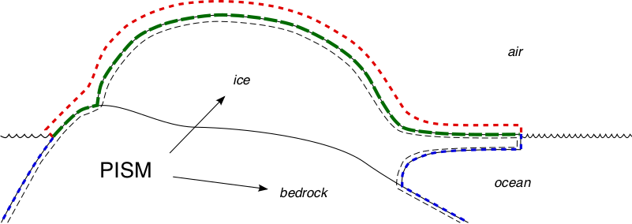

.. include:: ../../global.txt

.. _sec-climate-inputs:

Climate inputs, and their interface with ice dynamics
-----------------------------------------------------

Because PISM's job is to approximate ice flow, its "world view" is centered around ice
dynamics. The discussion of boundary conditions in this Manual is thus
ice-dynamics-centric. On the other hand, there is no constraint on the nature of, or
completeness of, climate models which could be coupled to PISM. This section therefore
explains a PISM organizing principle, namely that *climate inputs affect ice dynamics by a
well-defined interface*.

Almost no attempt is made here to describe the physics of the climate around ice sheets,
so see :cite:`massbalanceglossary` for terminology and :cite:`Hock05` for a review of how
surface melt can be modeled. See the :ref:`Climate Forcing Manual <sec-climate-forcing>`
for much more information on PISM's climate-coupling-related options and on the particular
fields which are shared between the ice dynamics core and the climate model.
:numref:`tab-ice-dynamics-bc` lists fields which are needed as boundary conditions at the
interfaces.

All PISM ice sheet models have some kind of interface green in
:numref:`fig-climate-inputs`) to a subaerial surface processes layer containing snow,
firn, and liquid (or refrozen) runoff. The surface layer is assumed to cover the whole
surface of the ice, and all grounded areas that the ice might occupy, including ablation
areas and ice-free land. We also always have an interface (blue) to the ocean, but this
interface is inactive if there is no floating ice.

   PISM's view of interfaces between an ice sheet and the outside world

.. list-table:: Boundary conditions required by PISM's ice dynamics core; see
                :numref:`fig-climate-inputs`. The optional :red:`red` interface is absent
                if PISM does not "own" the surface processes layer.
   :name: tab-ice-dynamics-bc
   :header-rows: 1

   * - Boundary surface
     - Fields (conditions)

   * - upper surface of the surface processes layer (:red:`red`)
     - *optional*; typically: air temperature, precipitation

   * - top ice surface, but below firn (:green:`green`)
     - *required*: boundary temperature (or enthalpy), mass flux (SMB) into the ice

   * - ice shelf basal surface (:blue:`blue`)
     - *required*: mass flux into the ocean, boundary temperature

   * - bottom surface of thermally-modeled bedrock layer (not shown)
     - *required*: geothermal flux

The surface processes layer might be very simple. It might either read the important
fields from a file or otherwise transfer them from a separate (non-PISM) climate model.
If, however, the surface processes layer is "owned" by the PISM model then there is an
additional interface (red) to the atmosphere above. In no case does PISM "own" the
atmosphere; if it has an interface to the atmosphere at all then it reads atmosphere
fields from a file or otherwise transfers them from a climate model.

Regarding the base of the ice, the temperature of a layer of bedrock in contact with
grounded ice is generally included in PISM's conservation of energy model; see subsections
:ref:`sec-coords` and :ref:`sec-grid`. Also, as described in section
:ref:`sec-beddef`, PISM can apply an optional bed deformation component approximating
the movement of the Earth's crust and upper mantle in response to changing ice load. In
these senses everything below the black dashed line in :numref:`fig-climate-inputs` is
always "owned" by PISM.

The PISM ice dynamics core would like to get the required fields listed in
:numref:`tab-ice-dynamics-bc` directly from observations or measurements, or directly from
a GCM. In many realistic modeling situations, however, PISM code must be used for all or
part of the surface processes modeling necessary to provide the ice-dynamics core with the
needed fields. Due to differences in model resolutions and required down-scaling, this
need for some PISM-based boundary-processes modelling may occur even in some cases where
PISM is coupled to a GCM. Thus, to be able to use the data that is available, a PISM run
might use components that are responsible for modeling surface (snow) processes or
sub-shelf/ocean interaction. These components might be very minimal, merely turning data
that we already have into data in the right units and with the right metadata.

.. figure:: figures/data-flow.png
   :name: fig-climate-input-data-flow
   :width: 75%
   :align: center

   PISM climate input data flow. Colored arrows correspond to interfaces in
   :numref:`fig-climate-inputs`.

Thus we have PISM's design: the ice-dynamics PISM core does not contain any
parameterization or other model for boundary mass or energy fluxes into or out of the ice.
These boundary parameterizations and models are present in the PISM source code, however,
as instances of ``pism::Component`` classes. This simplifies customizing and
debugging PISM's climate inputs, and it promotes code reuse. It isolates the code that
needs to be changed to couple PISM to different climate models.

The classes ``pism::SurfaceModel``, ``pism::AtmosphereModel``, and
``pism::OceanModel`` are all derived from ``pism::Component``. Corresponding to
the red dashed line in :numref:`fig-climate-inputs`, a ``pism::AtmosphereModel``
might not even be present in some PISM configurations. While they are required,
``pism::SurfaceModel`` and ``pism::OceanModel`` may contain (hide) anything from
nearly-trivial parameterizations of ice surface temperatures and mass fluxes to a GCM of
great complexity.

The "modifiers" in :numref:`fig-climate-input-data-flow` adjust the climate model inputs.
Modifiers can be chained together so that multiple modifications are made to the outputs
of the original component. For example, ice-core-derived air temperature offsets, used to
model the space-time distribution of paleo-climatic surface temperature, is an example of
an implemented modifier. Please see the :ref:`Climate Forcing Manual
<sec-climate-forcing>` for a list of climate components and modifiers included in PISM
source code and other details. Users wishing to customize PISM's climate inputs and/or
couple PISM to a climate model should additionally see the `PISM Source Browser
<pism-browser_>`_ and the documentation therein.

:numref:`fig-climate-input-data-flow` illustrates the data flow needed by the ice dynamics
core. The data flow in the other direction, i.e. needed by the model to which PISM is
coupled, depends on particular modeling choices, but great flexibility is allowed.

Why describe all this structure here? On the one hand, some users may be interested in
coupling PISM to other models. On the other hand, the PISM authors do not claim expertise
in modeling atmosphere, ocean, or even snow processes. This separation has a definite
code-reliability purpose. PISM users are ultimately responsible for providing the climate
inputs they intend.
