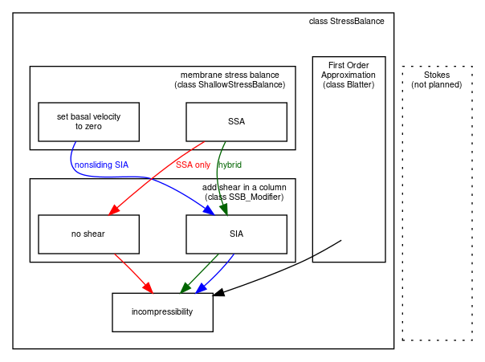

.. include:: ../../global.txt

.. _sec-model-hierarchy:

A hierarchy of simplifying assumptions for grounded ice flow
------------------------------------------------------------

:numref:`tab-modelhierarchy` describes a hierarchy of models, listed roughly in order of
increasing effectiveness in modeling grounded ice sheets with fast flow features. This is
also the order of increasing need for data to serve as boundary and initial conditions,
however, as also described in the Table.

.. list-table:: Hierarchy of flow models in PISM for the grounded parts of ice sheets.
                Listed from most to fewest simplifying assumptions *and* from least to
                greatest need for boundary data. The *italicized* models are planned for
                future versions of PISM but are not implemented so far.
   :name: tab-modelhierarchy
   :header-rows: 1

   * - Model
     - Assumptions
     - Required data

   * - *perfectly-plastic ice*
     - *steady state*; ice has shear stresses below a pre-determined ice "yield stress";
       also needs pre-determined location of ice sheet margin
     - - bed elevation

   * - *balance velocities*
     - *steady state*; ice flows down surface gradient :cite:`JoughinetalGrBal97`
     - *same as above, plus:*

       - surface mass balance
       - (initial) ice thickness

   * - isothermal SIA
     - non-sliding lubrication flow, fixed softness :cite:`BLKCB`, :cite:`EISMINT96`
     - *same as above, but time-dependence is allowed* 

   * - thermo-coupled SIA
     - non-sliding lubrication flow, temperature-dependent softness :cite:`BBL`,
       :cite:`EISMINT00`
     - *same as above, plus:*

       - surface temperature
       - geothermal flux

   * - polythermal SIA
     - allows liquid water fraction in temperate ice; conserves energy better
       :cite:`AschwandenBuelerKhroulevBlatter`, :cite:`Greve`
     - *same as above* 

   * - SIA + SSA hybrid
     - SSA as a sliding law for thermo-coupled SIA :cite:`BBssasliding`,
       :cite:`Winkelmannetal2011`; polythermal by default
     - *same as above, plus:*

       - model for subglacial water
       - model for basal resistance

   * - First Order Approximation
     - pressure within the ice is hydrostatic; `x` and `y` derivatives of the
       vertical velocity component are small compared to `z` derivatives of horizontal
       components :cite:`Blatter`, :cite:`Pattyn03`, :cite:`SchoofCoulombBlatter`
     - *same as above* 

It may also be helpful to view the implemented stress balances as PISM software components
(C++ classes). :numref:`fig-stressbalance` shows the sequences of actions taken by the
SIA-only, SSA-only, and SIA+SSA hybrid model components. In each case a membrane stress
solution is generated first, then a distribution of vertical shear in the column of ice is
generated second, and finally a use of incompressibility computes the vertical component
of the velocity. The nonsliding SIA-only model has a trivialized membrane stress solution.
The SSA-only model has a trivialized computation of vertical shear.

   The SIA-only, SSA-only, and SIA+SSA hybrid models represent different "routes" through
   stress balance PISM components. In each case the inputs are ice geometry and boundary
   stresses, and the final output is a three-dimensional velocity field within the ice.
