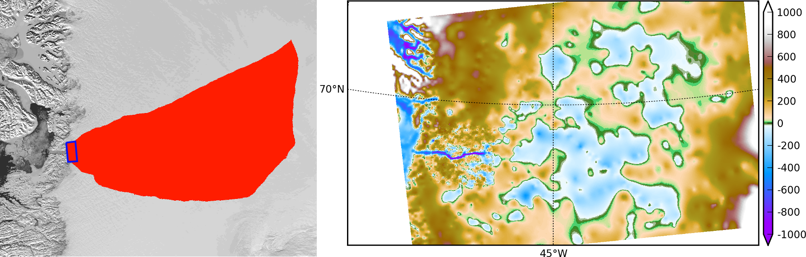

.. include:: ../../global.txt

.. _sec-jako:

Example: A regional model of the Jakobshavn outlet glacier in Greenland
=======================================================================

Jakobshavn Isbrae is a fast-flowing outlet glacier in western Greenland that drains
approximately 7% of the area of the Greenland ice sheet. It experienced a large
acceleration following the loss of its floating tongue in the 1990s
:cite:`JoughinAbdalatiFahnestock`, an event which seems to have been driven by warmer
ocean temperatures :cite:`Hollandetal2008`. Because it is thick, has a steep surface
slope, has a deep trough in its bedrock topography (Figure :numref:`fig-jako-basin-topg`),
and has a thick layer of low-viscosity temperate ice at its base :cite:`Luethietal2009`,
this ice flow is different from the ice streams in West Antarctica or Northeast Greenland
:cite:`TrufferEchelmeyer`.

This section describes how to build a PISM regional model of this outlet glacier
:cite:`DellaGiustina2011` using scripts from ``examples/jako/``. The same strategy should
work for other outlet glaciers. We also demonstrate the PISM regional mode ``pismr
-regional``, and Python `drainage-basin-delineation tools <regional-tools_>`_ which can be
downloaded from the PISM source code website. Such regional models allow modest-size
computers to run high resolution models [#]_ and large ensembles. Regional analysis is
justified if detailed data is available for the region.

The geometric data used here is the SeaRISE :cite:`Bindschadler2013SeaRISE` 1 km dataset
for the whole Greenland ice sheet. It contains bedrock topography from recent CReSIS radar
in the Jakobshavn area. We also use the SeaRISE 5 km data set which has climatic mass
balance from the Greenland-region climate model RACMO :cite:`Ettemaetal2009`.

A regional ice flow model generally needs ice flow and stress boundary conditions. For
this we use a 5 km grid, whole ice sheet, spun-up model state from PISM, described in
:ref:`sec-start` of this *Manual*. You can download the large NetCDF result from
the PISM website, or you can generate it by running a script from :ref:`sec-start`.

   A ``regional-tools`` script computes a drainage basin mask from the surface DEM (left;
   Modis background) and from a user-identified terminus rectangle (blue). The regional
   model can exploit high-resolution bedrock elevations inland from Jakobshavn fjord
   (right; meters asl).

Get the drainage basin delineation tool
---------------------------------------

The drainage basin tool ``regional-tools`` is at |pism-regional-tools-url|.
Get it using ``git`` and set it up as directed in its ``README.md``. Then come back to the
``examples/jako/`` directory and link the script. Here is the quick summary:

.. code-block:: bash

   cd ~/usr/local/                                      # the location you want
   git clone https://github.com/pism/regional-tools.git
   cd regional-tools/
   python setup.py install                              # may add "sudo" or "--user"
   cd PISM/examples/jako/
   ln -s ~/usr/local/regional-tools/pism_regional.py .  # symbolic link to tool

Preprocess the data and get the whole ice sheet model file
----------------------------------------------------------

Script ``preprocess.sh`` downloads and cleans the 1 km SeaRISE data, an 80 Mb file called
``Greenland1km.nc``. [#]_ The script also downloads the SeaRISE 5 km data set
``Greenland_5km_v1.1.nc``, which contains the RACMO surface mass balance field (not
present in the 1 km data set). If you have already run the example in :ref:`sec-start`
then you already have this file and you can link to it to avoid downloading:

.. code-block:: none

   ln -s ../std-greenland/Greenland_5km_v1.1.nc

The same script also preprocesses a pre-computed 5 km grid PISM model result
``g5km_gridseq.nc`` for the whole ice sheet. This provides the boundary conditions, and
the thermodynamical initial condition, for the regional flow model we are building. If you
have already generated it by running the script in section :ref:`sec-gridseq` then link
to it,

.. code-block:: none

   ln -s ../std-greenland/g5km_gridseq.nc

Otherwise running ``preprocess.sh`` will download it. Because it is about 0.6 Gb this may
take some time.

So now let's actual run the preprocessing script:

.. code-block:: none

   ./preprocess.sh

Files ``gr1km.nc``, ``g5km_climate.nc``, and ``g5km_bc.nc`` will appear. These can be
examined in the usual ways, for example:

.. code-block:: none

   ncdump -h gr1km.nc | less            # read metadata
   ncview gr1km.nc                      # view fields

The boundary condition file ``g5km_bc.nc`` contains thermodynamical spun-up variables
(``enthalpy,bmelt,bwat``) and boundary values for the sliding velocity
(``u_ssa_bc,v_ssa_bc``); these have been extracted from ``g5km_gridseq.nc``.

None of the above actions is specific to Jakobshavn, though all are specific to Greenland.
If your goal is to build a regional model of another outlet glacier in Greenland, then you
may be able to use ``preprocess.sh`` as is. The SeaRISE 1 km data set has recent CReSIS
bed topography data only for the vicinity of the Jakobshavn outlet, however, and it is
otherwise just BEDMAP. Because outlet glacier flows are bed-topography-dominated,
additional bed elevation data should be sought.

Identify the drainage basin for the modeled outlet glacier
----------------------------------------------------------

Here we are going to extract a "drainage basin mask" from the surface elevation data (DEM)
in ``gr1km.nc``. The goal is to determine, in part, the locations outside of the drainage
basin where boundary conditions taken from the precomputed whole ice sheet run can be
applied to modeling the outlet glacier flow itself.

The basin mask is determined by the gradient flow of the surface elevation. Thus
generating the mask uses a highly-simplified ice dynamics model (namely: ice flows down
the surface gradient). Once we have the mask, we will apply the full PISM model in the
basin interior marked by the mask. Outside the basin mask we will apply simplified models
or use the whole ice sheet results as boundary conditions.

The script ``pism_regional.py`` computes the drainage basin mask based on a user choice of
a "terminus rectangle"; see Figure :numref:`fig-jako-basin-topg`. There are two ways to
use this script:

- To use the graphical user interface (GUI) mode.

  Run

  .. code-block:: none

     python pism_regional.py

  Select ``gr1km.nc`` to open. Once the topographic map appears in the Figure window, you
  may zoom enough to see the general outlet glacier area. Then select the button "Select
  terminus rectangle". Use the mouse to select a small rectangle around the Jakobshavn
  terminus (calving front), or around the terminus of another glacier if you want to model
  that. Once you have a highlighted rectangle, select a "border width" of at least 50
  cells. [#]_ Then click "Compute the drainage basin mask." Because this is a large data
  set there will be some delay. (Multi-core users will see that an automatic parallel
  computation is done.) Finally click "Save the drainage basin mask" and save with your
  preferred name; we will assume it is called ``jakomask.nc``. Then quit.

- To use the command-line interface.

  The command-line interface of ``pism_regional.py`` allows one to re-create the mask
  without changing the terminus rectangle choice. (It also avoids the slowness of the GUI
  mode for large data sets.) In fact, for repeatability, we will assume you have used this
  command to calculate the drainage basin:

  .. code-block:: none

     python pism_regional.py -i gr1km.nc -o jakomask.nc -x 360,382 -y 1135,1176 -b 50

  This call generates the red region in :numref:`fig-jako-basin-topg`. Options ``-x A,B -y
  C,D`` identify the grid index ranges of the terminus rectangle, and option ``-b`` sets
  the border width. To see more script options, run with ``--help``.

Cut out the computational domain for the regional model
-------------------------------------------------------

We still need to "cut out" from the whole ice sheet geometry data ``gr1km.nc`` the
computational domain for the regional model. The climate data file ``g5km_climate.nc`` and
the boundary condition file ``g5km_bc.nc`` do not need this action because PISM's coupling
and SSA boundary condition codes already handle interpolation and/or subsampling for such
data.

You may have noticed that the text output from running ``pism_regional.py`` included a
cutout command which uses ``ncks`` from the NCO tools. This command also appears as a
global attribute of ``jakomask.nc``:

.. code-block:: none

   ncdump -h jakomask.nc | grep cutout

Copy and run the command that appears, something like

.. code-block:: none

   ncks -d x,299,918 -d y,970,1394 gr1km.nc jako.nc

This command is also applied to the mask file; note the option ``-A`` for "append":

.. code-block:: none

   ncks -A -d x,299,918 -d y,970,1394 jakomask.nc jako.nc

Now look at ``jako.nc``, for example with "``ncview -minmax all jako.nc``". This file is
the full geometry data ready for a regional model. The field ``ftt_mask`` identifies the
drainage basin, outside of which we will use simplified time-independent boundary
conditions. Specifically, outside of the ``ftt_mask`` area, but within the computational
domain defined by the extent of ``jako.nc``, we will essentially keep the initial
thickness. Inside the ``ftt_mask`` area all fields will evolve normally.

Quick start
-----------

The previous steps starting with the command "``./preprocess.sh``" above, then using the
command-line version of ``pism_regional.py``, and then doing the ``ncks`` cut-out steps,
are all accomplished in one script,

.. code-block:: none

   ./quickjakosetup.sh

Running this takes about a minute on a fast laptop, assuming data files are already
downloaded.

Spinning-up the regional model on a 5 km grid
----------------------------------------------

To run the PISM regional model we will need to know the number of grid points in the 1 km
grid in ``jako.nc``. Do this:

.. code-block:: none

   ncdump -h jako.nc |head
       netcdf jako {
       dimensions:
         y = 425 ;
         x = 620 ;
       ...

The grid has spacing of 1 km, so our computational domain is a 620 km by 425 km rectangle.
A 2 km resolution, century-scale model run is easily achievable on a desktop or laptop
computer, and that is our goal below. A lower 5 km resolution spin-up run, matching the
resolution of the 5 km whole ice sheet state computed earlier, is also achievable on a
small computer; we do that first.

The boundary condition fields in ``g5km_bc.nc``, from the whole ice sheet model result
``g5km_gridseq.nc``, may or may not, depending on modeller intent, be spun-up adequately
for the purposes of the regional model. For instance, the intention may be to study
equilibrium states with model settings special to the region. Here, however we assume that
some regional spin-up is needed, if for no other reason that the geometry used here (from
the SeaRISE 1km data set) differs from that in the whole ice sheet model state.

We will get first an equilibrium 5 km regional model, and then do a century run of a 2 km
model based on that. While determining "equilibrium" requires a decision, of course, a
standard satisfied here is that the ice volume in the region changes by less than 0.1
percent in the final 100 model years. See ``ice_volume_glacierized`` in ``ts_spunjako_0.nc``
below.

The 5 km grid [#]_ uses ``-Mx 125 -My 86``. So now we do a basic run using 4 MPI
processes:

.. code-block:: none

   ./spinup.sh 4 125 86 &> out.spin5km &

.. This takes 4.5055 proc-hours on bueler-gazelle

You can read the ``stdout`` log file while it runs: "``less out.spin5km``". The run takes
about 4.4 processor-hours on a 2016 laptop. It produces three files which can be viewed
(e.g. with ``ncview``): ``spunjako_0.nc``, ``ts_spunjako_0.nc``, and ``ex_spunjako_0.nc``.
Some more comments on this run are appropriate:

- Generally the regridding techniques used at the start of this spin-up run are
  recommended for regional modeling. Read the actual run command by

  .. code-block:: none
  
     PISM_DO=echo ./spinup.sh 4 125 86 | less

- We use ``-i jako.nc -bootstrap``, so we get to choose our grid, and (as usual in PISM
  with ``-bootstrap``) the fields are interpolated to our grid.

- A modestly-fine vertical grid with 20 m spacing is chosen, but even finer is
  recommended, especially to resolve the temperate ice layer in these outlet glaciers.

- There is an option :opt:`-no_model_strip` ``10`` asking ``pismr -regional`` to put a 10
  km strip around edge of the computational domain. This strip is entirely outside of the
  drainage basin defined by ``ftt_mask``. In this strip the thermodynamical spun-up
  variables ``bmelt,tillwat,enthalpy,litho_temp`` from ``g5km_bc.nc`` are held fixed and
  used as boundary conditions for the conservation of energy model. A key part of putting
  these boundary conditions into the model strip are the options

  .. code-block:: none
  
     -regrid_file g5km_bc.nc -regrid_vars bmelt,tillwat,enthalpy,litho_temp,vel_ssa_bc

- Dirichlet boundary conditions ``u_ssa_bc,v_ssa_bc`` are also regridded from
  ``g5km_bc.nc`` for the sliding SSA stress balance, and the option ``-ssa_dirichlet_bc``
  then uses them during the run. The SSA equations are solved as usual except in the
  ``no_model_strip`` where these Dirichlet boundary conditions are used. Note that the
  velocity tangent to the north and south edges of the computational domain is
  significantly nonzero, which motivates this usage.

- The calving front of the glacier is handled by the following command-line options:

  .. code-block:: none
  
     -front_retreat_file jako.nc -pik

  This choice uses the present-day ice extent, defined by SeaRISE data in
  ``Greenland1km.nc``, to determine the location of the calving front (see
  :ref:`sec-prescribed-retreat`). Recalling that ``-pik`` includes ``-cfbc``, we are
  applying a PIK mechanism for the stress boundary condition at the calving front. The
  other PIK mechanisms are largely inactive because prescribing the maximum ice extent,
  but they should do no harm (see section :ref:`sec-pism-pik`).

.. figure:: figures/jako-csurf.png
   :name: fig-jako-csurf

   Left: modeled surface speed at the end of a 2 km grid, 100 model year, steady
   present-day climate run. Right: observed surface speed, an average of four winter
   velocity maps (2000,2006--2008) derived from RADARSAT data, as included in the SeaRISE
   5 km data set :cite:`Joughinetal2010`, for the same region. Scales are in meters per
   year.

Century run on a 2 km grid
--------------------------

Now that we have a spun-up state, here is a 100 model year run on a 2 km grid with a 10 m
grid in the vertical:

.. code-block:: none

   ./century.sh 4 311 213 spunjako_0.nc &> out.2km_100a &

This run requires at least 6 GB of memory, and it takes about 16 processor-hours.

It produces a file ``jakofine_short.nc`` almost immediately and then restarts from it
because we need to regrid fields from the end of the previous 5 km regional run (in
``spunjako_0.nc``) and then to "go back" and regrid the SSA boundary conditions from the 5
km whole ice sheet results ``g5km_bc.nc``. At the end of the run the final file
``jakofine.nc`` is produced. Also there is a time-series file ``ts_jakofine.nc`` with
monthly scalar time-series and a spatial time-dependent file ``ex_jakofine.nc``. The
surface speed at the end of this run is shown in :numref:`fig-jako-csurf`, with a
comparison to observations.

Over this 100 year period the flow appears to be relatively steady state. Though this is
not surprising because the climate forcing and boundary conditions are time-independent, a
longer run reveals ongoing speed variability associated to subglacially-driven sliding
cyclicity; compare :cite:`vanPeltOerlemans2012`.

The ice dynamics parameters chosen in ``spinup.sh`` and ``century.sh``, especially the
combination

.. code-block:: none

      -topg_to_phi 15.0,40.0,-300.0,700.0 -till_effective_fraction_overburden 0.02 \
         -pseudo_plastic -pseudo_plastic_q 0.25 -tauc_slippery_grounding_lines

are a topic for a parameter study (compare :cite:`AschwandenAdalgeirsdottirKhroulev`) or a
study of their relation to inverse modeling results (e.g. :cite:`Habermannetal2013`).

Plotting results
----------------

:numref:`fig-jako-csurf` was generated using pypismtools_, NCO_ and CDO_.  Do

.. code-block:: none

   ncpdq -a time,z,y,x spunjako_0.nc jako5km.nc
   nc2cdo.py jako5km.nc
   cdo remapbil,jako5km.nc Greenland_5km_v1.1.nc Greenland_5km_v1.1_jako.nc  # FIXME: if fails, proceed?
   ncap2 -O -s "velsurf_mag=surfvelmag*1.;" Greenland_5km_v1.1_jako.nc \
       Greenland_5km_v1.1_jako.nc
   basemap-plot.py -v velsurf_mag --singlerow -o jako-velsurf_mag.png jakofine.nc \
       Greenland_5km_v1.1_jako.nc

To choose a colormap ``foo.cpt`` add option ``--colormap foo.cpt`` in the last command.
For this example ``PyPISMTools/colormaps/Full_saturation_spectrum_CCW.cpt`` was used.

.. rubric:: Footnotes

.. [#] PISM can also do 1 km runs for the whole Greenland ice sheet; see this `news item
       <https://pism-docs.org/wiki/doku.php?id=news:first1km>`_.

.. [#] If this file is already present then no actual download occurs, and preprocessing
       proceeds. Thus: Do not worry about download time if you need to preprocess again.
       The same comment applies to other downloaded files.

.. [#] This recommendation is somewhat Jakobshavn-specific. We want our model to have an
       ice-free down flow (western) boundary on the resulting computational domain for the
       modeled region.

.. [#] Calculate ``620/5 + 1`` and ``425/5 + 1``, for example.
