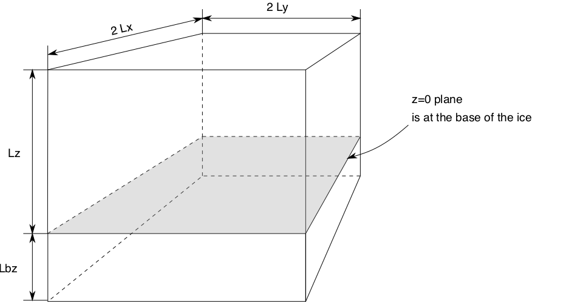

.. include:: ../../../global.txt

.. _sec-coords:

Computational box
-----------------

.. FIXME: This assumes that the sea (i.e. floatation) level is zero.

PISM does all simulations in a computational box which is rectangular in the PISM
coordinates. The coordinate system has horizontal coordinates `x,y` and a vertical
coordinate `z`. The `z` coordinate is measured positive upward from the base
of the ice.\ [#]_ The vector of gravity is in the negative `z` direction. The surface
`z=0` is the base of the ice, however, and thus is usually not horizontal in the
sense of being parallel to the geoid. The surface `z=0` is the base of the ice both
when the ice is grounded and when the ice is floating.

When the ice is grounded, the true physical vertical coordinate `z'`, namely the
coordinate measure relative to a reference geoid, is given by `z'=z+b(x,y)` where
`b(x,y)` is the bed topography. The surface `z'=h(x,y)` is the surface of the
ice. In the grounded case the equation `h(x,y)=H(x,y)+b(x,y)` always applies if
`H(x,y)` is the thickness of the ice.

In the floating case, the physical vertical coordinate is

.. math::

   z' = z - \frac{\rho_i}{\rho_s} H(x,y)

where `\rho_i` is the density of ice and `\rho_s` the density of sea
water. Again `z=0` is the base of the ice, which is the surface

.. math::

   z' = - \frac{\rho_i}{\rho_s} H(x,y).

The surface of the ice is

.. math::

   h(x,y) = \left(1-\frac{\rho_i}{\rho_s}\right) H(x,y).

The *flotation criterion* `-\frac{\rho_i}{\rho_s} H(x,y) > b(x,y)` applies.

The computational box can extend downward into the bedrock. As `z=0` is the base of
the ice, the bedrock corresponds to negative `z` values regardless of its true (i.e.
`z'`) elevation.

The extent of the computational box, along with its bedrock extension downward, is
determined by four numbers ``Lx``, ``Ly``, ``Lz``, and ``Lbz`` (see
:numref:`fig-rectilinearbox` and :numref:`tab-compbox`). The first two of these are
half-widths and have units of kilometers when set by command-line options or displayed.

   PISM's computational box

.. list-table:: Options defining the extent of PISM's computational box
   :name: tab-compbox
   :header-rows: 1
   :widths: 20, 80

   * - Option
     - Description
   * - :opt:`-Lx` (km)
     - Half-width of the computational domain (in the `x`\-direction)
   * - :opt:`-Ly` (km)
     - Half-width of the computational domain (in the `y`\-direction)
   * - :opt:`-Lz` (meters)
     - Height of the computational domain; must exceed maximum ice thickness
   * - :opt:`-Lbz` (meters)
     - Depth of the computational domain in the bedrock thermal layer
   * - :opt:`-x_range A,B` (meters)
     - Specify the range of `x` coordinates. Use this to select a subset of an input grid
       that isn't in the center of a domain.
   * - :opt:`-y_range A,B` (meters)
     - Specify the range of `y` coordinates.

See :ref:`sec-grid-registration` for details about the interpretation of `L_x`, `L_y`, and
the way the grid spacing is computed.

.. rubric:: Footnotes

.. [#] See :ref:`sec-vertchange` for details.
