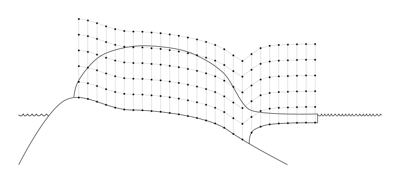
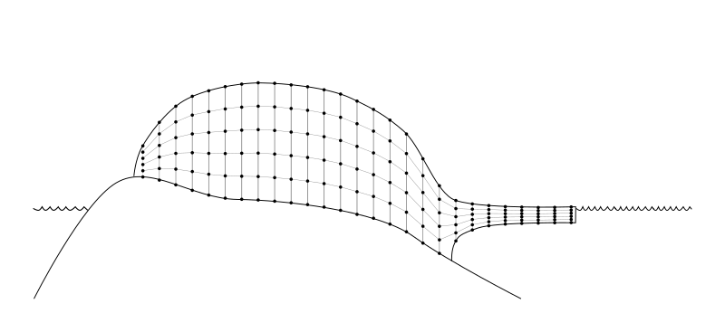

.. include:: ../../../global.txt

.. contents::

.. _sec-grid:

Spatial grid
------------

The PISM grid covering the computational box is equally spaced in horizontal (`x` and `y`)
directions. Vertical spacing in the ice is quadratic by default but optionally equal
spacing can be chosen; set using :config:`grid.ice_vertical_spacing` at bootstrapping. The
bedrock thermal layer model always uses equal vertical spacing.

The grid is described by four numbers, namely the number of grid points :config:`grid.Mx`
in the `x` direction, the number :config:`grid.My` in the `y` direction, the number
:config:`grid.Mz` in the `z` direction within the ice, and the number :config:`grid.Mbz`
in the `z` direction within the bedrock thermal layer. These can be specified by options
:opt:`-Mx`, :opt:`-My`, :opt:`-Mz`, and :opt:`-Mbz`, respectively. Note that ``Mx``,
``My``, ``Mz``, and ``Mbz`` all indicate the number of grid *points* so the number of grid
*spaces* are one less.

The lowest grid point in a grounded column of ice, at `z=0`, coincides with the highest
grid point in the bedrock, so :config:`grid.Mbz` must always be at least one.

   PISM's vertical grid with uniform `z` spacing. See :ref:`sec-vertchange` for details.

Some PISM components (currently: the Blatter stress balance solver) use a
geometry-following vertical grid with uniform vertical spacing withing each column.
See :numref:`fig-grid-vertical-sigma`.

   The "sigma" vertical grid used by PISM's Blatter solver

Set :config:`grid.Mbz` to a number greater than one to use the bedrock thermal model. When
a thermal bedrock layer is used, the depth of the layer is controlled by
:config:`grid.Lbz`. Note that :config:`grid.Mbz` is unrelated to the bed deformation model
(glacial isostasy model); see section :ref:`sec-bed-def`.

In the quadratically-spaced case the vertical spacing near the ice/bedrock interface is
about :config:`grid.lambda` times finer than it would be with equal spacing for the same
value of :config:`grid.Mz`, while the spacing near the top of the computational box is
correspondingly coarser. For a detailed description of the spacing of the grid, see the
documentation on ``Grid::compute_vertical_levels()`` in the `PISM class browser
<pism-browser_>`_.

The user should specify the grid when using ``-bootstrap`` or when initializing a
verification test (section :ref:`sec-verif`) or a simplified-geometry experiment (section
:ref:`sec-simp`). If one initializes PISM from a saved model state using ``-i`` then the
input file determines all grid parameters. For instance, the command

.. code-block:: none

   pism -i foo.nc -y 100

should work fine if ``foo.nc`` is a PISM output file. Because ``-i`` input files take
precedence over options,

.. code-block:: none

   pism -i foo.nc -Mz 201 -y 100

will give a warning that "``PISM WARNING: ignoring command-line option '-Mz'``".

.. _sec-grid-resolution:

Setting grid resolution
^^^^^^^^^^^^^^^^^^^^^^^

Once :config:`grid.Lx` and :config:`grid.Mx` are known, the grid resolution in the X
direction `\Delta x` is computed using :eq:`eq-grid-center` (if
:config:`grid.registration` is "center") or :eq:`eq-grid-corner` (with the "corner" grid
registration). Alternatively, one can set :config:`grid.Lx` and :config:`grid.dx` to
compute `M_x` (`L_x` will be re-computed, if necessary):

.. math::
   M_x &= \left\lfloor \frac{2 L_x}{\Delta x} \right\rfloor,

   L_x &= \frac12 M_x\, \Delta x

in the case of the "center" grid registration; compare this to :eq:`eq-grid-center` and
note that we round `\frac{2 L_x}{\Delta x}` *down* to get `M_x`. A similar equation is
used when :config:`grid.registration` is "corner" (see :eq:`eq-grid-corner`).

Set :config:`grid.Ly` and :config:`grid.dy` to set grid resolution in the Y direction.

.. note::

   Recall that PISM will automatically convert from provided units into units used
   internally, so the command below will work as expected.

   .. code-block:: bash

      pism -bootstrap -i pism_Greenland_5km_v1.1.nc \
            -dx 5km -dy 5km ...

.. _sec-grid-registration:

Grid registration
^^^^^^^^^^^^^^^^^

.. |xmin| replace:: `x_\text{min}`
.. |xmax| replace:: `x_\text{max}`

PISM's horizontal computational grid is uniform and (by default) cell-centered.\ [#]_

This is not the only possible interpretation, but it is consistent with the finite-volume
handling of mass (ice thickness) evolution is PISM.

Consider a grid with minimum and maximum `x` coordinates `x_\text{min}` and `x_\text{max}`
and the spacing `\dx`. The cell-centered interpretation implies that the domain
extends *past* |xmin| and |xmax| by one half of the grid spacing, see
:numref:`fig-cell-center`.

.. figure:: figures/grid-centered-both.png
   :name: fig-cell-center
   :width: 80%
   :align: center

   Computational grids using the default (``center``) grid registration.

   *Left*: a coarse grid. *Right*: a finer grid covering the same domain.

   The solid black line represents the domain boundary, dashed red lines are cell
   boundaries, black circles represent grid points.

When getting the size of the domain from an input file, PISM will compute cell-centered
grid parameters as follows:

.. math::
   :label: eq-grid-from-file-centered

   \dx &= x_1 - x_0

   L_x &= \frac12 ((x_\text{max} - x_\text{min}) + \dx).

This is not an issue when re-starting from a PISM output file but can cause confusion when
specifying grid parameters at bootstrapping and reading in fields using "regridding."

For example:

.. code-block:: none

   > pism -eisII A \
           -grid.registration center \
           -Lx 10 -Mx 4 -My 4 \
           -y 0 -verbose 1 \
           -o grid-test.nc
   > ncdump -v x grid-test.nc | grep "^ x ="
    x = -7500, -2500, 2500, 7500 ;

Note that we specified the domain half width of 10 km and selected 4 grid points in the
`x` direction. The resulting `x` coordinates range from `-7500` meters to `7500` meters
with the grid spacing of `5` km, so the width of the domain is `20` km, but
`x_{\text{max}} - x_{\text{min}} = 15` km.

In summary, with the default (center) grid registration

.. math::
   :label: eq-grid-center

   \dx &= \frac{2 L_x}{M_x},

   x_\text{min} &= x_c - L_x + \frac12 \dx,

   x_\text{max} &= x_c + L_x - \frac12 \dx,

where `x_c` is the `x`\-coordinate of the domain center.

.. note::

   One advantage of this approach is that it is easy to build a set of grids covering a
   given region such that grid cells nest within each other as in
   :numref:`fig-cell-center`. In particular, this makes it easier to create a set of
   surface mass balance fields for the domain that use different resolutions but *have the
   same total SMB*.

Compare this to

.. code-block:: none

   > pism -eisII A \
           -grid.registration corner \
           -Lx 10 -Mx 5 -My 5 \
           -y 0 -verbose 1 \
           -o grid-test.nc
   > ncdump -v x grid-test.nc | grep "^ x ="
    x = -10000, -5000, 0, 5000, 10000 ;

Here the grid spacing is also 5 km, although there are 5 grid points in the `x` direction
and `x` coordinates range from `-10000` to `10000`.

With the "corner" grid registration

.. math::
   :label: eq-grid-corner

   \dx &= \frac{2 L_x}{M_x - 1},

   x_\text{min} &= x_c - L_x,

   x_\text{max} &= x_c + L_x.

See :numref:`fig-cell-corner` for an illustration.

.. figure:: figures/grid-corner-both.png
   :name: fig-cell-corner
   :width: 80%
   :align: center

   Computational grids using the ``corner`` grid registration.

   *Left*: a coarse grid. *Right*: a finer grid covering the same domain.

To switch between :eq:`eq-grid-center` and :eq:`eq-grid-corner`,
set the configuration parameter :config:`grid.registration`.

.. _sec-crs:

Coordinate Reference Systems
^^^^^^^^^^^^^^^^^^^^^^^^^^^^

PISM can use the PROJ_ library (see :ref:`sec-install-prerequisites`) and coordinate
reference system (CRS) information to

- compute latitudes and longitudes of cell centers (used by some parameterizations and
  saved to output files as variables :var:`lat` and :var:`lon`),
- compute latitudes and longitudes of cell corners (saved to output files as variables
  :var:`lat_bnds` and :var:`lon_bnds` to simplify post-processing),
- interpolate inputs (climate forcing, etc) from a grid present in an input file to PISM's
  computational grid.

Interpolation of model inputs requires YAC_ in addition to PROJ_; see
:ref:`sec-install-yac` and :ref:`sec-interpolation`.

.. admonition:: Limitations

   PISM's supports most projections defined in the Appendix F of the
   `CF Conventions`_ document.

   - *Longitude, latitude grids containing a pole* are not supported yet.
   - The "Vertical perspective" grid mapping is not supported.

To use features listed above, compile PISM with PROJ_ and specify the grid projection in
an input file as described below.

.. _sec-crs-metadata:

NetCDF metadata describing a CRS
%%%%%%%%%%%%%%%%%%%%%%%%%%%%%%%%

To convert coordinates from a projected coordinate system to longitudes and latitudes PISM
needs a *string* containing PROJ parameters corresponding to this mapping.

We support four ways of setting these parameters. Here they are listed in the order PISM
uses when looking for a CRS definition in an input file.

1. ``crs_wkt`` attribute of the grid mapping variable corresponding to a data variable (CF
   Conventions)
2. ``proj_params`` attribute of the grid mapping variable corresponding to a data variable
   (convention used by CDO_)
3. global attributes ``proj`` or ``proj4`` (PISM's old convention)
4. attributes of the grid mapping variable corresponding to a data or domain variable,
   according to `CF Conventions`_.

We recommend following CF Conventions if possible. However, sometimes what we want is a
minimal modification of a file's metadata needed to make it usable. In this case setting
the ``proj`` attribute might be easier.

If the ``proj`` (or ``proj_params``) attribute has the form ``"+init=EPSG:XXXX"``,
``"+init=epsg:XXXX"``, ``"EPSG:XXXX"`` or ``"epsg:XXXX"`` where ``XXXX`` is an EPSG code
listed below PISM will convert the EPSG code to a grid mapping variable conforming to CF
metadata conventions and use that in PISM's output files.

.. list-table:: Supported EPSG codes
   :header-rows: 1

   * - EPSG code
     - Description
   * - 3413
     - `WGS 84 / NSIDC Sea Ice Polar Stereographic North <https://epsg.io/3413>`_
   * - 3031
     - `WGS 84 / Antarctic Polar Stereographic <https://epsg.io/3031>`_
   * - 3057
     - `ISN93 / Lambert 1993 (Iceland) <https://epsg.io/3057>`_
   * - 5936
     - `WGS 84 / EPSG Alaska Polar Stereographic <https://epsg.io/5936>`_
   * - 26710
     - `NAD27 / UTM zone 10N (Canada) <https://epsg.io/26710>`_

.. _sec-crs-grid-mapping-variable:

Grid mapping variable
=====================

PISM supports some CF grid mapping variables corresponding to coordinate reference systems
described in `Appendix F of the CF Conventions <cf-appendix-f_>`_ document. Please see `CF
Conventions sections 5.6 <cf-section-56_>`_ for details about specifying the grid mapping
for a NetCDF variable.

.. list-table:: Supported coordinate reference systems
   :header-rows: 1

   * - CRS Name
     - ``grid_mapping_name`` attribute

   * - Albers Equal Area
     - ``albers_conical_equal_area``
   * - Azimuthal equidistant
     - ``azimuthal_equidistant``
   * - Lambert azimuthal equal area
     - ``lambert_azimuthal_equal_area``
   * - Lambert conformal
     - ``lambert_conformal_conic``
   * - Lambert Cylindrical Equal Area
     - ``lambert_cylindrical_equal_area``
   * - Latitude-Longitude
     - ``latitude_longitude``
   * - Mercator
     - ``mercator``
   * - Orthographic
     - ``orthographic``
   * - Polar stereographic
     - ``polar_stereographic``
   * - Rotated pole
     - ``rotated_latitude_longitude``
   * - Stereographic
     - ``stereographic``
   * - Transverse Mercator
     - ``transverse_mercator``

.. literalinclude:: cdl/climate_forcing.cdl
   :caption: ``ncdump -h`` output for a climate forcing file following CF metadata
             conventions and using the polar stereographic projection

If a grid mapping variable contains the ``crs_wkt`` attribute as described in `CF
Conventions sections 5.6 <cf-section-56_>`_ PISM will use this string to initialize the
mapping from projected coordinates to longitude and latitude coordinates and will not
attempt to create a PROJ string from other attributes of this variable.

If a grid mapping variable contains the ``proj_params`` attribute as used by CDO_ PISM
will use this string to initialize the mapping from projected coordinates to longitude and
latitude coordinates and will not attempt to create a PROJ string from other attributes of
this variable.

.. _sec-crs-cdo-proj-params:

Attribute ``proj_params`` of a grid mapping variable
====================================================

.. literalinclude:: cdl/cdo-proj_params.cdl
   :name: code-proj-params
   :caption: ``ncdump -h`` output for a climate forcing file using CDO's ``proj_params``
             attribute

.. note::

   This data set does not follow CF metadata conventions.

.. _sec-crs-proj-attribute:

Global attribute ``proj``
=========================

.. note::

   The global attribute ``proj4`` is still supported for compatibility with older PISM
   versions.

For example, the input file ``pism_Greenland_5km_v1.1.nc`` in :ref:`sec-start` contains the
following metadata:

.. code-block:: bash

   > ncdump -h pism_Greenland_5km_v1.1.nc | grep :proj
   :proj = "+proj=stere +lat_0=90 +lat_ts=71 +lon_0=-39 +k=1 +x_0=0 +y_0=0 +ellps=WGS84 +towgs84=0,0,0,0,0,0,0 +units=m +no_defs" ;

The spinup run in that example disables the code re-computing longitude, latitude grid
coordinates using projection information to avoid the dependency on PROJ (look for
:opt:`-grid.recompute_longitude_and_latitude` in the command). If we remove this option,
PISM will report the following.

.. code-block:: none

   > pism -i pism_Greenland_5km_v1.1.nc \
           -bootstrap -Mx 76 -My 141 -Mz 101 -Mbz 11 ... \
           -grid.recompute_longitude_and_latitude true ... -o output.nc
   ...
   * Got projection parameters "+proj=stere +lat_0=90 +lat_ts=71 +lon_0=-39 +k=1 +x_0=0 +y_0=0 +ellps=WGS84 +towgs84=0,0,0,0,0,0,0 +units=m +no_defs" from "pism_Greenland_5km_v1.1.nc".
   * Computing longitude and latitude using projection parameters...
   ...
   ... done with run
   Writing model state to file `output.nc'...

To simplify post-processing and analysis with CDO PISM adds the PROJ string (if known)
to the mapping variable, putting it in the ``proj_params`` attribute.

.. code-block:: none

   > ncdump -h g20km_10ka_hy.nc | grep mapping:

   mapping:ellipsoid = "WGS84" ;
   mapping:grid_mapping_name = "polar_stereographic" ;
   mapping:false_easting = 0. ;
   mapping:false_northing = 0. ;
   mapping:latitude_of_projection_origin = 90. ;
   mapping:standard_parallel = 71. ;
   mapping:straight_vertical_longitude_from_pole = -39. ;
   mapping:proj_params = "+proj=stere +lat_0=90 +lat_ts=71 +lon_0=-39 +k=1 +x_0=0 +y_0=0 +ellps=WGS84 +towgs84=0,0,0,0,0,0,0 +units=m +no_defs" ;

.. _sec-grid-file:

Using a grid definition file
^^^^^^^^^^^^^^^^^^^^^^^^^^^^

Configuration parameters :config:`grid.dx`, :config:`grid.dy`, :config:`grid.Mx`,
:config:`grid.My`, :config:`grid.Lx`, :config:`grid.Ly` make it relatively easy to change
the size and resolution of a grid, but not its location on the globe.

The parameter :config:`grid.file` makes it possible to read a grid definition from a
NetCDF file and then override values read from this file using configuration parameters,
if necessary. Its argument is a string containing the name of a grid definition file *or*
a string containing the name of a NetCDF file and the name of a 2D variable to get grid
information from, separated by a colon, ``file_name:variable_name`` (for example:
``pism_Greenland_5km_v1.1.nc:thk``).

A grid definition file has to contain a "domain variable" (see `CF Conventions`_ version
1.11 or later, section 5.8, ). A domain variable is a scalar variable that has the
``dimensions`` attribute, a space-separated list of names of coordinate variables defining
the domain. It may also have other attributes, e.g. ``grid_mapping`` to specify the
coordinate reference system.

See :numref:`code-coarse-grid-greenland` for an example of a grid definition. Here the
*size* of a domain is determined as described in section :ref:`sec-grid-registration`; see
equations :eq:`eq-grid-from-file-centered`, :eq:`eq-grid-center` and :eq:`eq-grid-corner`.

.. literalinclude:: cdl/grid.cdl
   :language: none
   :caption: Very coarse grid covering Greenland
   :name: code-coarse-grid-greenland

.. note::

   - PISM uses the first and last values of ``x`` in :numref:`code-coarse-grid-greenland`
     to determine `x_{\text{min}}` and `x_{\text{max}}` and the first and second values of
     ``x`` to compute `\Delta x`, and similarly for ``y``. Other values of ``x`` and ``y``
     are not used.

   - This example specifies grid coordinates in *km*. PISM will automatically convert to
     *meters* used internally.

Note that it can also be used as a *domain and CRS definition* since configuration
parameters :config:`grid.Mx` and :config:`grid.My` (or :config:`grid.dx` and
:config:`grid.dy`) can be used to create a finer grid covering the same domain.

For example, :numref:`code-using-grid-definition-file` below shows how one could set up a
simulation using a `5` km grid covering this domain.

.. code-block:: bash
   :caption: Using a grid definition file to define the domain and command-line options to
             set grid resolution.
   :name: code-using-grid-definition-file

   pism \
     -bootstrap -i pism_Greenland_5km_v1.1.nc \
     -grid.file grid.nc \
     -dx 5km -dy 5km \
     -y 1s \
     -o output.nc

.. note::

   The grid in the data set ``pism_Greenland_v1.1.nc`` from section :ref:`sec-start` and
   the grid described in :numref:`code-coarse-grid-greenland` use different projections.
   PISM will use YAC_ to re-project and interpolate data between these grids; see
   :ref:`sec-interpolation`.

.. _sec-domain-file:

A better way to define a modeling domain
%%%%%%%%%%%%%%%%%%%%%%%%%%%%%%%%%%%%%%%%

Defining the domain extent by setting `x_1=x_{\text{min}}`, `x_2` and `x_N=x_{\text{max}}`
in :numref:`code-using-grid-definition-file` so that `L_x` comes out "right" according to
equation :eq:`eq-grid-from-file-centered` is very awkward. There is a better way; see
:numref:`code-greenland-domain` for an example.

.. literalinclude:: cdl/domain.cdl
   :language: none
   :caption: Defining a domain including Greenland
   :name: code-greenland-domain

.. note::

   - This file defines *exactly* the same domain as
     :numref:`code-using-grid-definition-file`.

   - If ``x`` and ``y`` bounds (``x_bnds`` and ``y_bnds`` in
     :numref:`code-greenland-domain`) are present then *only bounds are used* to determine
     the domain extent and the number of grid points. Values of ``x`` and ``y`` are
     *ignored*.

   - All methods of specifying the CRS described in :ref:`sec-crs` are supported (here:
     the ``proj_params`` attribute).

   - Similarly to :numref:`code-proj-params`, a file with metadata in
     :numref:`code-greenland-domain` does not follow CF conventions.

.. rubric:: Minimal domain definition

If following conventions is not a concern a domain definition file can be stripped down to
its smallest form, see :numref:`code-greenland-domain-minimal`.

.. literalinclude:: cdl/domain_minimal.cdl
   :language: none
   :caption: Absolutely minimal domain definition
   :name: code-greenland-domain-minimal

.. _sec-domain-distribution:

Parallel domain distribution
^^^^^^^^^^^^^^^^^^^^^^^^^^^^

When running PISM in parallel with ``mpiexec -n N``, the horizontal grid is distributed
across `N` processes [#]_. PISM divides the grid into `N_x` parts in the `x` direction and
`N_y` parts in the `y` direction. By default this is done automatically, with the goal
that `N_x\times N_y = N` and `N_x` is as close to `N_y` as possible. Note that `N` should,
therefore, be a composite (not prime) number.

Users seeking to override this default can specify `N_x` and `N_y` using configuration
parameters :config:`grid.Nx` and :config:`grid.Ny`.

Once `N_x` and `N_y` are computed, PISM computes sizes of sub-domains `M_{x,i}` so that
`\sum_{i=1}^{N_x}M_{x,i} = M_x` and `M_{x,i} - \left\lfloor M_x / N_x \right\rfloor < 1`.
To specify strip widths `M_{x,i}` and `M_{y,i}`, use configuration parameters
:config:`grid.procs_x` and :config:`grid.procs_y`. Both of these parameters take a
comma-separated list of numbers as its argument. For example,

.. code-block:: none

   mpiexec -n 3 pism -eisII A -Mx 101 -My 101 \
                      -Nx 1 -grid.procs_x 101 \
                      -Ny 3 -grid.procs_y 20,61,20

splits a `101 \times 101` grid into 3 strips along the `x` axis.

To see the parallel domain decomposition from a completed run, see the :var:`rank`
variable in the output file, e.g. using ``-o_size big``. The same :var:`rank` variable is
available as a spatial diagnostic field (section :ref:`sec-saving-diagnostics`).

.. _sec-grid-parameters:

Configuration parameters controlling grid choices
^^^^^^^^^^^^^^^^^^^^^^^^^^^^^^^^^^^^^^^^^^^^^^^^^

.. pism-parameters::
   :regexp: ^grid\.

.. rubric:: Footnotes

.. [#] This is consistent with the `CF Conventions`_ document for data-sets without cell
       bounds: "If bounds are not provided, an application might reasonably assume the
       gridpoints to be at the centers of the cells, but we do not require that in this
       standard."

.. [#] In most cases one process corresponds to one "core" of your computer.
