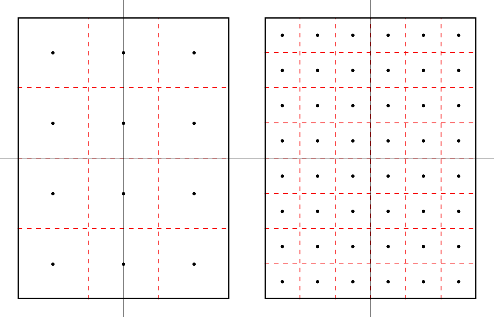
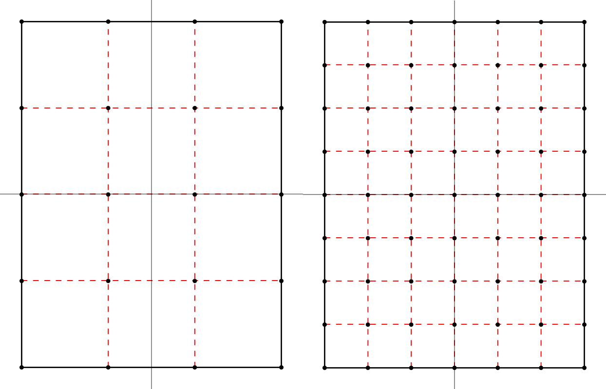

.. include:: ../../../global.txt

.. contents::

.. _sec-grid:

Spatial grid
------------

The PISM grid covering the computational box is equally spaced in horizontal (`x`
and `y`) directions. Vertical spacing in the ice is quadratic by default but
optionally equal spacing can be chosen; choose with options :opt:`-z_spacing`
[``quadratic``, ``equal``\] at bootstrapping. The grid read from a "``-i``" input file is
used as is. The bedrock thermal layer model always uses equal vertical spacing.

The grid is described by four numbers, namely the number of grid points ``Mx`` in the
`x` direction, the number ``My`` in the `y` direction, the number ``Mz`` in
the `z` direction within the ice, and the number ``Mbz`` in the `z` direction
within the bedrock thermal layer. These are specified by options :opt:`-Mx`, :opt:`-My`,
:opt:`-Mz`, and :opt:`-Mbz`, respectively. The defaults are 61, 61, 31, and 1,
respectively. Note that ``Mx``, ``My``, ``Mz``, and ``Mbz`` all indicate the number of
grid *points* so the number of grid *spaces* are one less, thus 60, 60, 30, and 0 in the
default case.

The lowest grid point in a column of ice, at `z=0`, coincides with the highest grid point
in the bedrock, so ``Mbz`` must always be at least one. Choosing ``Mbz`` `>1` is required
to use the bedrock thermal model. When a thermal bedrock layer is used, the distance
``Lbz`` is controlled by the :opt:`-Lbz` option. Note that ``Mbz`` is unrelated to the bed
deformation model (glacial isostasy model); see section :ref:`sec-beddef`.

In the quadratically-spaced case the vertical spacing near the ice/bedrock interface is
about four times finer than it would be with equal spacing for the same value of ``Mz``,
while the spacing near the top of the computational box is correspondingly coarser. For a
detailed description of the spacing of the grid, see the documentation on
``IceGrid::compute_vertical_levels()`` in the `PISM class browser <pism-browser_>`_.

The user should specify the grid when using ``-bootstrap`` or when initializing a
verification test (section :ref:`sec-verif`) or a simplified-geometry experiment (section
:ref:`sec-simp`). If one initializes PISM from a saved model state using ``-i`` then the
input file determines all grid parameters. For instance, the command

.. code-block:: none

   pismr -i foo.nc -y 100

should work fine if ``foo.nc`` is a PISM output file. Because ``-i`` input files take
precedence over options,

.. code-block:: none

   pismr -i foo.nc -Mz 201 -y 100

will give a warning that "``PISM WARNING: ignoring command-line option '-Mz'``".

.. _sec-grid-registration:

Grid registration
^^^^^^^^^^^^^^^^^

.. |xmin| replace:: `x_\text{min}`
.. |xmax| replace:: `x_\text{max}`

PISM's horizontal computational grid is uniform and (by default) cell-centered.\ [#]_

This is not the only possible interpretation, but it is consistent with the finite-volume
handling of mass (ice thickness) evolution is PISM.

Consider a grid with minimum and maximum `x` coordinates `x_\text{min}` and `x_\text{max}`
and the spacing `\Delta x`. The cell-centered interpretation implies that the domain
extends *past* |xmin| and |xmax| by one half of the grid spacing, see
:numref:`fig-cell-center`.

   Computational grids using the default (``center``) grid registration.

   *Left*: a coarse grid. *Right*: a finer grid covering the same domain.

   The solid black line represents the domain boundary, dashed red lines are cell
   boundaries, black circles represent grid points.

When getting the size of the domain from an input file, PISM will compute grid parameters
as follows:

.. math::

   \Delta x &= x_1 - x_0

   L_x &= \frac12 ((x_\text{max} - x_\text{min}) + \Delta x).

This is not an issue when re-starting from a PISM output file but can cause confusion when
specifying grid parameters at bootstrapping and reading in fields using "regridding."

For example:

.. code-block:: bash

   > pisms -grid.registration center \
           -Lx 10 -Mx 4 \
           -y 0 -verbose 1 \
           -o grid-test.nc
   > ncdump -v x grid-test.nc | tail -2 | head -1
    x = -7500, -2500, 2500, 7500 ;

Note that we specified the domain half width of 10 km and selected 4 grid points in the
`x` direction. The resulting `x` coordinates range from `-7500` meters to `7500` meters with
the grid spacing of `5` km.

In summary, with the default (center) grid registration

.. math::
   :label: eq-grid-center

   \Delta x &= \frac{2 L_x}{M_x},

   x_\text{min} &= x_c - L_x + \frac12 \Delta x,

   x_\text{max} &= x_c + L_x - \frac12 \Delta x,

where `x_c` is the `x`\-coordinate of the domain center.

.. note::

   One advantage of this approach is that it is easy to build a set of grids covering a
   given region such that grid cells nest within each other as in
   :numref:`fig-cell-center`. In particular, this makes it easier to create a set of
   surface mass balance fields for the domain that use different resolutions but *have the
   same total SMB*.

Compare this to

.. code-block:: bash

   > pisms -grid.registration corner \
           -Lx 10 -Mx 5 \
           -y 0 -verbose 1 \
           -o grid-test.nc
   > ncdump -v x grid-test.nc | tail -2 | head -1
    x = -10000, -5000, 0, 5000, 10000 ;

Here the grid spacing is also 5 km, although there are 5 grid points in the `x` direction
and `x` coordinates range from `-10000` to `10000`.

With the "corner" grid registration

.. math::
   :label: eq-grid-corner

   \Delta x &= \frac{2 L_x}{M_x - 1},

   x_\text{min} &= x_c - L_x,

   x_\text{max} &= x_c + L_x.

See :numref:`fig-cell-corner` for an illustration.

   Computational grids using the ``corner`` grid registration.

   *Left*: a coarse grid. *Right*: a finer grid covering the same domain.

To switch between :eq:`eq-grid-center` and :eq:`eq-grid-corner`,
set the configuration parameter :config:`grid.registration`.

.. _sec-projections:

Grid projections
^^^^^^^^^^^^^^^^

PISM can use the PROJ.4_ library (see :ref:`sec-install-prerequisites`) and projection
information to compute

- latitudes and longitudes of grid points (variables :var:`lat` and :var:`lon`), and
- latitudes and longitudes of cell corners (variables :var:`lat_bnds` and :var:`lon_bnds`).

To use this feature, compile PISM with PROJ.4 and add the global attribute ``proj4``
containing the parameter string describing the projection to the input file.

For example, the input file ``pism_Greenland_5km_v1.1.nc`` in :ref:`sec-start` has the
following:

.. code-block:: bash

   > ncdump -h pism_Greenland_5km_v1.1.nc | grep :proj4
   :proj4 = "+proj=stere +lat_0=90 +lat_ts=71 +lon_0=-39 +k=1 +x_0=0 +y_0=0 +ellps=WGS84 +towgs84=0,0,0,0,0,0,0 +units=m +no_defs" ;

The spinup run in that example disables the code re-computing longitude, latitude grid
coordinates using projection information to avoid the dependency on PROJ.4 (look for
:opt:`-grid.recompute_longitude_and_latitude` in the command). If we remove this option,
PISM will report the following.

.. code-block:: none

   > pismr -i pism_Greenland_5km_v1.1.nc \
           -bootstrap -Mx 76 -My 141 -Mz 101 -Mbz 11 ... \
           -grid.recompute_longitude_and_latitude true ... -o output.nc
   ...
   * Got projection parameters "+proj=stere +lat_0=90 +lat_ts=71 +lon_0=-39 +k=1 +x_0=0 +y_0=0 +ellps=WGS84 +towgs84=0,0,0,0,0,0,0 +units=m +no_defs" from "pism_Greenland_5km_v1.1.nc".
   * Computing longitude and latitude using projection parameters...
   ...
   ... done with run
   Writing model state to file `output.nc'...

If the ``proj4`` attribute contains the string "``+init=epsg:XXXX``" where ``XXXX`` is
3413, 3031, or 26710, PISM will also create a CF-conforming ``mapping`` variable
describing the projection in use.

"Mapping" variables following CF metadata conventions in input files are copied to output
files (including ``-extra_file``\s) but are **not** used to compute latitude/longitude
coordinates.

To simplify post-processing and analysis with CDO PISM adds the PROJ.4 string (if known)
to the mapping variable, putting it in the ``proj4_params`` attribute.

.. code-block:: none

   > ncdump -h g20km_10ka_hy.nc | grep mapping:

   mapping:ellipsoid = "WGS84" ;
   mapping:grid_mapping_name = "polar_stereographic" ;
   mapping:false_easting = 0. ;
   mapping:false_northing = 0. ;
   mapping:latitude_of_projection_origin = 90. ;
   mapping:standard_parallel = 71. ;
   mapping:straight_vertical_longitude_from_pole = -39. ;
   mapping:proj4_params = "+proj=stere +lat_0=90 +lat_ts=71 +lon_0=-39 +k=1 +x_0=0 +y_0=0 +ellps=WGS84 +towgs84=0,0,0,0,0,0,0 +units=m +no_defs" ;

.. _sec-domain-distribution:

Parallel domain distribution
^^^^^^^^^^^^^^^^^^^^^^^^^^^^

When running PISM in parallel with ``mpiexec -n N``, the horizontal grid is distributed
across `N` processes [#]_. PISM divides the grid into `N_x` parts in the `x` direction and
`N_y` parts in the `y` direction. By default this is done automatically, with the goal
that `N_x\times N_y = N` and `N_x` is as close to `N_y` as possible. Note that `N` should,
therefore, be a composite (not prime) number.

Users seeking to override this default can specify `N_x` and `N_y` using the :opt:`-Nx`
and :opt:`-Ny` command-line options.

Once `N_x` and `N_y` are computed, PISM computes sizes of sub-domains `M_{x,i}` so that
`\sum_{i=1}^{N_x}M_{x,i} = M_x` and `M_{x,i} - \left\lfloor M_x / N_x \right\rfloor < 1`.
To specify strip widths `M_{x,i}` and `M_{y,i}`, use command-line options :opt:`-procs_x`
and :opt:`-procs_y`. Each option takes a comma-separated list of numbers as its argument.
For example,

.. code-block:: none

   mpiexec -n 3 pisms -Mx 101 -My 101 \
                      -Nx 1 -procs_x 101 \
                      -Ny 3 -procs_y 20,61,20

splits a `101 \times 101` grid into 3 strips along the `x` axis.

To see the parallel domain decomposition from a completed run, see the :var:`rank`
variable in the output file, e.g. using ``-o_size big``. The same :var:`rank` variable is
available as a spatial diagnostic field (section :ref:`sec-saving-diagnostics`).

.. rubric:: Footnotes

.. [#] This is consistent with the `CF Conventions`_ document for data-sets without cell
       bounds: "If bounds are not provided, an application might reasonably assume the
       gridpoints to be at the centers of the cells, but we do not require that in this
       standard."

.. [#] In most cases one process corresponds to one "core" of your computer.
