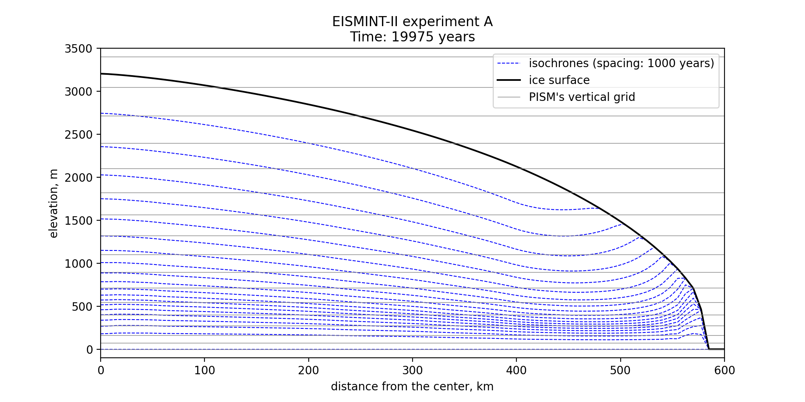

.. include:: ../../../global.txt

.. _sec-age:

Computing ice age
-----------------

By default, PISM does not compute the age of the ice because it does not directly impact
ice flow when using the default flow laws. (But see :ref:`sec-sia-age-coupling` for SIA
parameterizations that use it.)

Set :config:`age.enabled` to turn it on. A 3D variable :var:`age` will appear in output
files. It is read during model initialization if :config:`age.enabled` is set and ignored
otherwise. If :config:`age.enabled` is set and the variable :var:`age` is absent in the
input file then the initial age is set to :config:`age.initial_value`.

The first order upwinding method used to approximate the evolution of :var:`age` is
diffusive, which leads to the loss of detail, especially near the base of the ice where
the variation of age with depth is more pronounced. Increasing vertical grid resolution
and using quadratic grid spacing (finer near the bed, coarser by a factor of
:config:`grid.lambda` near the surface; see :ref:`sec-grid`) would reduce the effect of
numerical diffusion but cannot eliminate it.

.. _sec-isochronal-layers:

Isochronal layer tracing
========================

To model closely-spaced isochrones PISM implements the *isochronal layer tracing scheme*
described in :cite:`Born2016` and :cite:`Born2021`; see section 2.4 of the latter for
details. This method uses a "Lagrangian" approximation in the vertical direction and a
first-order upwinding method in horizontal directions. This eliminates numerical diffusion
in the critical, *vertical* direction.

.. note::

   This approximation assumes that the age of the ice increases monotonically with depth,
   so it cannot be used to model overturning folds :cite:`Bons2016` and plume formation
   :cite:`Vieli2018`.

.. rubric:: Summary

Ice masses are interpreted as "stacks" of layers of varying thickness. Isochrones are
represented by boundaries between these layers; the depth of an isochrone is the sum of
thicknesses of all the layers above it (some may have zero thickness, e.g. in ablation and
ice-free areas). The surface mass balance is applied to the topmost layer; if a layer is
depleted by a negative mass balance, the remaining mass loss is used to reduce the
thickness of the next layer below it. Similarly, the basal melt rate is applied to the
bottom layer, then (if necessary) the one above it, etc. Within each layer mass is
transported according to the horizontal components of the 3D ice velocity by sampling it
at the depth of the middle of a layer. There is no mass transport between layers. A new
layer is added to the top of the stack each time the simulation reaches a requested
deposition time.

Set :config:`isochrones.deposition_times` to enable this mechanism. This parameter takes
an argument in the format identical to :config:`output.extra.times`; see
:ref:`sec-saving-diagnostics`.

   Modeled isochrones after 20000 years from the start of the EISMINT-II
   :cite:`EISIIdescribe` experiment A. Note that many isochrones near the base are closer
   than the vertical grid spacing. See the directory ``examples/isochrones`` in PISM's
   repository for scripts used to create this figure.

.. rubric:: Model state

Layer thicknesses are saved to the variable :var:`isochronal_layer_thickness` in an output
file. A subset of requested deposition times is saved to :var:`deposition_time`. Since the
state of the model may be saved before a simulation reached all requested deposition times
some layers may not have been created. We use the :var:`time` variable to identify
"active" layers: a layer is active if the model reached the corresponding deposition time.

.. note::

   The :var:`time` variable is used to interpret layer thicknesses and deposition times
   read from an input file, so the current simulation has to be compatible with the one
   that produced the model state used to initialize it.

   If a simulation `S_1` is initialized using the output of a simulation `S_0`, then
   `S_1` should start at the end of the time interval modeled by `S_0`; also, `S_0`
   and `S_1` should use the same calendar and the reference date.

.. rubric:: Bootstrapping

During bootstrapping :var:`deposition_time` is set using :config:`isochrones.deposition_times`.

We implement two ways of initializing :var:`isochronal_layer_thickness`:

1. **Default**: interpret current ice thickness as *one* layer; apply surface
   mass balance to this layer until a new layer is added. This is appropriate when
   starting simulations from an ice-free initial state.

2. Divide current ice thickness equally into `N` layers (here `N` is set by
   :config:`isochrones.bootstrapping.n_layers`), then immediately add one more layer and
   apply SMB to it until a new layer is added. This may be appropriate when starting from an
   initial state with a significant ice thickness. In this case sampling ice velocity in
   the middle of the layer (halfway between the base and the surface) is likely give lower
   accuracy compared to sampling at `N` equally-spaced locations in each column of ice.

.. rubric:: Regridding

Set :opt:`-regrid_file foo.nc -regrid_vars isochronal_layer_thickness,...` to read in
:var:`isochronal_layer_thickness` from a file ``foo.nc`` using bilinear interpolation
instead of reading from :config:`input.file` (without interpolation). Regridding layer
thicknesses bypasses bootstrapping heuristics.

.. rubric:: Diagnostics

The isochronal tracing scheme provides one diagnostic: :var:`isochrone_depth` (depth below
the surface for isochrones corresponding to all requested deposition times).

.. note::

   It is not recommended to append diagnostics to the same file
   (:config:`output.extra.append`) when re-starting a simulation. A restarted simulation
   may not be able to write :var:`isochrone_depth` and :var:`isochronal_layer_thickness`
   to the same file because of a difference in the number of deposition times handled by
   the model in the two runs involved.

.. rubric:: Parameters

Prefix: ``isochrones.``

.. pism-parameters::
   :prefix: isochrones.
