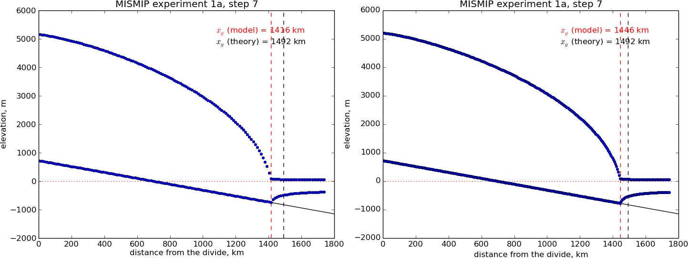
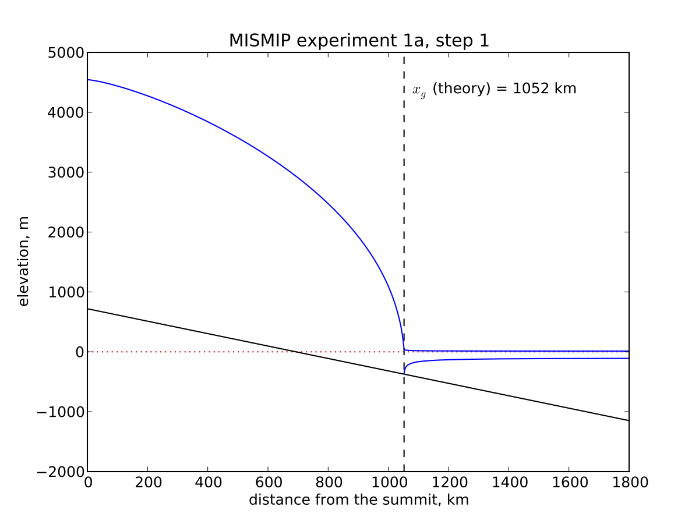
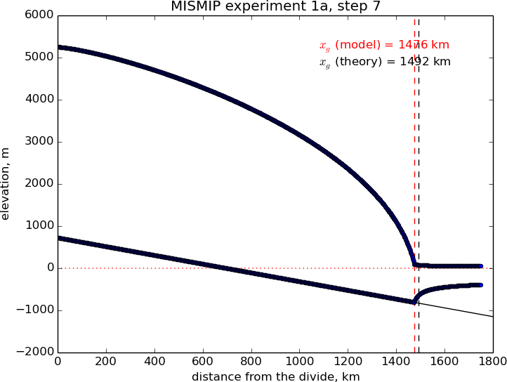

.. include:: ../../global.txt

.. _sec-MISMIP:

MISMIP
------

This intercomparison addresses grounding line dynamics by considering an idealized
one-dimensional stream-shelf system. In summary, a flowline ice stream and ice shelf
system is modeled, the reversibility of grounding line movement under changes in the ice
softness is tested, different sliding laws are tested, and the behavior of grounding lines
on reverse-slope beds is tested. The intercomparison process is described at the website

    |mismip-url|

Find a full text description there, along with the published report on the results
:cite:`MISMIP2012`; that paper includes results from PISM version 0.1. These documents are
essential reading for understanding MISMIP results generally, and for appreciating the
brief discussion in this subsection.

PISM's version of MISMIP includes an attached ice shelf even though modeling the shelf is
theoretically unnecessary in the flow line case. The analysis in :cite:`SchoofMarine1` shows
that the only effect of an ice shelf, in the flow line case, is to transfer the force
imbalance at the calving front directly to the ice column at the grounding line. Such an
analysis does not apply to ice shelves with two horizontal dimensions; real ice shelves
have "buttressing" and "side drag" and other forces not present in the flow line
:cite:`Goldbergetal2009`. See the next subsection on MISMIP3d and the Ross ice shelf example in
section :ref:`sec-ross`, among other examples.

We must adapt the usual 3D PISM model to two horizontal dimensions, i.e. to do flow-line
problems (see section :ref:`sec-flowline-modeling`). The flow direction for MISMIP is
taken to be "`x`". We periodize the cross-flow direction "`y`", and use the minimum number
of points in the `y`-direction. This number turns out to be "``-My 3``"; fewer points than
this in the cross-flow direction confuses the finite difference scheme.

PISM can do MISMIP experiments with either of two applicable ice dynamics models. Model 1
is a pure SSA model; "category 2" in the MISMIP classification. Model 2 combines SIA and
SSA velocities as described in :cite:`Winkelmannetal2011`; "category 3" because it resolves
"vertical" shear (i.e. using SIA flow).

There are many runs for a complete MISMIP intercomparison submission. Specifically, for a
given model there are `62` runs for each grid choice, and three (suggested) grid choices,
so a full suite is `3 \times 62 = 186` runs.

The coarsest grid ("mode 1") has 12 km spacing. The finest grid, "mode 2" with 1.2 km
spacing, accounts for all the compute time, however; in the MISMIP description it is 1500
grid spaces in the flow line direction (= 3001 grid *points* in PISM's doubled
computational domain). In between is "mode 3", a mode interpretable by the intercomparison
participant, and here we just use a 6 km grid.

The implementation of MISMIP in PISM conforms to the intercomparison description, but that
document specifies

    ... we require that the rate of change of grounding line position be `0.1` m/a or
    less, while the rate of change of ice thickness at each grid point at which ice
    thickness is defined must be less than `10^{-4}` m/a...

as a standard for "steady state". The scripts here do not implement this stopping
criterion. However, we report enough information, in PISM output files with scalar and
spatially-variable time-series, to compute a grounding line rate or the time at which the
thickness rate of change drops below `10^{-4}` m/a.

See

.. code-block:: none

   examples/mismip/mismip2d/README.md

for usage of the scripts that run MISMIP experiments in PISM. For example, as described in
this ``README.md``, the commands

.. code-block:: none

   ./run.py -e 1a --mode=1 > experiment-1a-mode-1.sh
   bash experiment-1a-mode-1.sh 2 >& out.1a-mode-1 &
   ./plot.py ABC1_1a_M1_A7.nc -p -o profileA7.png

first generate a bash script, then use it to do a run which takes about 20 minutes, and
then generate an image in ``.png`` format. Note that step 7 is in the middle of the
experiment. It is shown in :numref:`fig-MISMIPmodel1exper1aA7` (left).

   A marine ice sheet profile in the MISMIP intercomparison; PISM model 1, experiment 1a,
   at step 7. Left: grid mode 1 (12 km grid). Right: grid mode 3 (6 km grid).

   Analytical profile for steady state of experiment 1a, step 1, from theory in
   :cite:`SchoofMarine1`. This is a boundary layer asymptotic matching result, but not the
   exact solution to the equations.

The script ``MISMIP.py`` in ``examples/mismip/mismip2d`` has the ability to compute the
profile from the Schoof's :cite:`SchoofMarine1` asymptotic-matching boundary layer theory. This
script is a Python translation, using ``scipy`` and ``pylab``, of the `provided MATLAB
codes <mismip-code_>`_. For example,

.. code-block:: none

   python MISMIP.py -o mismip_analytic.png

produces a ``.png`` image file with :numref:`fig-SMexper1aM1A1`. By default
``run.py`` uses the asymptotic-matching thickness result from the :cite:`SchoofMarine1` theory
to initialize the initial ice thickness, as allowed by the MISMIP specification.

   Results from MISMIP grid mode 2, with 1.2 km spacing, for steady state of experiment
   1a: profile at step 7 (compare :numref:`fig-MISMIPmodel1exper1aA7`).

Generally the PISM result does not put the grounding line in the same location as Schoof's
boundary layer theory, and at least at coarser resolutions the problem is with PISM's
numerical solution, not with Schoof's semi-analytic theory. The result improves under grid
refinement, however. Results from grid mode 3 with 6 km spacing, instead of 12 km in mode
1, are the right part of :numref:`fig-MISMIPmodel1exper1aA7`. The corresponding
results from grid mode 2, with 1.2 km spacing, are in Figure
:numref:`fig-MISMIPmode2results`. Note that the difference between the numerical grounding
line location and the semi-analytical location has been reduced from 76 km for grid mode 1
to 16 km for grid mode 2 (a factor of about 5), by using a grid refinement from 12 km to
1.2 km (a factor of about 10).

