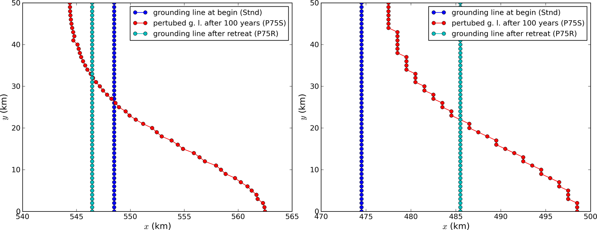

.. include:: ../../global.txt

.. _sec-MISMIP3d:

MISMIP3d
--------

The ice2sea MISMIP3d intercomparison is a two-horizontal-dimensional extension of the
flowline case described above. As before, in MISMIP3d the grounding line position and its
reversibility under changes of physical parameters is analyzed. Instead of changing the
ice softness, however, the spatial distribution and magnitude of basal friction is
adjusted between experiments. The applied basal friction perturbation of the basal
friction is a localized gaussian "bump" and thus a curved grounding line is obtained. In
contrast to the flowline experiments, no (semi-)analytical solutions are available to
compare to the numerical results.

A full description of the MISMIP3d experiments can be found at

   |mismip3d-url|

and the results are published in :cite:`MISMIP3d2013`.

A complete set of MISMIP3d experiments consists of three runs: Firstly, a flowline
solution on a linearly-sloped bed, similar to the flowline MISMIP experiments of the
previous section, is run into a steady state ("standard experiment ``Stnd``"). Then the
localized sliding perturbation is applied ("perturbation experiment") causing the
grounding line to shift and lose symmetry. Two different amplitudes of the perturbation
are considered ("``P10``" and "``P75``"). Finally, beginning from the final state of the
perturbation experiment, the sliding perturbation is removed and the system is run again
into steady state ("reversibility experiment"). The resulting geometry, in particular the
grounding line position, is expected to be close to that of the standard experiment.
Expecting such reversibility assumes that a particular stationary ice geometry only
depends on its physical parameters and boundary conditions and not on how it is
dynamically reached.

For these experiments in PISM, a Python script generates a shell script which has the
commands and options for running a MISMIP3d experiment. The python script is
``createscript.py`` in the folder ``examples/mismip/mismip3d/``. Run

.. code-block:: none

   ./createscript.py -h

to see a usage message. A ``README.md`` gives a tutorial on how to use ``createscript.py``
and do the runs themselves.

For the flowline ``Stnd`` experiment, as in the MISMIP case, a computational domain with
three grid points in the direction orthogonal to the ice flow (arbitrarily chosen as
y-direction) is chosen by ``createscript.py``. For the perturbation and reversibility
experiments a domain is defined which is symmetric along the ice-divide (mirror symmetry)
and along the center line of the ice flow, while the side boundaries are periodic, which
corresponds to a free-slip condition for the flow in x-direction. Though this choice of
the symmetric computational domain increases computational cost, it allows us to use
standard PISM without fixing certain boundary conditions in the code. (That is, it avoids
the issues addressed in the regional mode of PISM; see section :ref:`sec-jako`.)

PISM participated in the MISMIP3d intercomparison project :cite:`MISMIP3d2013` using version
pism0.5, and the exact results can be reproduced using that version. PISM's results, and
the role of resolution and the new subgrid grounding line interpolation scheme are
discussed in :cite:`Feldmannetal2014`.

We observed a considerable improvement of the results with respect to the absolute
grounding line positions compared to other models (e.g. the FE reference model Elmer/Ice)
and to the reversibility when applying the subgrid grounding line interpolation method;
see :numref:`fig-Subgl`. Furthermore, we observed that only using SSA yields almost
the same results as the full hybrid SIA+SSA computation for the MISMIP3D (and also the
MISMIP) experiments, but, when not applying the SIA computation, after a considerably
shorter computation time (about 10 times shorter). We explain the small and almost
negligible SIA velocities for the MISMIP(3D) experiments with the comparably small ice
surface gradients in the MISMIP3d ice geometries. See :numref:`fig-compSIASSA` for a
comparison of SSA and SIA velocities in the MISMIP3D geometry. Note that both Figures
:numref:`fig-Subgl` and :numref:`fig-compSIASSA` were generated with resolution of
`\dx = \dy = 1\km`.

   Comparison between the grounding lines of the higher-amplitude ("``P75``") MISMIP3d
   experiments performed with PISM when using the subgrid grounding line interpolation
   method (left) or not using it (right). In both cases the SIA+SSA hybrid is used.

.. figure:: figures/comp-SIA-SSA.png
   :name: fig-compSIASSA

   The SIA velocities are negligible in the MISMIP3d standard experiment ("``Stnd``"). The
   steady state ice geometry is plotted (black) together with the computed SSA velocity
   (red) and SIA velocity (blue). The SIA velocity reaches its maximum value of about
   `10` m/a at the grounding line, about two orders of magnitude less than the maximum of
   the SSA velocity.
