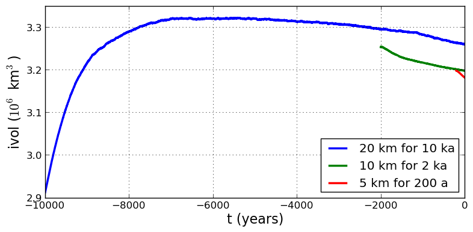

.. include:: ../../global.txt

.. _sec-gridseq:

Grid sequencing
---------------

The previous sections were not very ambitious. We were just getting started! Now we
demonstrate a serious PISM capability, the ability to change, specifically to *refine*,
the grid resolution at runtime.

One can of course do the longest model runs using a coarse grid, like the 20 km grid used
first. It is, however, only possible to pick up detail from high quality data, for
instance bed elevation and high-resolution climate data, using high grid resolution.

A 20 or 10 km grid is inadequate for resolving the flow of the ice sheet through the kind
of fjord-like, few-kilometer-wide topographical confinement which occurs, for example, at
Jakobshavn Isbrae in the west Greenland ice sheet :cite:`Joughinetal08`, an important
outlet glacier which both flows fast and drains a large fraction of the ice sheet. One
possibility is to set up an even higher-resolution PISM regional model covering only one
outlet glacier, but this requires decisions about coupling to the whole ice sheet flow.
(See section :ref:`sec-jako`.) Here we will work on high resolution for the whole ice
sheet, and thus all outlet glaciers.

Consider the following command and compare it to the :ref:`first one <firstcommand>`:

.. code-block:: none

   mpiexec -n 4 pismr \
           -bootstrap -i pism_Greenland_5km_v1.1.nc \
           -Mx 301 -My 561 \
           -Mz 201 -Lz 4000 -z_spacing equal \
           -Mbz 21 -Lbz 2000 \
           -ys -200 -ye 0 \
           -regrid_file g20km_10ka_hy.nc \
           -regrid_vars litho_temp,thk,enthalpy,tillwat,bmelt ...

Instead of a 20 km grid in the horizontal (``-Mx 76 -My 141``) we ask for a 5 km grid
(``-Mx 301 -My 561``). Instead of vertical grid resolution of 40 m (``-Mz 101 -z_spacing
equal -Lz 4000``) we ask for a vertical resolution of 20 m (``-Mz 201 -z_spacing equal -Lz
4000``).\ [#bootstrapping-grid]_ Most significantly, however, we say ``-regrid_file
g20km_10ka_hy.nc`` to regrid --- specifically, to bilinearly-interpolate --- fields from a
model result computed on the coarser 20 km grid. The regridded fields (``-regrid_vars
litho_temp,...``) are the evolving mass and energy state variables which are already
approximately at equilibrium on the coarse grid. Because we are bootstrapping (i.e. using
the ``-bootstrap`` option), the other variables, especially the bedrock topography
``topg`` and the climate data, are brought in to PISM at "full" resolution, that is, on
the original 5 km grid in the data file ``pism_Greenland_5km_v1.1.nc``.

This technique could be called "grid sequencing".\ [#not-mg]_

By approximating the equilibrium state on a coarser grid and then interpolating onto a
finer grid the command above allows us to obtain the near-equilibrium result on the finer
5km grid using a relatively short (200 model years) run. How close to equilibrium we get
depends on both durations, i.e. on both the coarse and fine grid run durations, but
certainly the computational effort is reduced by doing a short run on the fine grid. Note
that in the previous subsection we also used regridding. In that application, however,
``-regrid_file`` only "brings in" fields from a run on the same resolution.

Generally the fine grid run duration in grid sequencing should be at least `t = \dx /
v_{\text{min}}` where `\dx` is the fine grid resolution and `v_{\text{min}}` is the lowest
ice flow speed that we expect to be relevant to our modeling purposes. That is, the
duration should be such that slow ice at least has a chance to cross one grid cell. In
this case, if `\dx = 5` km and `v_{\text{min}} = 25` m/year then we get `t=200` a. Though
we use this as the duration, it is a bit short, and the reader might compare `t=500`
results (i.e. using `v_{\text{min}} = 10` m/year).

Actually we will demonstrate how to go from `20\km` to `5\km` in two
steps, `20\km\,\to\,10\km\,\to\,5\km`, with durations of `10000`,
`2000`, and `200` years, respectively. The 20 km coarse grid run is already done; the
result is in ``g20km_10ka_hy.nc``. So we run the following script which is ``gridseq.sh``
in ``examples/std-greenland/``. It calls ``spinup.sh`` to collect all the right PISM
options:

.. code-block:: bash

   #!/bin/bash
   NN=4
   export PARAM_PPQ=0.5
   export REGRIDFILE=g20km_10ka_hy.nc
   export EXSTEP=100
   ./spinup.sh $NN const 2000  10 hybrid g10km_gridseq.nc
   export REGRIDFILE=g10km_gridseq.nc
   export EXSTEP=10
   ./spinup.sh $NN const 200    5 hybrid  g5km_gridseq.nc

Environment variable ``EXSTEP`` specifies the time in years between writing the
spatially-dependent, and large-file-size-generating, frames for the ``-extra_file ...``
diagnostic output.

.. warning::

   The 5 km run requires 8 Gb of memory at minimum!

If you try it without at least 8 Gb of memory then your machine will "bog down" and start
using the hard disk for swap space! The run will not complete and your hard disk will get
a lot of wear! (If you have less than 8 Gb memory, comment out the last three lines of the
above script by putting the "``#``" character at the beginning of the line so that you
only do the 20 km `\to` 10 km refinement.)

Run the script like this:

.. code-block:: none

   ./gridseq.sh &> out.gridseq &

The 10 km run takes under two wall-clock hours (8 processor-hours) and the 5 km run takes
about 6 wall-clock hours (24 processor-hours).

.. figure:: figures/g40-20-10-5km-detail.png
   :name: fig-gridseqdetail

   Detail of field ``velsurf_mag`` showing the central western coast of Greenland,
   including Jakobshavn Isbrae (lowest major flow), from runs of resolution 40, 20, 10, 5
   km (left-to-right). Color scheme and scale, including 100 m/year contour (solid black),
   are all identical to ``velsurf_mag`` Figures :numref:`fig-secondoutputcoarse`,
   :numref:`fig-csurf-vs-observed`, and :numref:`fig-second-output-finer`.

:numref:`fig-gridseqdetail`, showing only a detail of the western coast of Greenland, with
several outlet glaciers visible, suggests what is accomplished: the high resolution runs
have separated outlet glacier flows, as they are in reality. Note that all of these results
were generated in a few wall clock hours on a laptop! The surface speed ``velsurf_mag``
from files ``g10km_gridseq.nc`` and ``g5km_gridseq.nc`` is shown (two right-most
subfigures). In the two left-hand subfigures we show the same field from NetCDF files
``g40km_10ka_hy.nc`` and ``g20km_10ka_hy.nc``; the former is an added 40 km result using
an obvious modification of the run in section :ref:`sec-ssarun`.

   Time series of ice volume ``ice_volume_glacierized`` from the three runs in our grid
   sequencing example: 20 km for 10 ka = ``ts_g20km_10ka_hy.nc``, 10 km for 2 ka =
   ``ts_g10km_gridseq.nc``, and 5 km for 200 a = ``ts_g5km_gridseq.nc``.

:numref:`fig-ivol-gridseq`, which shows time series of ice volume, also shows the cost of
high resolution, however. The short 200 a run on the 5 km grid took about 3 wall-clock
hours compared to the 10 minutes taken by the 10 ka run on a 20 km grid. The fact that the
time series for ice volume on 10 km and 5 km grids are not very "steady" also suggests
that these runs should actually be longer.

In this vein, if you have an available supercomputer then a good exercise is to extend our
grid sequencing example to 3 km or 2 km resolutions
:cite:`AschwandenAdalgeirsdottirKhroulev`; these grids are already supported in the script
``spinup.sh``. Note that the vertical grid also generally gets refined as the horizontal
grid is refined.

Going to a 1km grid is possible, but you will start to see the limitations of distributed
file systems in writing the enormous NetCDF files in question :cite:`DickensMorey2013`.
Notice that a factor-of-five refinement in all three dimensions, e.g. from 5 km to 1 km in
the horizontal, and from 20 m to 4 m in the vertical, generates an output NetCDF file
which is 125 times larger. Since the already-generated 5 km result ``g5km_gridseq.nc`` is
over 0.5 Gb, the result is a very large file at 1 km.

On the other hand, on fine grids we observe that *memory* parallelism, i.e. spreading the
stored model state over the separated memory of many nodes of supercomputers, is as
important as the usual *computation* (CPU) parallelism.

This subsection has emphasized the "P" in PISM, the nontrivial parallelism in which the
solution of the conservation equations, especially the stress balance equations, is
distributed across processors. An easier and more common mode of parallelism is to
distribute distinct model runs, each with different parameter values, among the
processors. For scientific purposes, such parameter studies, whether parallel or not, are
at least as valuable as individual high-resolution runs.

.. rubric:: Footnotes

.. [#bootstrapping-grid] See subsections :ref:`sec-bootstrapping`, :ref:`sec-coords`, and
   :ref:`sec-grid` for more about determining the computation domain and grid at
   bootstrapping.

.. [#not-mg] It is not quite "multigrid." That would both involve refinement and
   coarsening stages in computing the fine grid solution.
