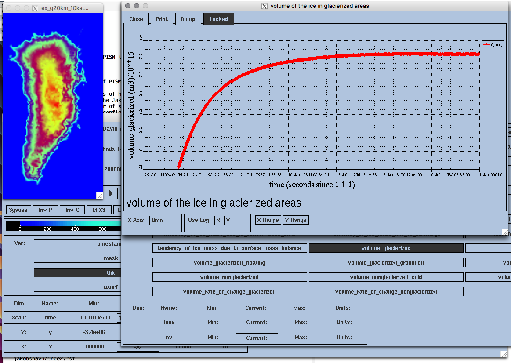
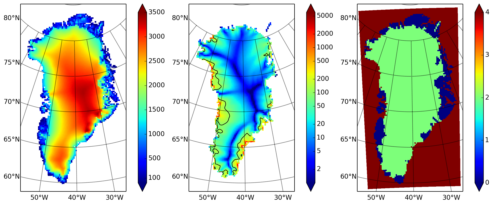

.. include:: ../../global.txt

.. _sec-watchrun:

Watching the first run
----------------------

As soon as the run starts it creates time-dependent NetCDF files ``ts_g20km_10ka.nc`` and
``ex_g20km_10ka.nc``. The latter file, which has spatially-dependent fields at each time,
is created after the first 100 model years, a few wall clock seconds in this case. The
command ``-extra_file ex_g20km_10ka.nc -extra_times -10000:100:0`` adds a
spatially-dependent "frame" at model times -9900, -9800, ..., 0.

To look at the spatial-fields output graphically, do:

.. code-block:: none

   ncview ex_g20km_10ka.nc

We see that ``ex_g20km_10ka.nc`` contains growing "movies" of the fields chosen by the
``-extra_vars`` option. A frame of the ice thickness field ``thk`` is shown in
:numref:`fig-growing` (left).

The time-series file ``ts_g20km_10ka.nc`` is also growing. It contains spatially-averaged
"scalar" diagnostics like the total ice volume or the ice-sheet-wide maximum velocity
(variable ``ice_volume_glacierized`` and ``max_hor_vel``, respectively). It can be viewed by
running

.. code-block:: none

   ncview ts_g20km_10ka.nc

The growing time series for ``ice_volume_glacierized`` is shown in :numref:`fig-growing`
(right). Recall that our intention was to generate a minimal model of the Greenland ice
sheet in approximate steady-state with a steady (constant-in-time) climate. The measurable
steadiness of the ``ice_volume_glacierized`` time series is a possible standard for steady
state (see :cite:`EISMINT00`, for exampe).

   Two views produced by ``ncview`` during a PISM model run.

   :Left: :var:`thk`, the ice sheet thickness, a space-dependent field, from file
          ``ex_g20km_10ka.nc``.
   :Right: :var:`ice_volume_glacierized`, the total ice sheet volume time-series, from file
           ``ts_g20km_10ka.nc``.

At the end of the run the output file ``g20km_10ka.nc`` is generated.
:numref:`fig-firstoutput` shows some fields from this file. In the next subsections we
consider their "quality" as model results. To see a report on computational performance,
we do:

.. code-block:: none

   ncdump -h g20km_10ka.nc |grep history
   :history = "user@machine 2017-10-04 19:16:08 AKDT: PISM done.  Performance stats: 0.1784 wall clock hours, 0.7136 proc.-hours, 14005.0054 model years per proc.-hour.\n",

   Fields from output file ``g20km_10ka.nc``.

   :Left: :var:`usurf`, the ice sheet surface elevation in meters.
   :Middle: :var:`velsurf_mag`, the surface speed in meters/year, including the 100 m/year
            contour (solid black).
   :Right: :var:`mask`, with 0 = ice-free land, 2 = grounded ice, 4 = ice-free ocean.
