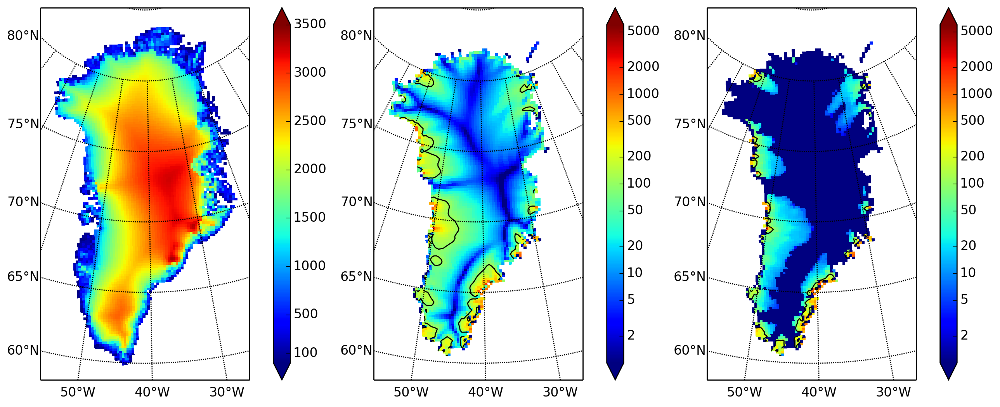
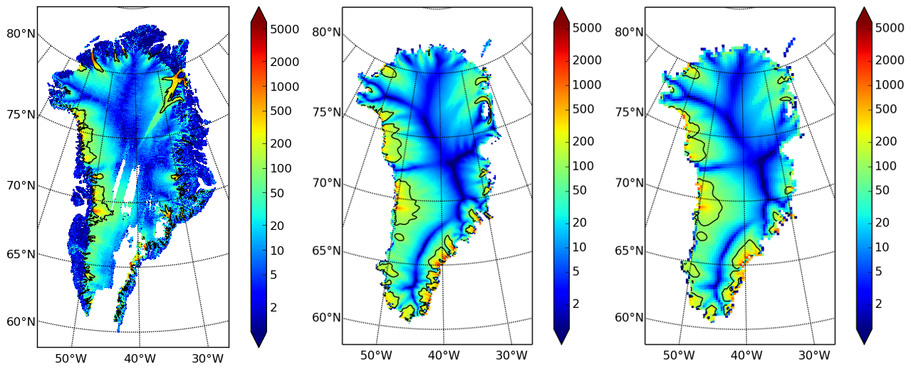

.. include:: ../../global.txt

.. _sec-ssarun:

Second run: a better ice-dynamics model
---------------------------------------

It is widely-understood that ice sheets slide on their bases, especially when liquid water
is present at the base (see :cite:`Joughinetal2001`, :cite:`MacAyeal`, among others). An
important aspect of modeling such sliding is the inclusion of membrane or "longitudinal"
stresses into the stress balance :cite:`BBssasliding`. The basic stress balance in PISM
which involves membrane stresses is the Shallow Shelf Approximation (SSA)
:cite:`WeisGreveHutter`. The stress balance used in the previous section was, by contrast,
the (thermomechanically-coupled) non-sliding, non-membrane-stress Shallow Ice
Approximation (SIA) :cite:`BBL`, :cite:`EISMINT00`. The preferred ice dynamics model
within PISM, that allows both sliding balanced by membrane stresses and shear flow as
described by the SIA, is the SIA+SSA "hybrid" model :cite:`BBssasliding`,
:cite:`Winkelmannetal2011`. For more on stress balance theories see section
:ref:`sec-dynamics` of this Manual.

The practical issue with models of sliding is that a distinctly-uncertain parameter space
must be introduced. This especially involves parameters controlling the amount and
pressure of subglacial water (see :cite:`AschwandenAdalgeirsdottirKhroulev`,
:cite:`Clarke05`, :cite:`Tulaczyketal2000`, :cite:`vanPeltOerlemans2012`, among others). In
this regard, PISM uses the concept of a saturated and pressurized subglacial till with a
modeled distribution of yield stress :cite:`BBssasliding`, :cite:`SchoofStream`. The yield
stress arises from the PISM model of the production of subglacial water, which is itself
computed through the conservation of energy model :cite:`AschwandenBuelerKhroulevBlatter`.
We use such models in the rest of this Getting Started section.

While the ``spinup.sh`` script has default sliding-related parameters, for demonstration
purposes we change one parameter. We replace the default power `q=0.25` in the
sliding law (the equation which relates both the subglacial sliding velocity and the till
yield stress to the basal shear stress which appears in the SSA stress balance) by a less
"plastic" and more "linear" choice `q=0.5`. See section :ref:`sec-basestrength`
for more on sliding laws. To see the run we propose, do

.. literalinclude:: scripts/run-2-echo.sh
   :language: bash
   :lines: 3-

Now remove "``PISM_DO=echo``" and redirect the text output into a file to start the run:

.. literalinclude:: scripts/run-2.sh
   :language: bash
   :lines: 3-

This run should take 10 minutes or less.\ [#]_

When this run is finished it produces ``g20km_10ka_hy.nc``.  As before do

.. code-block:: none

   ncdump -h g20km_10ka_hy.nc |grep history

to see performance results for your machine.

The results of this run are shown in :numref:`fig-secondoutputcoarse`. We show the basal
sliding speed field ``velbase_mag`` in this Figure, where :numref:`fig-firstoutput` had
the ``mask``, but the reader can check that ``velbase_mag`` is zero in the nonsliding
SIA-only result ``g20km_10ka.nc``.

   Fields from output file ``g20km_10ka_hy.nc``.

   :Left: :var:`usurf`, the ice sheet surface elevation in meters.
   :Middle: :var:`velsurf_mag`, the surface speed in m/year, including the 100 m/year
            contour (solid black).
   :Right: the sliding speed :var:`velbase_mag`, shown the same way as :var:`velsurf_mag`.

The hybrid model includes sliding, and it is important to evaluate that aspect of the
output. However, though it is critical to the response of the ice to changes in climate,
basal sliding velocity is essentially unobservable in real ice sheets. On the other hand,
because of relatively-recent advances in radar and image technology and processing
:cite:`Joughin2002`, the surface velocity of an ice sheet can be measured.

So, how good is our model result ``velsurf_mag``? :numref:`fig-csurf-vs-observed` compares
the radar-observed ``surfvelmag`` field in the downloaded SeaRISE-Greenland data file
``Greenland_5km_v1.1.nc`` with the just-computed PISM result (20 km) and results from the next step in the tutorial (10 km). 
The reader might agree with these broad qualitative judgements:

- the model results and the observed surface velocity look similar, and
- slow near-divide flow is generally in the right areas and of generally the right
  magnitude, but
- the observed Northeast Greenland ice stream is more distinct than in the model.

   Comparing observed and modeled surface speed.

   All figures have a common scale (m/year), with 100 m/year contour shown (solid black).

   :Left: :var:`surfvelmag`, the observed values from SeaRISE data file
          ``Greenland_5km_v1.1.nc``.
   :Middle: :var:`velsurf_mag` from ``g10km_10ka_hy.nc`` (will be run in next step of tutorial).
   :Right: :var:`velsurf_mag` from ``g20km_10ka_hy.nc``.

We can compare these PISM results to other observed-vs-model comparisons of surface
velocity maps, for example Figure 1 in :cite:`Priceetal2011` and Figure 8 in
:cite:`Larouretal2012`. Only ice-sheet-wide parameters and models were used here in PISM,
that is, each location in the ice sheet was modeled by the same physics. By comparison,
those published comparisons involved tuning a large number of spatially-variable
subglacial parameters to values which would yield close match to observations of the
surface velocity. Such tuning techniques, called "inversion" or "assimilation" of the
surface velocity data, are also possible in PISM,\ [#]_ but the advantage of having few
parameters in a model is well-known: the results reflect the underlying model, not the
flexibility of many parameters.

We have only tried two of the many models possible in PISM, and we are free to identify
and adjust important parameters. The first parameter change we consider, in the next
subsection, is one of the most important: grid resolution.

.. rubric:: Footnotes

.. [#] Regarding the relative speeds of the runs that produce ``g20km_10ka.nc`` and
       ``g20km_10ka_hy.nc``, note that the computation of the SSA stress balance is
       substantially more expensive than the SIA in a per-step sense. However, the SSA
       stress balance in combination with the mass continuity equation causes the maximum
       diffusivity in the ice sheet to be substantially lower during the run. Because the
       maximum diffusivity controls the time-step in the PISM adaptive time-stepping
       scheme :cite:`BBL`, the number of time steps is reduced in the hybrid run. To see
       this contrast use ``ncview ts_g20km_10ka*nc`` to view variables ``max_diffusivity``
       and ``dt``.

.. [#] See :cite:`vanPeltetal2013` (inversion of DEMs for basal topography) and
       :cite:`Habermannetal2013` (inversion surface velocities for basal shear stress) for
       PISM-based inversion methods and analysis.
