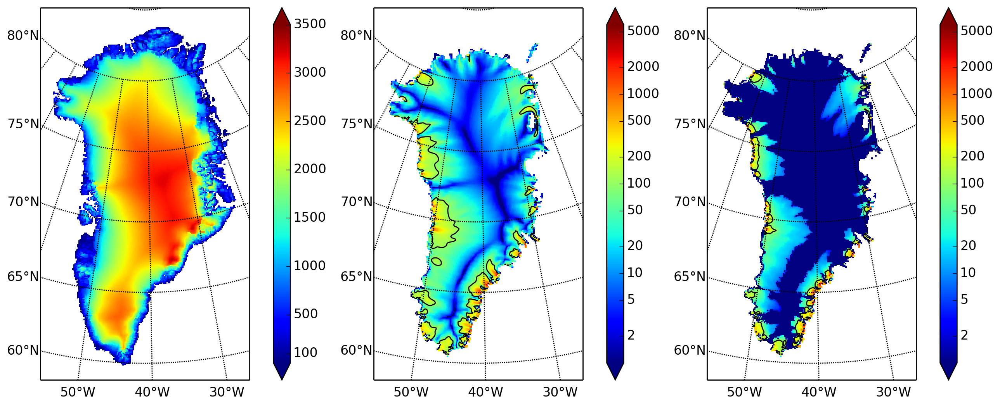

.. include:: ../../global.txt

.. _sec-higherresrun:

Third run: higher resolution
----------------------------

Now we change one key parameter, the grid resolution. Model results differ even when the
only change is the resolution. Using higher resolution "picks up" more detail in the bed
elevation and climate data.

If you can let it run overnight, do

.. literalinclude:: scripts/run-3.sh
   :language: bash
   :lines: 3-

This run might take 4 to 6 hours. However, supposing you have a larger parallel computer,
you can change "``mpiexec -n 4``" to "``mpiexec -n N``" where ``N`` is a substantially
larger number, up to 100 or so with an expectation of reasonable scaling on this grid
:cite:`BBssasliding`, :cite:`DickensMorey2013`.

   Fields from output file ``g10km_10ka_hy.nc``.

   Compare to :numref:`fig-secondoutputcoarse`, which only differs by resolution.

   :Left: :var:`usurf` in meters.
   :Middle: :var:`velsurf_mag` in m/year.
   :Right: :var:`velbase_mag` in m/year.

Some fields from the result ``g10km_10ka_hy.nc`` are shown in
:numref:`fig-secondoutputfiner`. :numref:`fig-csurfvsobserved` also compares observed
velocity to the model results from 20 km and 10 km grids. As a different comparison,
:numref:`fig-ivolboth` shows ice volume time series ``ice_volume_glacierized`` for 20 km and
10 km runs done here. We see that this result depends on resolution, in particular because
higher resolution grids allow the model to better resolve the flux through
topographically-controlled outlet glaciers (compare :cite:`Pfefferetal2008`). However,
because the total ice sheet volume is a highly-averaged quantity, the
``ice_volume_glacierized`` difference from 20 km and 10 km resolution runs is only about one
part in 60 (about 1.5%) at the final time. By contrast, as is seen in the near-margin ice
in various locations shown in :numref:`fig-csurfvsobserved`, the ice velocity at a
particular location may change by 100\% when the resolution changes from 20 km to 10 km.

Roughly speaking, the reader should only consider trusting model results which are
demonstrated to be robust across a range of model parameters, and, in particular, which
are shown to be relatively-stable among relatively-high resolution results for a
particular case. Using a supercomputer is justified merely to confirm that
lower-resolution runs were already "getting" a given feature or result.

.. figure:: figures/ivol-both-g20km-g10km.png
   :name: fig-ivolboth

   Time series of modeled ice sheet volume ``ice_volume_glacierized`` on 20km and 10km grids.
   The present-day ice sheet has volume about `2.9\times 10^6\,\text{km}^3`
   :cite:`BamberLayberryGogenini`, the initial value seen in both runs.
