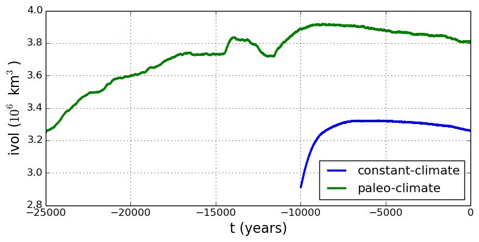

.. include:: ../../global.txt

.. _sec-paleorun:

Fourth run: paleo-climate model spin-up
---------------------------------------

A this point we have barely mentioned one of the most important players in an ice sheet
model: the surface mass balance (SMB) model. Specifically, an SMB model combines
precipitation (e.g. :cite:`Balesetal2001` for present-day Greenland) and a model for melt.
Melt models are always based on some approximation of the energy available at the ice
surface :cite:`Hock05`. Previous runs in this section used a "constant-climate"
assumption, which specifically meant using the modeled present-day SMB rates from the
regional climate model RACMO :cite:`Ettemaetal2009`, as contained in the SeaRISE-Greenland
data set ``Greenland_5km_v1.1.nc``.

While a physical model of ice dynamics only describes the movement of the ice, the SMB
(and the sub-shelf melt rate) are key inputs which directly determine changes in the
boundary geometry. Boundary geometry changes then influence the stresses seen by the
stress balance model and thus the motion.

There are other methods for producing SMB than using present-day modeled values. We now
try such a method, a "paleo-climate spin-up" for our Greenland ice sheet model. Of course,
direct measurements of prior climates in Greenland are not available as data! There are,
however, estimates of past surface temperatures at the locations of ice cores (see
:cite:`JohnsenetalGRIP` for GRIP), along with estimates of past global sea level
:cite:`Imbrieetal1984` which can be used to determine where the flotation criterion is
applied---this is how PISM's ``mask`` variable is determined. Also, models have been
constructed for how precipitation differs from the present-day values
:cite:`Huybrechts02`. For demonstration purposes, these are all used in the next run. The
relevant options are further documented in the :ref:`Climate Forcing Manual
<sec-climate-forcing>`.

As noted, one must compute melt in order to compute SMB. Here this is done using a
temperature-index, :ref:`"positive degree-day" <sec-surface-pdd>` (PDD) model :cite:`Hock05`. Such a PDD model has
parameters for how much snow and/or ice is melted when surface temperatures spend time
near or above zero degrees. Again, see the :ref:`Climate Forcing Manual
<sec-climate-forcing>` for relevant options.

To summarize the paleo-climate model applied here, temperature offsets from the GRIP core
record affect the snow energy balance, and thus the rates of melting and runoff calculated
by the PDD model. In warm periods there is more marginal ablation, but precipitation may
also increase (according to a temperature-offset model :cite:`Huybrechts02`). Additionally
sea level undergoes changes in time and this affects which ice is floating. Finally we add
an earth deformation model, which responds to changes in ice load by changing the bedrock
elevation :cite:`BLKfastearth`.

To see how all this translates into PISM options, run

.. literalinclude:: scripts/run-4-echo.sh
   :language: bash
   :lines: 3-

You will see an impressively-long command, which you can compare to the :ref:`first one
<firstcommand>`. There are several key changes. First, we do not start from scratch but
instead from a previously computed near-equilibrium result:

.. code-block:: none

     -regrid_file g20km_10ka_hy.nc -regrid_vars litho_temp,thk,enthalpy,tillwat,bmelt

For more on regridding see section :ref:`sec-regridding`. Then we turn on the earth
deformation model with option ``-bed_def lc``; see section :ref:`sec-beddef`. After
that the atmosphere and surface (PDD) models are turned on and the files they need are
identified:

.. code-block:: none

     -atmosphere searise_greenland,delta_T,paleo_precip -surface pdd \
     -atmosphere_paleo_precip_file pism_dT.nc -atmosphere_delta_T_file pism_dT.nc

Then the sea level forcing module providing both a time-dependent sea level to the ice
dynamics core, is turned on with ``-sea_level constant,delta_sl`` and the file it needs is
identified with ``-ocean_delta_sl_file pism_dSL.nc``. For all of these "forcing" options,
see the :ref:`Climate Forcing Manual <sec-climate-forcing>`. The remainder of the options
are similar or identical to the run that created ``g20km_10ka_hy.nc``.

To actually start the run, which we rather arbitrarily start at year `-25000`, essentially
at the LGM, do:

.. literalinclude:: scripts/run-4.sh
   :language: bash
   :lines: 3-

This run should only take one or two hours, noting it is at a coarse 20 km resolution.

The fields ``usurf``, ``velsurf_mag``, and ``velbase_mag`` from file
``g20km_25ka_paleo.nc`` are sufficiently similar to those shown in
:numref:`fig-secondoutputcoarse` that they are not shown here. Close inspection reveals
differences, but of course these runs only differ in the applied climate and run duration
and not in resolution or ice dynamics parameters.

To see the difference between runs more clearly, :numref:`fig-ivolconstpaleo` compares the
time-series variable ``ice_volume_glacierized``. We see the effect of option ``-regrid_file
g20km_10ka_hy.nc -regrid_vars ...,thk,...``, which implies that the paleo-climate run
starts with the ice geometry from the end of the constant-climate run.

   Time series of modeled ice sheet volume ``ice_volume_glacierized`` from constant-climate
   (blue; ``ts_g20km_10ka_hy.nc``) and paleo-climate (green; ``ts_g20km_25ka_paleo.nc``)
   spinup runs. Note that the paleo-climate run started with the ice geometry at the end
   of the constant-climate run.

Another time-series comparison, of the variable ``ice_volume_glacierized_temperate``, the
total volume of temperate (at `0^\circ C`) ice, appears in
:numref:`fig-ivoltempconstpaleo`. The paleo-climate run shows the cold period from
`\approx -25` ka to `\approx -12` ka. Both constant-climate and paleo-climate runs then
come into rough equilibrium in the holocene. The bootstrapping artifact, seen at the start
of the constant-climate run, which disappears in less than 1000 years, is avoided in the
paleo-climate run by starting with the constant-climate end-state. The reader is
encouraged to examine the diagnostic files ``ts_g20km_25ka_paleo.nc`` and
``ex_g20km_25ka_paleo.nc`` to find more evidence of the (modeled) climate impact on the
ice dynamics.

.. figure:: figures/ivoltemp-const-paleo.png
   :name: fig-ivoltempconstpaleo

   Time series of temperate ice volume ``ice_volume_glacierized_temperate`` from
   constant-climate (blue; ``ts_g20km_10ka_hy.nc``) and paleo-climate (green;
   ``ts_g20km_25ka_paleo.nc``) spinup runs. The cold of the last ice age affects the
   fraction of temperate ice. Note different volume scale compared to that in
   :numref:`fig-ivolconstpaleo`; only about 1\% of ice is temperate (by volume).
