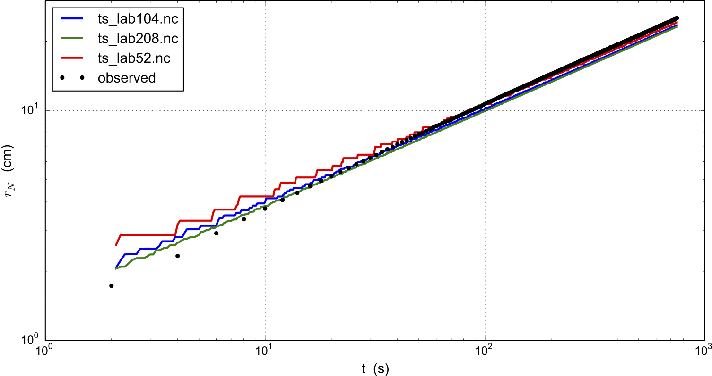

.. include:: ../../global.txt

.. _sec-labgum:

An SIA flow model for a table-top laboratory experiment
-------------------------------------------------------

Though there are additional complexities to the flow of real ice sheets, an ice sheet is a
shear-thinning fluid with a free surface. PISM ought to be able to model such flows in
some generality. We test that ability here by comparing PISM's isothermal SIA numerical
model to a laboratory observations of a 1% Xanthan gum suspension in water in a
table-top, moving-margin experiment by R. Sayag and M. Worster
:cite:`SayagWorster2013`, :cite:`SayagPeglerWorster2012`. The "gum" fluid is more shear-thinning
than ice, and it has much lower absolute viscosity values, but it has the same density.
This flow has total mass `\sim 1` kg, compared to `\sim 10^{18}` kg for the Greenland ice
sheet.

We compare our numerical results to the "constant-flux" experiment from
:cite:`SayagWorster2013`. :numref:`fig-labgumexperiment` shows the experimental setup by
reproducing Figures 2(c) and 2(d) from that reference. A pump pushes the translucent
blue-dyed fluid through a round 8 mm hole in the middle of a clear table-top at a mass
rate of about 3 gm/s. The downward-pointing camera, which produced the right-hand figure,
allows measurement of the location of margin of the "ice cap", and in particular of its
radius. The measured radii data are the black dots in :numref:`fig-labgumresult`.

.. figure:: figures/labgumexperiment.png
   :name: fig-labgumexperiment

   Reproduction of Figures 2(c) and 2(d) from :cite:`SayagWorster2013`. Left: experimental
   apparatus used for "constant-flux release" experiment. Right: snapshot of constant-flux
   experiment (plan view), showing an axisymmetric front.

The closest glaciological analog would be an ice sheet on a flat bed fed by positive basal
mass balance (i.e. "refreeze") underneath the dome, but with zero mass balance elsewhere
on the lower and upper surfaces. However, noting that the mass-continuity equation is
vertically-integrated, we may model the input flux (mass balance) as arriving at the
*top* of the ice sheet, to use PISM's climate-input mechanisms. The flow though the
input hole is simply modeled as constant across the hole, so the input "climate" uses
``-surface given`` with a field ``climatic_mass_balance``, in the bootstrapping
file, which is a positive constant in the hole and zero outside. While our replacement of
flow into the base by mass balance at the top represents a very large change in the
vertical component of the velocity field, we still see good agreement in the overall shape
of the "ice sheet", and specifically in the rate of margin advance.

Sayag & Worster estimate Glen exponent `n = 5.9` and a softness coefficient `A = 9.7
\times 10^{-9}\,\text{Pa}^{-5.9}\,\text{s}^{-1}` for the flow law of their gum suspension,
using regression of laboratory measurements of the radius. (Compare PISM defaults `n=3`
and `A\approx 4\times 10^{-25}\,\text{Pa}^{-3}\,\text{s}^{-1}` for ice.) Setting the Sayag
\& Worster values is one of several changes to the configuration parameters, compared to
PISM ice sheet defaults, which are done in part by overriding parameters at run time by
using the ``-config_override`` option. See ``examples/labgum/preprocess.py`` for
the generation of a configuration ``.nc`` file with these settings.

To run the example on the default 10 mm grid, first do

.. code-block:: none

   ./preprocess.py

and then do a run for 746 model seconds :cite:`SayagWorster2013` on the 10 mm grid on a
`520\,\text{mm}\,\times 520\,\text{mm}` square domain using 4 processors:

.. code-block:: none

   ./rungum.sh 4 52 &> out.lab52 &

This run generates text file ``out.lab52``, diagnostic files ``ts_lab52.nc`` and
``ex_lab52.nc``, and final output ``lab52.nc``. This run took about 5 minutes on
a 2013 laptop, thus roughly real time! When it is done, you can compare the modeled radius
to the experimental data:

.. code-block:: none

   ./showradius.py -o r52.png -d constantflux3.txt ts_lab52.nc

You can also redo the whole thing on higher resolution grids (here: 5 and 2.5 mm), here
using 6 MPI processes if the runs are done simultaneously, and when it is done after
several hours, make a combined figure just like :numref:`fig-labgumresult`:

.. code-block:: none

   ./preprocess.py -Mx 104 -o initlab104.nc
   ./preprocess.py -Mx 208 -o initlab208.nc
   ./rungum.sh 2 104 &> out.lab104 &
   ./rungum.sh 4 208 &> out.lab208 &
   ./showradius.py -o foo.png -d constantflux3.txt ts_lab*.nc

   Radius `r_N(t)` for runs with 10 mm (``ts_lab52.nc``), 5 mm (``ts_lab104.nc``), and 2.5
   mm (``ts_lab208.nc``) grids, compared to observations from Sayag & Worster's
   :cite:`SayagWorster2013` table-top "ice cap" (gravity current) made from a 1% Xanthan
   gum suspension, as shown in Figure :numref:`fig-labgumexperiment`.

We see that on the coarsest grid the modeled volume has "steps" because the margin
advances discretely. Note we are computing the radius by first computing the fluid-covered
area `a` on the cartesian grid, and then using `a=\pi r^2` to compute the radius.

Results are better on finer grids, especially at small times, because the input hole has
radius of only 8 mm. Furthermore this "ice cap" has radius comparable to the hole for the
first few model seconds. The early evolution is thus distinctly non-shallow, but we see
that increasing the model resolution reduces most of the observation-model difference. In
fact there is little need for "higher-order" stresses because the exact similarity
solution of the shallow continuum equations, used by Sayag & Worster, closely-fits the
data even for small radius and time (see :cite:`SayagWorster2013`, Figure 4).

In any case, the large-time observations are very closely-fit by the numerical results at
all grid resolutions. We have used the Glen-law parameters `n,A` as calculated by Sayag &
Worster, but one could do parameter-fitting to get the "best" values if desired. In
particular, roughly speaking, `n` controls the slope of the results in
:numref:`fig-labgumresult` and `A` controls their vertical displacement.
