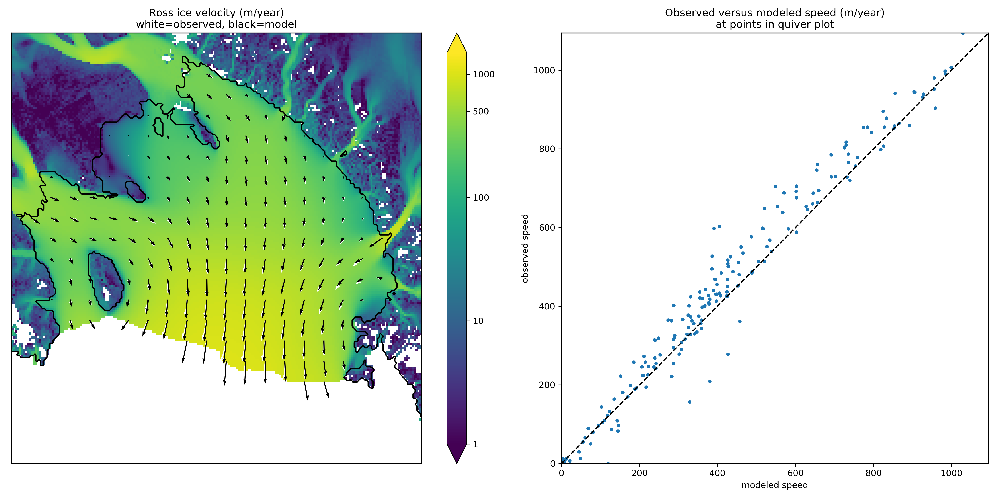

.. include:: ../../global.txt

.. _sec-ross:

An SSA flow model for the Ross Ice Shelf in Antarctica
------------------------------------------------------

As part of the EISMINT series of intercomparisons, MacAyeal and others :cite:`MacAyealetal`
successfully validated early-1990s ice shelf numerical models using velocity data for the
Ross ice shelf. The data were from the RIGGS survey :cite:`RIGGS2`, acquired in the period
1973--1978 and measured at a few hundred locations in a grid across the shelf. Substantial
modelling developments followed EISMINT-Ross, including inverse modeling to recover
depth-averaged viscosity :cite:`RommelaereMacAyeal` and parameter-sensitivity studies
:cite:`HumbertGreveHutter`. Previous PISM versions set up the EISMINT-Ross flow model and
performed the diagnostic computation, with RIGGS data for validation.

However, availability of rich new data sets for ice sheet modeling, including the ALBMAP
v1 :cite:`LeBrocqetal2010` ice sheet geometry, bedrock, and climate data set, and the
radar-derived (InSAR) MEaSUREs Antarctica Velocity Map :cite:`Rignotetal2011`, allows us to
use more complete, recent, and higher-resolution data for the same basic job. Furthermore
one can extend the diagnostic Ross ice shelf calculation both to other ice shelves around
Antarctica and to time-evolving ("prognostic") cases using the eigencalving
:cite:`Levermannetal2012` mechanisms.

The scripts in this subsection are found in directory ``examples/ross/``. In summary, the
script ``preprocess.py`` downloads easily-available data and builds a NetCDF input file
for PISM. For the diagnostic computation we document first, the script ``run_diag.sh`` (in
subdirectory ``examples/ross/diagnostic/``) runs PISM. The script ``plot.py`` shows a
comparison of observations and model results, as in :numref:`fig-rosspython`.

Preprocessing input data
^^^^^^^^^^^^^^^^^^^^^^^^

NSIDC_ requires registration to download the `MEaSUREs InSAR-Based Antarctica Ice Velocity
Map <measures-ross_>`_; please register, log in, and get the *first*, 900 m version
of it (``antarctica_ice_velocity_900m.nc``) here:

    https://n5eil01u.ecs.nsidc.org/MEASURES/NSIDC-0484.001/1996.01.01/

Put this file in ``examples/ross``.

The script ``preprocess.py`` then downloads ALBMAP using ``wget``; these two files total
around 350 Mb. Then it uses NCO_ to cut out the relevant portion of the grid and CDO_ to
conservatively-interpolate the high-resolution (900 m) velocity data onto the coarser (5
km) geometry grid used in ALBMAP. The script ``nc2cdo.py`` from directory ``util/``,
prepares the NetCDF file for the application of CDO, which requires complete projection
information. Run

.. code-block:: none

   cd examples/ross/
   ./preprocess.py

to download ALBMAP and finish the pre-processing.

The NetCDF file ``Ross_combined.nc`` produced by ``preprocess.py`` contains ice thickness,
bed elevations, surface temperature, net accumulation, as well as latitude and longitude
values. All of these are typical of ice sheet modelling data, both in diagnostic runs and
as needed to initialize and provide boundary conditions for prognostic (evolutionary)
runs; see below for the prognostic case with these data. The ``_combined`` file also has
variables ``u_ssa_bc`` and ``v_ssa_bc`` for the boundary values used in the (diagnostic
and prognostic) computation of velocity. They are used at all grounded locations and at
ice shelf cells that are immediate neighbors of grounded ice. The variable ``bc_mask``
specifies these locations. Finally the variables ``u_ssa_bc,v_ssa_bc``, which contain
observed values, are used after the run to compare to the computed interior velocities.

Diagnostic computation of ice shelf velocity
^^^^^^^^^^^^^^^^^^^^^^^^^^^^^^^^^^^^^^^^^^^^

The diagnostic velocity computation bootstraps from ``Ross_combined.nc`` and performs a
short run; in the `211\times 211` grid case we demonstrate below, the key parts of the
PISM command are

.. code-block:: none

   pismr -i ../Ross_combined.nc -bootstrap -Mx 211 -My 211 -Mz 3 -Lz 3000 -z_spacing equal \
       -surface given -stress_balance ssa -energy none -no_mass -yield_stress constant -tauc 1e6 \
       -pik -ssa_dirichlet_bc -y 1.0 -ssa_e 0.6 -ssafd_ksp_monitor

The computational grid here is the "native" `5` km data grid used in ALBMAP. Regarding the
options,

- The maximum thickness of the ice is `2766` m so we choose a height for the computational
  box large enough to contain the ice (i.e. ``-Lz 3000``). Vertical grid resolution
  is, however, unimportant in this case because we use the SSA stress balance only, and
  the temperature set at bootstrapping suffices to determine the ice softness; thus the
  options ``-Mz 3 -z_spacing equal``.

- Option ``-stress_balance ssa`` selects the SSA stress balance and turns off the SIA
  stress balance computation, since our goal is to model the ice shelf. It also side-steps
  a technical issue: PISM uses periodic boundary conditions at domain boundaries and most
  fields in this setup are not periodic. Turning off SIA avoids operations such as
  differencing surface elevation across the domain edges. For a more complete solution to
  this technical issue see section :ref:`sec-jako` about a regional model using PISM's
  "regional mode" ``pismr -regional`` and the option :opt:`-no_model_strip`.

- Option ``-y 1.0 -no_mass -energy none`` chooses a "diagnostic" run: in absence of
  geometry evolution and stability restrictions of the energy balance model a
  one-year-long run will be covered by exactly one time step.

- Option ``-pik`` is equivalent to ``-cfbc -part_grid -kill_icebergs -subgl`` in this
  non-evolving example. Note that ``-kill_icebergs`` removes effectively-detached bits of
  ice, especially in McMurdo sound area, so that the SSA problem is well-posed for the
  grounded-ice-sheet-connected ice shelf.

- Option :opt:`-ssa_dirichlet_bc` forces the use of fields ``u_ssa_bc, v_ssa_bc, bc_mask``
  described above. The field ``bc_mask`` is `1` at boundary condition locations, and `0`
  elsewhere. For the prognostic runs below, the ice thickness is also fixed at boundary
  condition locations, so as to prescribe ice flux as an ice shelf input.

- Options ``-yield_stress constant -tauc 1e6`` essentially just turn off the
  grounded-ice evolving yield stress mechanism, which is inactive anyway, and force a high
  resistance under grounded ice so it does not slide.

- Option ``-ssa_e 0.6`` is the single tuned parameter; this value gives good
  correlation between observed and modeled velocity magnitudes.

- Option ``-ssafd_ksp_monitor`` provides feedback on the linear solver iterations
  "underneath" the nonlinear (shear-thinning) SSA solver iteration.

There is no need to type in the above command; just run

.. code-block:: none

   cd diagnostic/
   ./run_diag.sh 2 211 0.6

Note ``run_diag.sh`` accepts three arguments: ``run_diag.sh N Mx E`` does a run
with ``N`` MPI processes, an ``Mx`` by ``Mx`` grid, and option
``-ssa_e E``. The choices above give a run which only takes a few seconds, and it
produces output file ``diag_Mx211.nc``.

There are many reasonable choices for the effective softness of an ice shelf, as ice
density, temperature, and the presence of fractures all influence the effective softness.
Using an enhancement factor :opt:`-ssa_e 0.6` acknowledges that the physical justification
for tuning the ice softness is uncertain. One could instead use the temperature itself or
the ice density\ [#]_ as tuning parameters, and these are worthwhile experiments for the
interested PISM user.

The script ``plot.py`` takes PISM output such as ``diag_Mx211.nc`` to produce
:numref:`fig-rosspython`. The run shown in the figure used an enhancement factor of
`0.6` as above. The thin black line outlines the floating shelf, which is the actual
modeling domain here. To generate this figure yourself, run

.. code-block:: none

   ../plot.py diag_Mx211.nc

   *Left*: Color is speed in m/a. Arrows are observed (white) and modeled (black)
   velocities. *Right*: Comparison between modeled and observed speeds at points plotted
   on the left.

Extending this example to other ice shelves
^^^^^^^^^^^^^^^^^^^^^^^^^^^^^^^^^^^^^^^^^^^

The SSA diagnostic solution described in this section can be easily applied to other ice
shelves in Antarctica, such as the Filchner-Ronne Ice Shelf modeled using PISM in
:cite:`AlbrechtLevermann2012`, for example.

Simply choose a different rectangular domain, within the area covered by the
whole-Antarctic data-sets used here, at the preprocessing stage. In particular you should
modify the lines "``ncks -O -d x1,439,649 -d y1,250,460 ...``" (for ALBMAP data) and
"``ncks -d x,2200,3700 -d y,3500,4700 ...``" (for MEaSUREs velocity data) in the
script ``examples/ross/preprocess.py``.

Prognostic modelling using eigencalving
^^^^^^^^^^^^^^^^^^^^^^^^^^^^^^^^^^^^^^^

Next we summarize how you can create an evolving-geometry model of the Ross ice shelf with
constant-in-time inflow across the fixed grounding line. See ``README.md`` and
``run_prog.sh`` in ``examples/ross/prognostic/``. This example also demonstrates the
:opt:`-calving eigen_calving` model for a moving calving front :cite:`Levermannetal2012`.

Start by running ``preprocess.py`` in ``examples/ross/`` as described above. If
you have already done the diagnostic example above, then this stage is complete.

Then change to the ``prognostic/`` directory and run the default example:

.. code-block:: none

   cd examples/ross/prognostic/
   ./run_prog.sh 4 211 0.6 100

This 100 model year run on 4 processes and a 5 km grid took about forty minutes on a 2016
laptop. It starts with a bootstrapping stage which does a ``-y 1.0`` run, which generates
``startfile_Mx211.nc``. It then re-initializes to start the prognostic run itself. See the
``README.md`` for a bit more on the arguments taken by ``run_prog.sh`` and on viewing the
output files.

The PISM command done here is (essentially, and without showing diagnostic output choices)

.. code-block:: none

   pismr -i startfile_Mx211.nc -surface given -stress_balance ssa \
       -yield_stress constant -tauc 1e6 -pik -ssa_dirichlet_bc -ssa_e 0.6 \
       -y 100 -o prog_Mx211_yr100.nc -o_size big \
       -calving eigen_calving,thickness_calving -eigen_calving_K 1e17 \
       -front_retreat_cfl -thickness_calving_threshold 50.0

Several of these options are different from those used in the diagnostic case. First,
while the command ``-pik`` is the same as before, now each part of its expansion, namely
``-cfbc -part_grid -kill_icebergs -subgl``, is important. As the calving front evolves
(i.e. regardless of the calving law choices), option ``-part_grid`` moves the calving
front by one grid cell only when the cell is full of the ice flowing into it; see
:cite:`Albrechtetal2011`. The option ``-kill_icebergs`` is essential to maintain well-posedness
of the SSA velocity problem at each time step :cite:`Winkelmannetal2011`. See section
:ref:`sec-pism-pik`.

Option combination

.. code-block:: none

       -calving eigen_calving,thickness_calving -eigen_calving_K 1e17 \
       -front_retreat_cfl -thickness_calving_threshold 50.0

specifies that ice at the calving front will be removed if either a criterion on the
product of principal stresses is satisfied :cite:`Levermannetal2012`, namely ``eigen_calving``
with the given constant `K`, or if the ice thickness goes below the given threshold of 50
meters. See section :ref:`sec-calving`.

.. %FIXME Use evolving fracture density. See ``README.md``, ``preprocess_frac.py``, and
   ``run_frac.sh`` in directory ``examples/ross/fracture_density/``. This example
   demonstrates the fracture density transport model in :cite:`AlbrechtLevermann2012`.

.. rubric:: Footnotes

.. [#] High accumulation rates, cold firn with minimal compression, and basal freeze-on of
       marine ice may all generate significant variation in shelf density.
