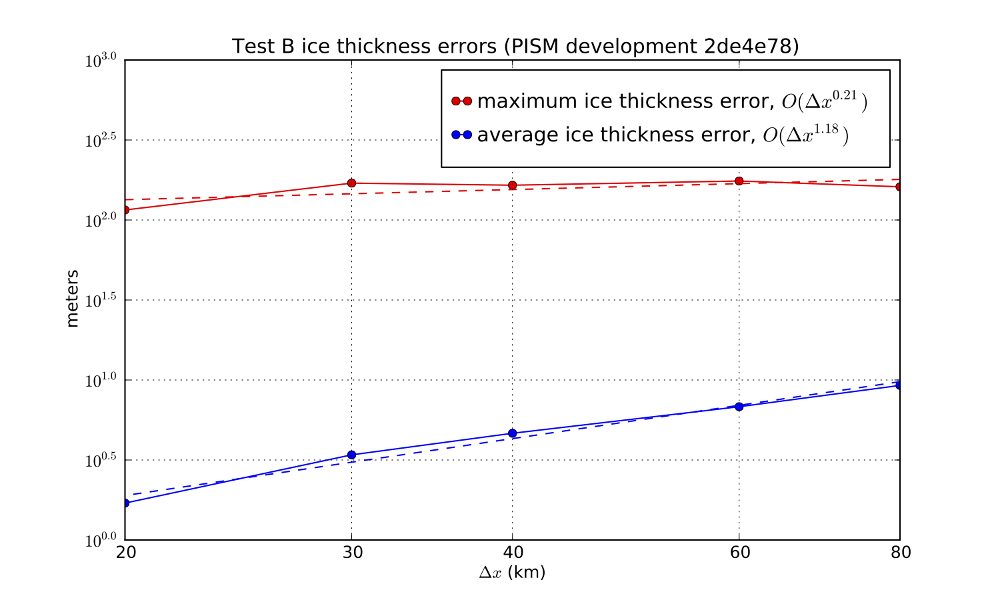

.. include:: ../../global.txt

.. _sec-convergence-plots:

Sample convergence plots
^^^^^^^^^^^^^^^^^^^^^^^^

   Numerical thickness errors in test B. See :cite:`BLKCB` for discussion.

.. figure:: figures/test-G-thickness.png
   :name: fig-thickerrsG

   Numerical thickness errors in test G.  See :cite:`BBL` and :cite:`BLKCB`.

.. figure:: figures/test-G-temp.png
   :name: fig-temperrsG

   Numerical temperature errors in test G. See :cite:`BBL`.

.. figure:: figures/test-G-surfvels.png
   :name: fig-surfvelerrsG

   Numerical errors in computed surface velocities in test G.

.. figure:: figures/test-I-errors.png
   :name: fig-velerrsI

   Numerical errors in horizontal velocities in test I, an ice stream.
   See :cite:`SchoofStream`, :cite:`BBssasliding`.
