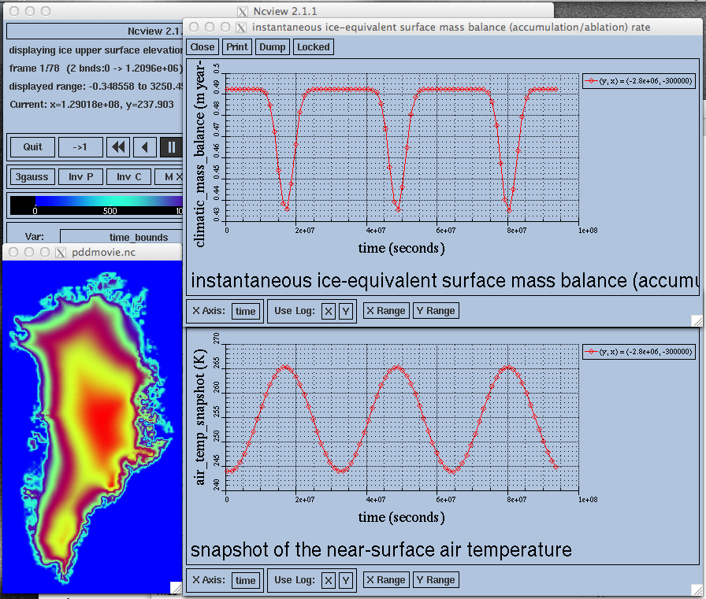
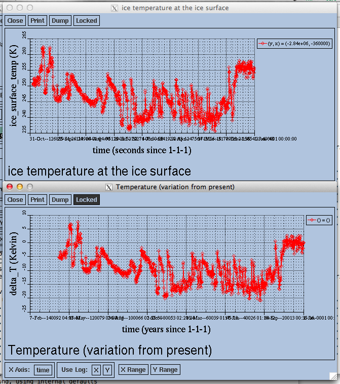

.. default-role:: math

.. |date| date::
.. |flux| replace:: :math:`kg / (m^{2} s)`

.. |variables| replace:: Variables
.. |options| replace:: Options
.. |seealso| replace:: See also
.. |implementation| replace:: C++ class

PISM climate forcing components
===============================

.. contents:: Contents

Introduction
------------

PISM has a well-defined separation of climate forcing from ice dynamics. This manual is
about the climate forcing interface.

By contrast, most options documented in the PISM User's Manual [1]_ control the ice
dynamics part. The User's Manual does, however, give an overview of PISM's surface
(atmosphere) and ocean (sub-shelf) interfaces. At these interfaces the surface mass and
energy balances are determined and/or passed to the ice dynamics code.

To get started with climate forcing usage we need to introduce some language to describe
parts of PISM. In this manual a *component* is a piece of PISM code, usually a C++ class.
A combination of components (or, in some cases, one component) makes up a "model" --- an
implementation of a physical/mathematical description of a system.

PISM's climate forcing code has two kinds of components.

- Ones that can be used as "stand-alone" models, such as the implementation of the PDD
  scheme (section :ref:`sec-surface-pdd`). These are *model components*.
- Ones implementing "corrections" of various kinds, such as lapse rate corrections
  (sections :ref:`sec-surface-lapse-rate` and :ref:`sec-atmosphere-lapse-rate`) or
  ice-core derived offsets (sections :ref:`sec-surface-delta-t` and
  :ref:`sec-ocean-delta-sl`, for example). These are called *modifier components* or
  *modifiers*.

Model components and modifiers can be chained as shown in Figure
:numref:`fig-climate-input-data-flow`. For example,

.. code-block:: none

    -ocean constant,delta_SL -ocean_delta_SL_file delta_SL.nc

combines the component providing constant (both in space and time) ocean boundary
conditions with a modifier that applies scalar sea level ("SL") offsets. This combination
one of the many ocean models that can be chosen using components as building blocks.

Section `Examples and corresponding options`_ gives examples of combining components to
choose models. Before that we address how PISM handles model time (Section `Managing model
time`_).

.. note:: Summary of the main idea in using this manual

   Setting up PISM's climate interface *requires* selecting one surface and one ocean
   component. The surface component may use an atmosphere component also; see Figure
   :numref:`fig-climate-input-data-flow`. Command-line options ``-atmosphere``,
   ``-surface`` and ``-ocean`` each take a comma-separated list of keywords as an
   argument; the first keyword *has* to correspond to a model component, the rest can be
   "modifier" components. Any of these options can be omitted to use the default
   atmosphere, surface or ocean model components, but one has to explicitly choose a model
   component to use a modifier. Model components and modifiers are chained as in Figure
   :numref:`fig-climate-input-data-flow`.

Managing model time
-------------------

Most of PISM only needs to know how long the current time step is. The climate forcing
(reporting) code, on the other hand, uses time in a precise manner to provide (and report)
the correct values at the right time. For example: the February mass balance should be
used for 28 days (except during leap years) and not `365/12 = 30.4167` days.

.. _sec-periodic-forcing:

Periodic climate data
+++++++++++++++++++++

All components reading time-dependent forcing data from files can interpret it as
"periodic". The length of the period (in years) is specified using a :opt:`-..._period`
option. For example, to prescribe a periodic climate which has the same values each year
but which includes inter-annual variations, using the :opt:`-surface given` option, set:

.. code-block:: none

    -surface given -surface_given_period 1 -surface_given_file forcing.nc

Each component has a unique command-line option prefix for a :opt:`-..._period` option.
Please refer to corresponding sections for allowed prefixes.

If forcing data has the period other than one year it is also necessary to specify the
"starting time" using the :opt:`-..._reference_year` option.

For example, to use a 20 year long climate record as periodic climate starting at the
beginning of the model year 10, do

.. code-block:: none

    -surface given -surface_given_period 20 -surface_given_file forcing.nc \
    -surface_given_reference_year 10

Note that the reference year is given in *model years*, not calendar years.

The :var:`time` variable in a forcing file that is to be used as periodic should start at
`0`. (In other words, time in a file with periodic forcing data is *time since the
beginning of a period*.) Please see the *User's Manual* for a discussion of time units
appropriate in forcing files.

.. _sec-time-bounds:

Using time bounds in forcing data
+++++++++++++++++++++++++++++++++

PISM interprets climate forcing data as piecewise-constant in time. A forcing file is
required to contain time bounds corresponding to each record.

PISM follows the CF (Climate and Forecasting) meta-data conventions. The ``ncdump -h``
output from a conforming file would look similar to:

.. code-block:: none

    netcdf forcing {
    dimensions:
            time = UNLIMITED ; // (214 currently)
            nv = 2 ;
    variables:
            double time(time) ;
                    time:units = "seconds since 2000-1-1" ;
                    time:axis = "T" ;
                    time:bounds = "time_bounds" ;
                    time:calendar = "gregorian" ;
                    time:long_name = "time" ;
            double nv(nv) ;
            double time_bounds(time, nv) ;

The :var:`time_bounds` variable stores the starting and the ending time for each interval
in the forcing. This variable is assumed to have the same units as the :var:`time`
variable it is associated with, which is why its arguments are not set in this example.

Please see the `CF Conventions`_ document for details.

Examples and corresponding options
----------------------------------

This section gives a very brief overview of some coupling options. Please see sections
referenced below for more information.

One way coupling to a climate model
+++++++++++++++++++++++++++++++++++

One-way coupling of PISM to a climate model can be achieved by reading a NetCDF file with
time- and space-dependent climate data produced by a climate model.

There are two cases:

- coupling to a climate model that includes surface (firn, snow) processes
- coupling to a climate model providing near-surface air temperature and precipitation

.. _sec-example-surface-given:

Reading ice surface temperature and mass balance
++++++++++++++++++++++++++++++++++++++++++++++++

This is the simplest case. It is often the preferred case, for example when the climate
model in use has high quality surface mass and energy sub-models which are then preferred
to the highly simplified (e.g. temperature index) surface models in PISM.

:|variables|: :var:`climatic_mass_balance`, :var:`ice_surface_temp`
:|options|: :opt:`-surface given -surface_given_file forcing.nc`
:|seealso|: :ref:`sec-surface-given`

.. _sec-example-atmosphere-given:

Reading air temperature and precipitation
+++++++++++++++++++++++++++++++++++++++++

As mentioned above, if a climate model provides near-surface air temperature and
precipitation, these data need to be converted into top-of-the-ice temperature and
climatic mass balance.

One way to do that is by using a temperature index (PDD) model component included in PISM.
This component has adjustable parameters; default values come from [RitzEISMINT]_.

:|variables|: :var:`precipitation`, :var:`air_temp`
:|options|: :opt:`-atmosphere given -atmosphere_given_file forcing.nc -surface pdd`
:|seealso|: :ref:`sec-atmosphere-given`, :ref:`sec-surface-pdd`

If melt is negligible :opt:`-surface pdd` should be replaced with :opt:`-surface simple`
(see section :ref:`sec-surface-simple`).

.. _sec-example-atmosphere-anomalies:

Using climate anomalies
+++++++++++++++++++++++

Prognostic modeling experiments frequently use time- and space-dependent air temperature
and precipitation anomalies.

:|variables|: :var:`precipitation`,
              :var:`air_temp`,
              :var:`precipitation_anomaly`,
              :var:`air_temp_anomaly`
:|options|: :opt:`-atmosphere given,anomaly`,
            :opt:`-atmosphere_given_file forcing.nc`,
            :opt:`-atmosphere_anomaly_file anomalies.nc`,
            :opt:`-surface simple`
:|seealso|: :ref:`sec-atmosphere-given`,
            :ref:`sec-atmosphere-anomaly`,
            :ref:`sec-surface-simple`

The ``simple`` surface model component re-interprets precipitation as climatic mass
balance, which is useful in cases when there is no melt (Antarctic simulations is an
example).

Simulations of the Greenland ice sheet typically use :opt:`-surface pdd` instead of
:opt:`-surface simple`.

.. _sec-example-searise-greenland:

SeaRISE-Greenland
+++++++++++++++++

The SeaRISE-Greenland setup uses a parameterized near-surface air temperature
[Faustoetal2009]_ and a constant-in-time precipitation field read from an input
(:opt:`-i`) file. A temperature-index (PDD) scheme is used to compute the climatic mass
balance.

:|variables|: :var:`precipitation`,
              :var:`lat`,
              :var:`lon`
:|options|:  :opt:`-atmosphere searise_greenland -surface pdd`
:|seealso|: :ref:`sec-atmosphere-searise-greenland`,
            :ref:`sec-surface-pdd`

The air temperature parameterization is a function of latitude (:var:`lat`), longitude
(:var:`lon`) and surface elevation (dynamically updated by PISM).

.. _sec-example-searise-greenland-paleo:

SeaRISE-Greenland paleo-climate run
+++++++++++++++++++++++++++++++++++

The air temperature parameterization in the previous section is appropriate for present
day modeling. PISM includes some mechanisms allowing for corrections taking into account
differences between present and past climates. In particular, one can use ice-core derived
scalar air temperature offsets [JohnsenetalGRIP]_, precipitation adjustments
[Huybrechts02]_, and sea level offsets from SPECMAP [Imbrieetal1984]_.

:|variables|: :var:`precipitation`,
              :var:`delta_T`,
              :var:`delta_SL`,
              :var:`lat`,
              :var:`lon`
:|options|: :opt:`-atmosphere searise_greenland,delta_T -atmosphere_delta_T_file
            delta_T.nc -surface pdd -ocean constant,delta_SL -ocean_delta_SL_file
            delta_SL.nc`
:|seealso|: :ref:`sec-atmosphere-searise-greenland`,
            :ref:`sec-atmosphere-delta-t`,
            :ref:`sec-surface-pdd`,
            :ref:`sec-ocean-constant`,
            :ref:`sec-ocean-delta-sl`
    
Note that the temperature offsets are applied to *air* temperatures at the *atmosphere
level*. This ensures that `\Delta T` influences the PDD computation.

.. _sec-example-antarctica-paleo:

Antarctic paleo-climate runs
++++++++++++++++++++++++++++

:|variables|: :var:`climatic_mass_balance`,
              :var:`air_temp`,
              :var:`delta_T`,
              :var:`delta_SL`
:|options|: :opt:`-surface given,delta_T -surface_delta_T_file delta_T.nc -ocean
            constant,delta_SL -ocean_delta_SL_file delta_SL.nc`
:|seealso|: :ref:`sec-surface-given`,
            :ref:`sec-surface-delta-t`,
            :ref:`sec-ocean-constant`,
            :ref:`sec-ocean-delta-sl`

Testing if forcing data is used correctly
------------------------------------------

It is very important to ensure that selected forcing options produce the result you
expect: we find that the ice sheet response is very sensitive to provided climate forcing,
especially in short-scale simulations.

This section describes how to use PISM to inspect climate forcing.

Visualizing climate inputs, without ice dynamics
++++++++++++++++++++++++++++++++++++++++++++++++

Recall that internally in PISM there is a separation of climate inputs from ice dynamics
(see *User's Manual*). This makes it possible to turn "off" the ice dynamics code to
visualize the climate mass balance and temperature boundary conditions produced using a
combination of options and input files. This is helpful during the process of creating
PISM-readable data files, and modeling with such.

To do this, use the option :opt:`-test_climate_models` (which is equivalent to
:opt:`-stress_balance none` and :opt:`-energy none`) together with PISM's reporting
capabilities (:opt:`-extra_file`, :opt:`-extra_times`, :opt:`-extra_vars`).

Turning "off" ice dynamics saves computational time while allowing one to use the same
options as in an actual modeling run. Note that :opt:`-test_climate_models` does *not*
disable geometry updates, so one can check if surface elevation feedbacks modeled using
lapse rates (and similar) work correctly. Please use the :opt:`-no_mass` command-line
option to fix ice geometry. (This may be necessary if the mass balance rate data would
result in extreme ice sheet growth that is not balanced by ice flow in this setup.

As an example, set up an ice sheet state file and check if climate data is read in
correctly:

.. code-block:: none

   mpiexec -n 2 pisms -eisII A -y 1000 -o state.nc
   pismr -i state.nc -surface given -extra_times 0.0:0.1:2.5 \
         -extra_file movie.nc -extra_vars climatic_mass_balance,ice_surface_temp \
         -ys 0 -ye 2.5

Using ``pisms`` merely generates demonstration climate data, using EISMINT II choices
[EISMINT00]_. The next run extracts the surface mass balance :var:`climatic_mass_balance`
and surface temperature :var:`ice_surface_temp` from ``state.nc``. It then does nothing
interesting, exactly because a constant climate is used. Viewing ``movie.nc`` we see these
same values as from ``state.nc``, in variables :var:`climatic_mass_balance`,
:var:`ice_surface_temp`, reported back to us as the time- and space-dependent climate at
times ``ys:dt:ye``. It is a boring "movie."

A more interesting example uses a `positive degree-day scheme <sec-surface-pdd_>`_). This scheme uses a variable called :var:`precipitation`, and a
calculation of melting, to get the surface mass balance :var:`climatic_mass_balance`.

Assuming that ``g20km_pre100.nc`` was created as described in the *User's Manual*, running

.. code-block:: none

    pismr -test_climate_models -no_mass -i g20km_pre100.nc \
          -atmosphere searise_greenland -surface pdd \
          -ys 0 -ye 1 -extra_times 0:1week:1 \
          -extra_file foo.nc \
          -extra_vars climatic_mass_balance,ice_surface_temp,air_temp_snapshot,precipitation
    
produces ``foo.nc``. Viewing in with ``ncview`` shows an annual cycle in the variable
:var:`air_temp` and a noticeable decrease in the surface mass balance during summer months
(see variable :var:`climatic_mass_balance`). Note that :var:`ice_surface_temp` is constant
in time: this is the temperature *at the ice surface but below firn* and it does not
include seasonal variations [Hock05]_.

Using low-resolution test runs
++++++++++++++++++++++++++++++

Sometimes a run like the one above is still too costly. In this case it might be helpful
to replace it with a similar run on a coarser grid, with or without the option
:opt:`-test_climate_models`. (Testing climate inputs usually means checking if the timing
of modeled events is right, and high spatial resolution is not essential.)

The command

.. code-block:: none

    pismr -i g20km_pre100.nc -bootstrap -Mx 51 -My 101 -Mz 11 \
          -atmosphere searise_greenland \
          -surface pdd -ys 0 -ye 2.5 \
          -extra_file foo.nc -extra_times 0:0.1:2.5 \
          -extra_vars climatic_mass_balance,air_temp_snapshot,smelt,srunoff,saccum
          -ts_file ts.nc -ts_times 0:0.1:2.5 \
          -o bar.nc

will produce ``foo.nc`` containing a "movie" very similar to the one created by the
previous run, but including the full influence of ice dynamics.

In addition to ``foo.nc``, the latter command will produce ``ts.nc`` containing scalar
time-series. The variable ``surface_ice_flux`` (the *total over the ice-covered area* of
the surface mass flux) can be used to detect if climate forcing is applied at the right
time.

Visualizing the climate inputs in the Greenland case
++++++++++++++++++++++++++++++++++++++++++++++++++++

Assuming that ``g20km_pre100.nc`` was produced by the run described in section
:ref:`sec-start`), one can run the following to check if the PDD model in PISM (see
section :ref:`sec-surface-pdd`) is "reasonable":

.. code-block:: none

   pismr -i g20km_pre100.nc -atmosphere searise_greenland,paleo_precip \
         -surface pdd -atmosphere_paleo_precip_file pism_dT.nc \
         -extra_times 0:1week:3 -ys 0 -ye 3 \
         -extra_file pddmovie.nc -o_order zyx \
         -extra_vars climatic_mass_balance,air_temp_snapshot

This produces the file ``pddmovie.nc`` with several variables:
:var:`climatic_mass_balance` (instantaneous net accumulation (ablation) rate),
:var:`air_temp_snapshot` (instantaneous near-surface air temperature),
:var:`precipitation` (mean annual ice-equivalent precipitation rate) and some others.

The variable :var:`precipitation` does not evolve over time because it is part of the
SeaRISE-Greenland data and is read in from the input file.

The other two variables were used to create figure :numref:`fig-pddseries`, which shows
the time-series of the accumulation rate (top graph) and the air temperature (bottom
graph) with the map view of the surface elevation on the left.

Here are two things to notice:

#. The summer peak day is in the right place. The default for this value is July 15 (day
   `196`, at approximately `196/365 \simeq 0.54` year). (If it is important,
   the peak day can be changed using the
   :config:`atmosphere.fausto_air_temp.summer_peak_day` configuration parameter).

#. Lows of the surface mass balance rate :var:`climatic_mass_balance` correspond to
   positive degree-days in the given period, because of highs of the air temperature.
   Recall the air temperature graph does not show random daily variations. Even though it
   has the maximum of about `266` Kelvin, the parameterized instantaneous air
   temperature can be above freezing. A positive value for positive degree-days is
   expected [CalovGreve05]_.

   Time series of the surface mass balance rate and near-surface air temperature.

We can also test the surface temperature forcing code with the following command.

.. code-block:: none

    pismr -i g20km_pre100.nc -surface simple \
          -atmosphere searise_greenland,delta_T \
          -atmosphere_delta_T_file pism_dT.nc \
          -extra_times 100 -ys -125e3 -ye 0 \
          -extra_vars ice_surface_temp \
          -extra_file dT_movie.nc -o_order zyx \
          -test_climate_models -no_mass
    
The output ``dT_movie.nc`` and ``pism_dT.nc`` were used to create
:numref:`fig-artm-timeseries`.

This figure shows the GRIP temperature offsets and the time-series of the temperature at
the ice surface at a point in southern Greenland (bottom graph), confirming that the
temperature offsets are used correctly.

   Time series of the surface temperature compared to GRIP temperature offsets

Surface mass and energy process model components
------------------------------------------------

.. _sec-surface-simple:

The "invisible" model
+++++++++++++++++++++

:|options|: ``-surface simple``
:|variables|: none
:|implementation|: ``PSSimple``

This is the simplest "surface model" available in PISM, enabled using ``-surface simple``.
Its job is to re-interpret precipitation as climatic mass balance, and to re-interpret
mean annual near-surface (2m) air temperature as the temperature of the ice at the depth
at which firn processes cease to change the temperature of the ice. (I.e. the temperature
*below* the firn.) This implies that there is no melt. Though primitive, this model
component may be desired in cold environments (e.g. East Antarctic ice sheet) in which
melt is negligible and heat from firn processes is ignored.

.. _sec-surface-given:

Reading top-surface boundary conditions from a file
+++++++++++++++++++++++++++++++++++++++++++++++++++

:|options|: ``-surface given``
:|variables|: :var:`ice_surface_temp`, :var:`climatic_mass_balance` |flux|
:|implementation|: ``PSGivenClimate``

.. note::

   This is the default choice.

This model component was created to force PISM with sampled (possibly periodic) climate
data by reading ice upper surface boundary conditions from a file. These fields are
provided directly to the ice dynamics code (see the *User's Manual* for details).

PISM will stop if variables :var:`ice_surface_temp` (ice temperature at the ice surface
but below firn) and :var:`climatic_mass_balance` (top surface mass flux into the ice) are
not present in the input file.

Command-line options:

- :opt:`-surface_given_file` prescribes an input file
- :opt:`-surface_given_period` (*years*) makes PISM interpret data in
  ``-surface_given_file`` as periodic. See :ref:`sec-periodic-forcing`.
- :opt:`-surface_given_reference_year` sets the reference model year; see `Periodic
  climate data`_.

A file ``foo.nc`` used with ``-surface given -surface_given_file foo.nc`` should contain
several records. If this file contains one record (i.e. fields corresponding to one time
value only), provided forcing data is interpreted as time-independent. The :var:`time`
variable should describe what model time these records correspond to; see `Managing model
time`_ for details.

For example, to use monthly records and period of 1 year, create a file (say,
"``foo.nc``") with 12 records. The :var:`time` variable may contain `0, 1, 2, 3,
\dots, 11` and have the units of "month" [2]_. Then, run

.. code-block:: none

    pismr -surface given -surface_given_file foo.nc -surface_given_period 1

.. note::

   - This surface model *ignores* the atmosphere model selection made using the option
     :opt:`-atmosphere`.
   - PISM can handle files with virtually any number of records: it will read and store in
     memory at most :config:`climate_forcing.buffer_size` records at any given time
     (default: 60, or 5 years' worth of monthly fields).
   - when preparing a file for use with this model, it is best to use the ``t,y,x``
     variable storage order: files using this order can be read in faster than ones using
     the ``t,x,y`` order, for reasons explained in the *User's Manual*.
   
     To change the storage order in a NetCDF file, use ``ncpdq``:
   
     .. code-block:: none
   
       ncpdq -a t,y,x input.nc output.nc
   
     will copy data from ``input.nc`` into ``output.nc``, changing the storage order to
     ``t,y,x`` at the same time.

.. _sec-surface-elevation:

Elevation-dependent temperature and mass balance
++++++++++++++++++++++++++++++++++++++++++++++++

:|options|: ``-surface elevation``
:|variables|: none
:|implementation|: ``PSElevation``

.. math::

  \newcommand{\var}[2]{ {#1}_{\text{#2}} }
  \newcommand{\h}[1]{ \var{h}{#1} }
  \newcommand{\T}[1]{ \var{T}{#1} }
  \newcommand{\m}[1]{ \var{m}{#1} }
  \newcommand{\ms}[1]{ \var{m^{*}}{#1} }

This surface model component parameterizes the ice surface temperature `T_{h}` =
:var:`ice_surface_temp` and the mass balance `m` = :var:`climatic_mass_balance` as
*piecewise-linear* functions of surface elevation `h`.

The option :opt:`-ice_surface_temp` (*list of 4 numbers*) determines the surface
temperature using the 4 parameters `\T{min}`, `\T{max}`, `\h{min}`,
`\h{max}`. Let

.. math::

  \diff{T}{h} = (\T{max} - \T{min}) / (\h{max} - \h{min})

be the temperature gradient. Then

.. math::

  T(x,y) =
  \begin{cases}
    \T{min}, & h(x,y) \le \h{min}, \\
    \T{min} + \diff{T}{h} \, (h(x,y) - \h{min}), & \h{min} < h(x,y) < \h{max}, \\
    \T{max}, & \h{max} \le h(x,y).
  \end{cases}

The option :opt:`-climatic_mass_balance` (*list of 5 numbers*) determines the surface mass
balance using the 5 parameters `\m{min}`, `\m{max}`, `\h{min}`,
`\h{ELA}`, `\h{max}`. Let

.. math::

   \diff{\m{abl}}{h} = -\m{min} / (\h{max} - \h{min})

and

.. math::

   \diff{\m{acl}}{h} = \m{max} / (\h{max} - \h{min})

be the mass balance gradient in the ablation and in the accumulation area, respectively.
Then

.. math::

  m(x,y) =
  \begin{cases}
   \m{min}, & h(x,y) \le \h{min}, \\
   \diff{\m{abl}}{h} \, (h(x,y) - h_{\text{ELA}}), &  \h{min} < h(x,y) < \h{max}, \\
   \diff{\m{acl}}{h} \, (h(x,y) - h_{\text{ELA}}), & \h{min} < h(x,y) < \h{max},
   \m{max}, & \h{max} \le h(x,y).
 \end{cases}

The option :opt:`-climatic_mass_balance_limits` (*list of 2 numbers*) limits the mass
balance below `\h{min}` to `\ms{min}` and above `\h{max}` to
`\ms{max}`, thus

.. math::

  m(x,y) =
  \begin{cases}
    m^{*}_{\text{min}}, & h(x,y) \le \h{min}, \\
    \diff{\m{abl}}{h} \, (h(x,y) - h_{\text{ELA}}), & \h{min} < h(x,y) < \h{max}, \\
    \diff{\m{acl}}{h} \, (h(x,y) - h_{\text{ELA}}), & \h{min} < h(x,y) < \h{max},
    m^{*}_{\text{max}}, & \h{max} \le h(x,y).
  \end{cases}

Note: this surface model *ignores* the atmosphere model selection made using the
:opt:`-atmosphere` option.

.. _sec-surface-pdd:

Temperature-index scheme
++++++++++++++++++++++++

:|options|: ``-surface pdd``
:|variables|: :var:`air_temp_sd`, :var:`snow_depth`
:|implementation|: ``PSTemperatureIndex``

.. figure:: pdd-model.png
   :name: fig-pdd-model

   PISM's positive degree day model. `F_s` and `F_i` are PDD factors for snow
   and ice, respectively; `\theta_{\text{refreeze}}` is the refreeze fraction.
                   
The default PDD model used by PISM, turned on by option :opt:`-surface pdd`, is based on
[CalovGreve05]_ and EISMINT-Greenland intercomparison (see [RitzEISMINT]_).

Our model computes the solid (snow) precipitation rate using the air temperature threshold
with a linear transition. All precipitation during periods with air temperatures above
:config:`air_temp_all_precip_as_rain` (default of `2^\circ C`) is interpreted as
rain; all precipitation during periods with air temperatures below
:config:`air_temp_all_precip_as_snow` (default of `0^\circ C`) is interpreted as
snow.

For long-term simulations, a PDD model generally uses an idealized seasonal temperature
cycle. "White noise" is added to this cycle to simulate additional daily variability
associated to the vagaries of weather. This additional random variation is quite
significant, as the seasonal cycle may never reach the melting point but that point may be
reached with some probability, in the presence of the daily variability, and thus melt may
occur. Concretely, a normally-distributed, mean zero random temperature increment is added
to the seasonal cycle. There is no assumed spatial correlation of daily variability. The
standard deviation of the daily variability is controlled by command-line options:

- :opt:`-pdd_sd_file`, which prescribes an input file.
- :opt:`-pdd_sd_period` (*years*), which interprets its data as periodic; see `Periodic
  climate data`_.
- :opt:`-pdd_sd_reference_year`, which sets the reference model year; see `Periodic
  climate data`_.

A file ``foo.nc`` used with ``-surface pdd -pdd_sd_file foo.nc`` should contain standard
deviation of near-surface air temperature in variable :var:`air_temp_sd`, and the
corresponding time coordinate in variable :var:`time`. If ``-pdd_sd_file`` is not set,
PISM uses a constant value for standard deviation, which is set by the ``pdd_std_dev``
configuration parameter. The default value is `5.0` degrees [RitzEISMINT]_. However,
this approach is not recommended as it induces significant errors in modeled surface mass
balance in both ice-covered and ice-free regions [RogozhinaRau2014]_, [Seguinot2013]_.

Over ice-covered grid cells, daily variability can also be parameterized as a linear
function of near-surface air temperature `\sigma = a \cdot T + b` using the
:config:`pdd_std_dev_use_param` configuration flag, and the corresponding parameters
:config:`pdd_std_dev_param_a` and :config:`pdd_std_dev_param_b`. This parametrization
replaces prescribed standard deviation values over glacierized grid cells as defined by
the :var:`mask` variable (see :config:`geometry.ice_free_thickness_standard`). Default
values for the slope `a` and intercept `b` were derived from the ERA-40
reanalysis over the Greenland ice sheet [SeguinotRogozhina2014]_.

The number of positive degree days is computed as the magnitude of the temperature
excursion above `0\!\phantom{|}^\circ \text{C}` multiplied by the duration (in days)
when it is above zero.

In PISM there are two methods for computing the number of positive degree days. The first
computes only the expected value, by the method described in [CalovGreve05]_. This is the
default when a PDD is chosen (i.e. option ``-surface pdd``). The second is a Monte Carlo
simulation of the white noise itself, chosen by adding the option :opt:`-pdd_rand`. This
Monte Carlo simulation adds the same daily variation at every point, though the seasonal
cycle is (generally) location dependent. If repeatable randomness is desired use
:opt:`-pdd_rand_repeatable` instead of ``-pdd_rand``.

By default, the computation summarized in Figure :numref:`fig-pdd-model` is performed
every week. (This frequency is controlled by the :config:`pdd_max_evals_per_year`
parameter.) To compute mass balance during each week-long time-step, PISM keeps track of
the current snow depth (using units of ice-equivalent thickness). This is necessary to
determine if melt should be computed using the degree day factor for snow
(:config:`pdd_factor_snow`) or the corresponding factor for ice
(:config:`pdd_factor_ice`).

A fraction of the melt controlled by the configuration parameter :config:`pdd_refreeze`
(`\theta_{\text{refreeze}}` in Figure :numref:`fig-pdd-model`, default: `0.6`)
refreezes. The user can select whether melted ice should be allowed to refreeze using the
:config:`pdd_refreeze_ice_melt` configuration flag.

Since PISM does not have a principled firn model, the snow depth is set to zero at the
beginning of the balance year. See :config:`pdd_balance_year_start_day`. Default is
`274`, corresponding to October 1`^{\text{st}}`.

Our PDD implementation is meant to be used with an atmosphere model implementing a cosine
yearly cycle such as ``searise_greenland`` (section
:ref:`sec-atmosphere-searise-greenland`), but it is not restricted to parameterizations
like these.

This code also implements latitude- and mean July temperature dependent ice and snow
factors using formulas (6) and (7) in [Faustoetal2009]_; set :opt:`-pdd_fausto` to enable.
The default standard deviation of the daily variability (:opt:`-pdd_std_dev` option) is
2.53 degrees under the :opt:`-pdd_fausto` option [Faustoetal2009]_. See also configuration
parameters with the ``surface.pdd.fausto`` prefix.

Note that when used with periodic climate data (air temperature and precipitation) that is
read from a file (see section :ref:`sec-atmosphere-given`), use of
:opt:`-timestep_hit_multiplies X` is recommended. (Here `X` is the length of the climate
data period in years.)

.. _sec-surface-pik:

PIK
+++

:|options|: ``-surface pik``
:|variables|: :var:`climatic_mass_balance` |flux|,
              :var:`lat` (latitude), (degrees north)
:|implementation|: ``PSConstantPIK``

This surface model component implements the setup used in [Martinetal2011]_. The
:var:`climatic_mass_balance` is read from an input (``-i``) file; the ice surface
temperature is computed as a function of latitude (variable :var:`lat`) and surface
elevation (dynamically updated by PISM). See equation (1) in [Martinetal2011]_.

.. _sec-surface-delta-t:

Scalar temperature offsets
++++++++++++++++++++++++++

:|options|: ``-surface ...,delta_T``
:|variables|: :var:`delta_T`
:|implementation|: ``PS_delta_T``

Command-line options:

- :opt:`-surface_delta_T_file` sets the name of the file PISM will read :var:`delta_T`
  from.
- :opt:`-surface_delta_T_period` (*years*) sets the period of the forcing data (section
  :ref:`sec-periodic-forcing`)
- :opt:`-surface_delta_T_reference_year` sets the reference year (section
  :ref:`sec-periodic-forcing`).

The time-dependent scalar offsets :var:`delta_T` are added to :var:`ice_surface_temp`
computed by a surface model.

Please make sure that :var:`delta_T` has the units of "``Kelvin``".

This modifier is identical to the corresponding atmosphere modifier, but applies offsets
at a different stage in the computation of top-surface boundary conditions needed by the
ice dynamics core.

.. _sec-surface-lapse-rate:

Lapse rate corrections
++++++++++++++++++++++

:|options|: ``-surface ...,lapse_rate``
:|variables|: :var:`surface_altitude` (CF standard name),
:|implementation|: ``PSLapseRates``

The ``lapse_rate`` modifier allows correcting ice-surface temperature and surface mass
balance using elevation lapse rates. It uses the following options.

- :opt:`-temp_lapse_rate` gives the temperature lapse rate, in `K/km`. Note that we
  use the following definition of the temperature lapse rate:

  .. math::

    \gamma = -\frac{dT}{dz}.

- :opt:`-smb_lapse_rate` gives the surface mass balance lapse rate, in `m/year/km`.
  Here, `\gamma=-\frac{dM}{dz}`.
- :opt:`-surface_lapse_rate_file` specifies the file containing the reference surface
  elevation field (standard name: :var:`surface_altitude`). This file can contain several
  surface elevation records to use lapse rate corrections relative to time-dependent
  surface. If one record is provided, the reference surface elevation is assumed to be
  time-independent.
- :opt:`-surface_lapse_rate_period` gives the period, in model years, to use when
  interpreting data in the file given with ``-surface_given_file``,
- :opt:`-surface_lapse_rate_reference_year` takes the time `T` in model years. The
  record for `t` years in ``-surface_given_file`` is interpreted as corresponding to
  `t` years since `T`.

.. _sec-surface-forcing:

Mass flux adjustment
++++++++++++++++++++
    
:|options|: ``-surface ...,forcing``
:|variables|: :var:`thk` (ice thickness), :var:`ftt_mask` (mask of zeros and ones; 1 where
              surface mass flux is adjusted and 0 elsewhere)
:|implementation|: ``PSForceThickness``

The ``forcing`` modifier implements a surface mass balance adjustment mechanism which
forces the thickness of grounded ice to a target thickness distribution at the end of the
run. The idea behind this mechanism is that spinup of ice sheet models frequently requires
the surface elevation to come close to measured values at the end of a run. A simpler
alternative to accomplish this, namely option ``-no_mass``, represents an unmodeled,
frequently large, violation of the mass continuity equation.

In more detail, let `H_{\text{tar}}` be the target thickness. Let `H` be the
time-dependent model thickness. The surface model component described here produces the
term `M` in the mass continuity equation:

.. math::

   \frac{\partial H}{\partial t} = M - S - \nabla\cdot \mathbf{q}.

(Other details of this equation do not concern us here.) The ``forcing`` modifier causes
`M` to be adjusted by a multiple of the difference between the target thickness and
the current thickness,

.. math::

   \Delta M = \alpha (H_{\text{tar}} - H)

where `\alpha>0`. We are adding mass (`\Delta M>0`) where
`H_{\text{tar}} > H` and ablating where `H_{\text{tar}} < H`.

Option :opt:`-force_to_thickness_file` identifies the file containing the target ice
thickness field ``thk`` and the mask ``ftt_mask``. A basic run modifying surface model
``given`` would look like

.. code-block:: none

    pismr -i foo.nc -surface given,forcing -force_to_thickness_file bar.nc

In this case ``foo.nc`` contains fields :var:`climatic_mass_balance` and
:var:`ice_surface_temp`, as normal for ``-surface given``, and ``bar.nc`` contains fields
:var:`thk` which will serve as the target thickness and :var:`ftt_mask` which defines the
map plane area where this adjustment is applied. Option :opt:`-force_to_thickness_alpha`
adjusts the value of `\alpha`, which has a default value specified in the `Source
Code Browser <pism-browser_>`_.

In addition to this one can specify a multiplicative factor `C` used in areas where
the target thickness field has less than
:opt:`-force_to_thickness_ice_free_thickness_threshold` meters of ice;
`\alpha_{\text{ice free}} = C \times \alpha`. Use the
:opt:`-force_to_thickness_ice_free_alpha_factor` option to set `C`.

.. _sec-surface-anomaly:

Using climate data anomalies
++++++++++++++++++++++++++++
    
:|options|: :opt:`-surface ...,anomaly`
:|variables|: :var:`ice_surface_temp_anomaly`,
              :var:`climatic_mass_balance_anomaly` |flux|
:|implementation|: ``PSAnomaly``

This modifier implements a spatially-variable version of ``-surface ...,delta_T`` which
also applies time-dependent climatic mass balance anomalies.

It takes the following options:

- :opt:`-surface_anomaly_file` specifies a file containing variables
  :var:`ice_surface_temp_anomaly` and :var:`climatic_mass_balance_anomaly`.
- :opt:`-surface_anomaly_period` (years) specifies the period of the forcing data, in
  model years; see :ref:`sec-periodic-forcing`
- :opt:`-surface_anomaly_reference_year` specifies the reference year; see `Periodic
  climate data`_

See also to ``-atmosphere ...,anomaly`` (section :ref:`sec-atmosphere-anomaly`), which is
similar, but applies anomalies at the atmosphere level.

.. _sec-surface-cache:

The caching modifier
++++++++++++++++++++

:|options|: ``-surface ...,cache``
:|implementation|: ``PSCache``
:|seealso|: :ref:`sec-ocean-cache`
    
This modifier skips surface model updates, so that a surface model is called no more than
every :opt:`-surface_cache_update_interval` years. A time-step of `1` year is used every
time a surface model is updated.

This is useful in cases when inter-annual climate variability is important, but one year
differs little from the next. (Coarse-grid paleo-climate runs, for example.)

It takes the following options:

- :opt:`-surface_cache_update_interval` (*years*) Specifies the minimum interval between
  updates. PISM may take longer time-steps if the adaptive scheme allows it, though.

Atmosphere model components
---------------------------

.. _sec-atmosphere-given:

Reading boundary conditions from a file
+++++++++++++++++++++++++++++++++++++++

:|options|: ``-atmosphere given``
:|variables|: :var:`air_temp`, :var:`precipitation` |flux|
:|implementation|: ``PAGivenClimate``
:|seealso|: :ref:`sec-surface-given`

.. note:: This is the default choice.

Command-line options:

- :opt:`-atmosphere_given_file` prescribes an input file
- :opt:`-atmosphere_given_period` (*years*) makes PISM interpret data in
  ``-atmosphere_given_file`` as periodic. See section :ref:`sec-periodic-forcing`.
- :opt:`-atmosphere_given_reference_year` sets the reference model year; see section
  :ref:`sec-periodic-forcing`.

A file ``foo.nc`` used with ``-atmosphere given -atmosphere_given_file foo.nc`` should
contain several records; the :var:`time` variable should describe what model time these
records correspond to.

This model component was created to force PISM with sampled (possibly periodic) climate
data, e.g. using monthly records of :var:`air_temp` and :var:`precipitation`.

It can also used to drive a temperature-index (PDD) climatic mass balance computation
(section :ref:`sec-surface-pdd`).

.. _sec-atmosphere-yearly-cycle:

Cosine yearly cycle
+++++++++++++++++++

:|options|: :opt:`-atmosphere yearly_cycle`
:|variables|: :var:`air_temp_mean_annual`, 
              :var:`air_temp_mean_july`,
              :var:`precipitation` |flux|
              :var:`amplitude_scaling`
:|implementation|: ``PACosineYearlyCycle``

This atmosphere model component computes the near-surface air temperature using the
following formula:

.. math::

   T(\mathrm{time}) = T_{\text{mean annual}}
   + A(\mathrm{time})\cdot(T_{\text{mean July}} - T_{\text{mean annual}}) \cdot \cos(2\pi t),

where `t` is the year fraction "since last July"; the summer peak of the cycle is on
:config:`atmosphere.fausto_air_temp.summer_peak_day`, which is set to day `196` by
default (approximately July 15).

Here `T_{\text{mean annual}}` (variable :var:`air_temp_mean_annual`) and
`T_{\text{mean July}}` (variable :var:`air_temp_mean_july`) are read from a file
selected using the :opt:`-atmosphere_yearly_cycle_file` command-line option. A
time-independent precipitation field (variable :var:`precipitation`) is read from the same
file.

Optionally a time-dependent scalar amplitude scaling `A(t)` can be used. Specify a
file to read it from using the :opt:`-atmosphere_yearly_cycle_scaling_file` command-line
option. Without this option `A(\mathrm{time}) \equiv 1`.

.. _sec-atmosphere-searise-greenland:

SeaRISE-Greenland
+++++++++++++++++
    
:|options|: ``-atmosphere searise_greenland``
:|variables|: :var:`lon`,
              :var:`lat`,
              :var:`precipitation` |flux|
:|implementation|: ``PASeariseGreenland``
:|seealso|: :ref:`sec-atmosphere-paleo-precip`

This atmosphere model component implements a longitude, latitude, and elevation dependent
near-surface air temperature parameterization and a cosine yearly cycle described in
[Faustoetal2009]_ and uses a constant in time ice-equivalent precipitation field (in units
of thickness per time, variable :var:`precipitation`) that is read from an input (``-i``)
file. To read time-independent precipitation from a different file, use the option
:opt:`-atmosphere_searise_greenland_file`.

The air temperature parameterization is controlled by configuration parameters with the
``snow_temp_fausto`` prefix.

See also the ``-atmosphere ...,paleo_precip`` modifier, section
:ref:`sec-atmosphere-paleo-precip`, for an implementation of the SeaRISE-Greenland formula
for paleo-precipitation correction from present; a 7.3\% change of precipitation rate for
every one degree Celsius of temperature change [Huybrechts02]_.

.. _sec-atmosphere-pik:

PIK
+++
    
:|options|: :opt:`-atmosphere pik`
:|variables|: :var:`lat`,
              :var:`precipitation`
:|implementation|: ``PAConstantPIK``

This model component reads a time-independent precipitation field from an input
(:opt:`-i`) file and computes near-surface air temperature using a latitude and surface
elevation-dependent formula.

The parameterization is the same as in the :opt:`-surface pik` model, section
:ref:`sec-surface-pik`.

.. _sec-atmosphere-one-station:

One weather station
+++++++++++++++++++

:|options|: :opt:`-atmosphere one_station`
            :opt:`-atmosphere_one_station_file`
:|variables|: :var:`air_temp` [Kelvin],
              :var:`precipitation` |flux|
:|implementation|: ``PAWeatherStation``

This model component reads scalar time-series of the near-surface air temperature and
precipitation from a file specified using the :opt:`-atmosphere_one_station_file` option
and uses them at *all* grid points in the domain. In other words, resulting climate fields
are constant in space but not necessarily in time.

The :opt:`-atmosphere one_station` model should be used with a modifier such as
``lapse_rate`` (see section :ref:`sec-atmosphere-lapse-rate`) to create spatial
variablitity.

.. _sec-atmosphere-delta-t:

Scalar temperature offsets
++++++++++++++++++++++++++

:|options|: ``-atmosphere ...,delta_T``
:|variables|: :var:`delta_T`
:|implementation|: ``PA_delta_T``

This modifier applies scalar time-dependent air temperature offsets to the output of an
atmosphere model. It takes the following command-line options.

- :opt:`-atmosphere_delta_T_file` sets the name of the file PISM will read :var:`delta_T`
  from.
- :opt:`-atmosphere_delta_T_period` (*years*) sets the period of the forcing data (section
  :ref:`sec-periodic-forcing`).
- :opt:`-atmosphere_delta_T_reference_year` sets the reference year (section `Periodic
  climate data`_).

Please make sure that :var:`delta_T` has the units of "``Kelvin``".

.. _sec-atmosphere-delta-p:

Scalar precipitation offsets
++++++++++++++++++++++++++++

:|options|: :opt:`-atmosphere ...,delta_P`
:|variables|: :var:`delta_P` |flux|
:|implementation|: ``PA_delta_P``

This modifier applies scalar time-dependent precipitation offsets to the output of an
atmosphere model. It takes the following command-line options.

- :opt:`-atmosphere_delta_P_file` sets the name of the file PISM will read :var:`delta_P`
  from.
- :opt:`-atmosphere_delta_P_period` (*years*) sets the period of the forcing data (section
  :ref:`sec-periodic-forcing`).
- :opt:`-atmosphere_delta_P_reference_year` sets the reference year (section `Periodic
  climate data`_).

.. _sec-atmosphere-frac-p:

Scalar precipitation scaling
++++++++++++++++++++++++++++

:|options|: ``-atmosphere ...,frac_P``
:|variables|: :var:`frac_P` [no unit]
:|implementation|: ``PA_frac_P``

This modifier scales precipitation output of an atmosphere model using a scalar
time-dependent precipitation fraction, with a value of one corresponding to no change in
precipitation. It takes the following command-line options:

- :opt:`-atmosphere_frac_P_file` sets the name of the file PISM will read :var:`frac_P`
  from.
- :opt:`-atmosphere_frac_P_period` (*years*) sets the period of the forcing data (section
  :ref:`sec-periodic-forcing`).
- :opt:`-atmosphere_frac_P_reference_year` sets the reference year (section `Periodic
  climate data`_).

.. _sec-atmosphere-paleo-precip:

Precipitation correction using scalar temperature offsets
+++++++++++++++++++++++++++++++++++++++++++++++++++++++++

:|options|: ``-atmosphere ...,paleo_precip``
:|variables|: :var:`delta_T` [degrees Kelvin]
:|implementation|: ``PA_paleo_precip``

This modifier implements the SeaRISE-Greenland formula for a precipitation correction from
present; a 7.3\% change of precipitation rate for every one degree Celsius of air
temperature change [Huybrechts02]_. See `SeaRISE Greenland model initialization
<SeaRISE-Greenland_>`_ for details. The input file should contain air temperature offsets
in the format used by ``-atmosphere ...,delta_T`` modifier, see section :ref:`sec-atmosphere-delta-t`.

It takes the following command-line options.

- :opt:`-atmosphere_paleo_precip_file` sets the name of the file PISM will read
  :var:`delta_T` from.
- :opt:`-atmosphere_paleo_precip_period` (*years*) sets the period of the forcing data
  (section :ref:`sec-periodic-forcing`).
- :opt:`-atmosphere_paleo_precip_reference_year` sets the reference year (section
  :ref:`sec-periodic-forcing`).

.. _sec-atmosphere-lapse-rate:

Temperature and precipitation lapse rate corrections
++++++++++++++++++++++++++++++++++++++++++++++++++++

:|options|: :opt:`-atmosphere ...,lapse_rate`
:|variables|: :var:`surface_altitude` (CF standard name)
:|implementation|: ``PALapseRates``

The ``lapse_rate`` modifier allows for correcting air temperature and precipitation using
elevation lapse rates. It uses the following options.

- :opt:`-temp_lapse_rate` gives the temperature lapse rate, in `K/km`. Note that we
  use the following definition of the temperature lapse rate:

  .. math::

    \gamma = -\frac{dT}{dz}.

- :opt:`-precip_lapse_rate` gives the precipitation lapse rate, in `(m/year)/km`.
  Here `\gamma = -\frac{dM}{dz}`.
- :opt:`-atmosphere_lapse_rate_file` specifies a file containing the reference surface
  elevation field (standard name: :var:`surface_altitude`). This file may contain several
  surface elevation records to use lapse rate corrections relative to a time-dependent
  surface. If one record is provided, the reference surface elevation is assumed to be
  time-independent.
- :opt:`-atmosphere_lapse_rate_period` gives the period, in model years; see section
  :ref:`sec-periodic-forcing`.
- :opt:`-atmosphere_lapse_rate_reference_year` specifies the reference date; see section
  :ref:`sec-periodic-forcing`.

.. _sec-atmosphere-anomaly:

Using climate data anomalies
++++++++++++++++++++++++++++

:|options|: :opt:`-atmosphere ...,anomaly`
:|variables|: :var:`air_temp_anomaly`,
              :var:`precipitation_anomaly` |flux|
:|implementation|: ``PAAnomaly``

This modifier implements a spatially-variable version of ``-atmosphere
...,delta_T,delta_P``.

It takes the following options:

- :opt:`-atmosphere_anomaly_file` specifies a file containing variables
  :var:`air_temp_anomaly` and :var:`precipitation_anomaly`.
- :opt:`-atmosphere_anomaly_period` (years) specifies the period of the forcing data, in
  model years; section :ref:`sec-periodic-forcing`.
- :opt:`-atmosphere_anomaly_reference_year` specifies the reference year; section
  :ref:`sec-periodic-forcing`.

See also to ``-surface ...,anomaly`` (section :ref:`sec-surface-anomaly`), which is
similar, but applies anomalies at the surface level.

Ocean model components
----------------------

PISM Ocean model components provide sub-shelf ice temperature (:var:`shelfbtemp`) and
sub-shelf mass flux (:var:`shelfbmassflux`) to the ice dynamics core.

The sub-shelf ice temperature is used as a Dirichlet boundary condition in the energy
conservation code. The sub-shelf mass flux is used as a source in the mass-continuity
(transport) equation. Positive flux corresponds to ice loss; in other words, this
sub-shelf mass flux is a "melt rate".

.. _sec-ocean-constant:

Constant in time and space
++++++++++++++++++++++++++
    
:|options|: ``-ocean constant``
:|variables|: none
:|implementation|: ``POConstant``

.. note:: This is the default choice.

This ocean model component implements boundary conditions at the ice/ocean interface that
are constant *both* in space and time.

The sub-shelf ice temperature is set to pressure melting and the sub-shelf melt rate is
assumed to be proportional to the heat flux from the ocean into the ice (configuration
parameter :config:`ocean.sub_shelf_heat_flux_into_ice`).

Alternatively, the sub-shelf melt rate in meters per year can be set using the
:opt:`-shelf_base_melt_rate` command-line option.

.. _sec-ocean-given:

Reading forcing data from a file
++++++++++++++++++++++++++++++++
    
:|options|: ``-ocean given``
:|variables|: :var:`shelfbtemp` Kelvin,
              :var:`shelfbmassflux`  |flux|
:|implementation|: ``POGivenClimate``

This ocean model component reads sub-shelf ice temperature :var:`shelfbtemp` and the
sub-shelf mass flux :var:`shelfbmassflux` from a file. It takes the following command-line
options.

- :opt:`-ocean_given_file`: sets the name of the file to read forcing data from. The file
  may contain several records. If only one record is provided it is interpreted as
  time-independent.
- :opt:`-ocean_given_reference_year` specifies the reference date; see section `Periodic
  climate data`_.
- :opt:`-ocean_given_period` specifies the length of the period of the forcing data, in
  model years; see section :ref:`sec-periodic-forcing`.

Variables :var:`shelfbtemp` and :var:`shelfbmassflux` may be time-dependent. (The ``-ocean
given`` component is very similar to ``-surface given`` and ``-atmosphere given``.)

.. _sec-ocean-pik:

PIK
+++
    
:|options|: ``-ocean pik``
:|variables|: none
:|implementation|: ``POConstantPIK``

This ocean model component implements the ocean forcing setup used in [Martinetal2011]_.
The sub-shelf ice temperature is set to pressure-melting; the sub-shelf mass flux
computation follows [BeckmannGoosse2003]_.

It takes one command-line option:

- :opt:`-meltfactor_pik`: a melt factor `F_{\mathrm{melt}}` in sub-shelf-melting
  parameterization, see equation (5) in [Martinetal2011]_.

.. _sec-ocean-th:

Basal melt rate and temperature from thermodynamics in boundary layer
+++++++++++++++++++++++++++++++++++++++++++++++++++++++++++++++++++++

:|options|: ``-ocean th``
:|variables|: :var:`theta_ocean` (absolute potential ocean temperature), [Kelvin],
              :var:`salinity_ocean` (salinity of the adjacent ocean), [g/kg]
:|implementation|: ``POGivenTH``

This ocean model component derives basal melt rate and basal temperature from
thermodynamics in a boundary layer at the base of the ice shelf. It uses a set of three
equations describing

#. the energy flux balance,
#. the salt flux balance,
#. the pressure and salinity dependent freezing point in the boundary layer.

This model is described in [HollandJenkins1999]_ and [Hellmeretal1998]_.

Inputs are potential temperature (variable :var:`theta_ocean`) and salinity (variable
:var:`salinity_ocean`) read from a file.

No ocean circulation is modeled, so melt water computed by this model is not fed back into
the surrounding ocean.

This implementation uses different approximations of the temperature gradient at the base
of an ice shelf column depending on whether there is sub-shelf melt, sub-shelf freeze-on,
or neither (see [HollandJenkins1999]_ for details).

It takes two command-line option:

- :opt:`-ocean_th_file`: specifies the NetCDF file providing potential temperature and
  salinity fields.
- :opt:`-clip_shelf_base_salinity`: if this is set (which is the default), the sub-shelf
  salinity is clipped so that it stays in the `[4, 40]` psu range. This is done to
  ensure that we stay in the range of applicability of the melting point temperature
  parameterization; see [HollandJenkins1999]_. To disable salinity clipping, use the
  :opt:`-no_clip_shelf_base_salinity` option or set the
  :config:`ocean_three_equation_model_clip_salinity` configuration parameter to "no".

.. _sec-ocean-delta-sl:

Scalar sea level offsets
++++++++++++++++++++++++

:|options|: :opt:`-ocean ...,delta_SL`
:|variables|: :var:`delta_SL` (meters)
:|implementation|: ``PO_delta_SL``

The ``delta_SL`` modifier implements sea level forcing using scalar offsets.

It takes the following command-line options:

- :opt:`-ocean_delta_SL_file`: specifies the name of the file containing forcing data.
  This file has to contain the :var:`delta_SL` variable using units "meters" or
  equivalent.
- :opt:`-ocean_delta_SL_period` specifies the length of the period of the forcing data, in
  model years; see section :ref:`sec-periodic-forcing`.
- :opt:`-ocean_delta_SL_reference_year` specifies the reference date; see section
  :ref:`sec-periodic-forcing`.

.. _sec-ocean-delta-t:

Scalar sub-shelf temperature offsets
++++++++++++++++++++++++++++++++++++

:|options|: :opt:`-ocean ...,delta_T`
:|variables|: :var:`delta_T` (Kelvin)
:|implementation|: ``PO_delta_T``

This modifier implements forcing using sub-shelf ice temperature offsets.

It takes the following command-line options:

- :opt:`-ocean_delta_T_file`: specifies the name of the file containing forcing data. This
  file has to contain the :var:`delta_T` variable using units of "Kelvin" or equivalent.
- :opt:`-ocean_delta_T_period` specifies the length of the period of the forcing data, in
  model years; see section :ref:`sec-periodic-forcing`.
- :opt:`-ocean_delta_T_reference_year` specifies the reference date; see section `Periodic
  climate data`_.

.. _sec-ocean-delta-smb:

Scalar sub-shelf mass flux offsets
++++++++++++++++++++++++++++++++++

:|options|: ``-ocean ...,delta_SMB``
:|variables|: :var:`delta_SMB` |flux|
:|implementation|: ``PO_delta_SMB``

This modifier implements forcing using sub-shelf mass flux (melt rate) offsets.

It takes the following command-line options:

- :opt:`-ocean_delta_SMB_file`: specifies the name of the file containing forcing data.
  This file has to contain the :var:`delta_SMB` variable using units |flux| or equivalent.
- :opt:`-ocean_delta_SMB_period` specifies the length of the period of the forcing data,
  in model years; see section :ref:`sec-periodic-forcing`.
- :opt:`-ocean_delta_SMB_reference_year` specifies the reference date; see section
  :ref:`sec-periodic-forcing`.

.. _sec-ocean-frac-smb:

Scalar sub-shelf mass flux fraction offsets
+++++++++++++++++++++++++++++++++++++++++++

:|options|: ``-ocean ...,frac_SMB``
:|variables|: :var:`frac_SMB` [1]
:|implementation|: ``PO_frac_SMB``

This modifier implements forcing using sub-shelf mass flux (melt rate) fraction offsets.

It takes the following command-line options:

- :opt:`-ocean_frac_SMB_file`: specifies the name of the file containing forcing data.
  This file has to contain the :var:`frac_SMB` variable.
- :opt:`-ocean_frac_SMB_period` specifies the length of the period of the forcing data, in
  model years; see section :ref:`sec-periodic-forcing`.
- :opt:`-ocean_frac_SMB_reference_year` specifies the reference date; see section
  :ref:`sec-periodic-forcing`.

.. _sec-ocean-frac-mbp:

Scalar melange back pressure fraction
+++++++++++++++++++++++++++++++++++++

:|options|: :opt:`-ocean ...,frac_MBP`
:|variables|: :var:`frac_MBP`
:|implementation|: ``PO_frac_MBP``

This modifier implements forcing using melange back pressure fraction offsets. The
variable :var:`frac_MBP` should take on values from 0 to 1; it is understood as the
fraction of the maximum melange back pressure possible at a given location. (We assume
that melange back pressure cannot exceed the pressure of the ice column at a calving
front.)

Please see the *User's Manual* for details.

This modifier takes the following command-line options:

- :opt:`-ocean_frac_MBP_file`: specifies the name of the file containing forcing data.
  This file has to contain the :var:`frac_MBP` variable using units of "1" (a
  dimensionless parameter)
- :opt:`-ocean_frac_MBP_period` specifies the length of the period of the forcing data, in
  model years; see section :ref:`sec-periodic-forcing`.
- :opt:`-ocean_frac_MBP_reference_year` specifies the reference date; see section
  :ref:`sec-periodic-forcing`.

.. _sec-ocean-cache:

The caching modifier
++++++++++++++++++++

:|options|: :opt:`-ocean ...,cache`
:|implementation|: ``POCache``
:|seealso|: :ref:`sec-surface-cache`

This modifier skips ocean model updates, so that a ocean model is called no more than
every :opt:`-ocean_cache_update_interval` years. A time-step of `1` year is used every
time a ocean model is updated.

This is useful in cases when inter-annual climate variability is important, but one year
differs little from the next. (Coarse-grid paleo-climate runs, for example.)

It takes the following options:

- :opt:`-ocean_cache_update_interval` (*years*) Specifies the minimum interval between
  updates. PISM may take longer time-steps if the adaptive scheme allows it, though.

.. rubric:: Footnotes

.. [1] PDF for latest stable release on the `PISM's website <pism-manual_>`_.
.. [2] You can use other time units supported by UDUNITS.
