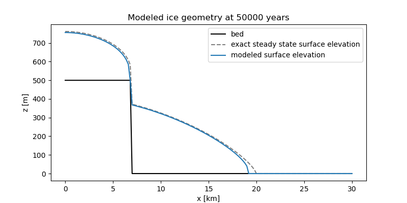
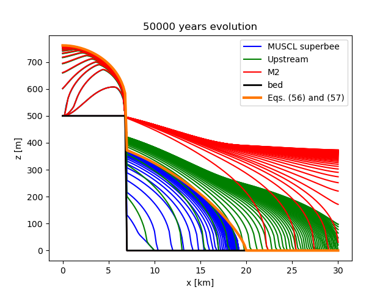

# "Bedrock step" setup

This directory contains scripts checking if PISM's "isothermal SIA + mass continuity"
approximation conserves mass in modeling setups with rough bed topography.

We use a verification test described in section 6 of

> [Jaroschetal2013] A. H. Jarosch, C. G. Schoof, and F. S. Anslow, “Restoring mass
> conservation to shallow ice flow models over complex terrain,” The Cryosphere, vol. 7,
> Art. no. 1, Feb. 2013.

Run

    make figure.png

to reproduce the figure below and compare to Figure 3 in [Jaroschetal2013] (copied below).
This requires Python 3, NumPy, SciPy, and Matplotlib.

The script `plot_results.py` also reports

    Exact volume: 4507018.717713624 m^2 (error: 0.04329382302239537 m^2)
    Modeled volume: 4368807.384490967 m^2
    Relative volume error: -3.0665799695806673 %

Note that [Jaroschetal2013] state that the exact volume is 4.546878 * 10^6 m^2 and the
script in the supplement reports

    vol exact: 4.539371e+06
    vol muscl: 4.399017e+06
    vol upstream: 7.586411e+06
    vol M2: 1.093219e+07
    err muscl -3.092
    err upstream: 67.125
    err M2 140.830

Their approximation of "exact" volume is less accurate: it appears to be obtained using a
trapezoidal quadrature and equally-spaced samples of a discontinuous function (ice
thickness).

## Implementation notes

PISM uses a Zalesak-style (see "flux-corrected transport" or FCT) limiter instead of
adjusting the discretization of the SIA diffusivity. This particular limiter is described
in

> P. K. Smolarkiewicz, “Comment on “A Positive Definite Advection Scheme Obtained by
> Nonlinear Renormalization of the Advective Fluxes”,” Monthly Weather Review, vol. 117,
> Art. no. 11, 1989.

It can be used with an arbitrary advection or advection-diffusion finite-difference scheme
in the "flux form" (i.e. a finite volume scheme):

    x_new = x_old - dt * ((Q.e - Q.w) / dx + (Q.n - Q.s) / dy),

where `Q.e` is the flux through the "eastern" face of a control volume, `Q.n` through the
north face, etc.

In our implementation this limiter is "active" *only* if fluxes through faces of a control
volume would lead to a negative thickness, i.e. it does not affect results of simulations
in which bed topography is smooth enough to avoid mass conservation issues.

It is worth pointing out that this limiter ensures non-negativity of ice thickness (and so
mass conservation) for *all* stress balance models in PISM.
