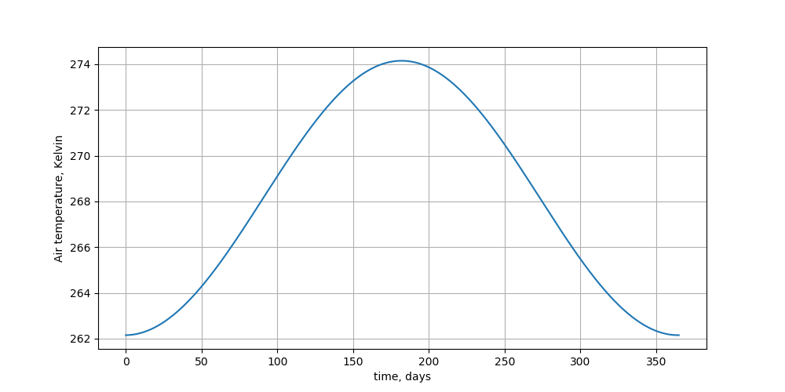
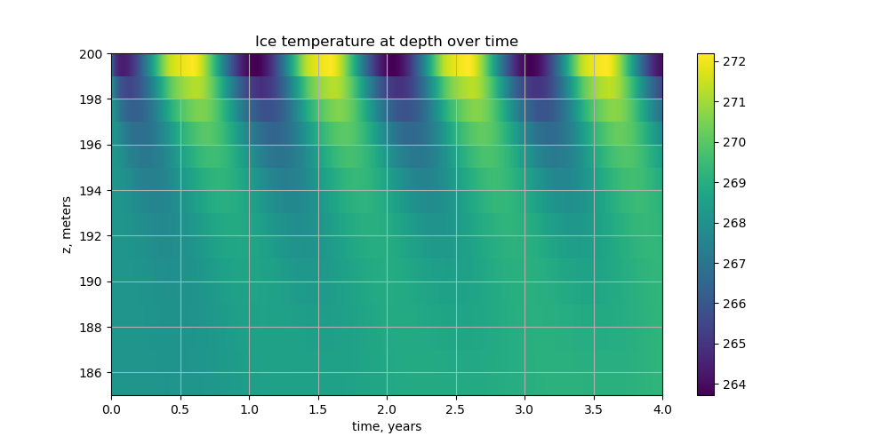
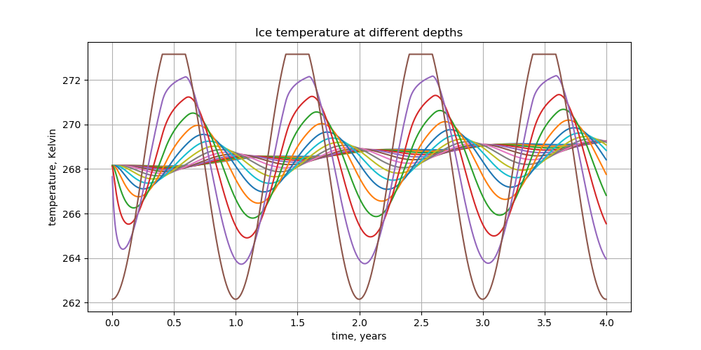
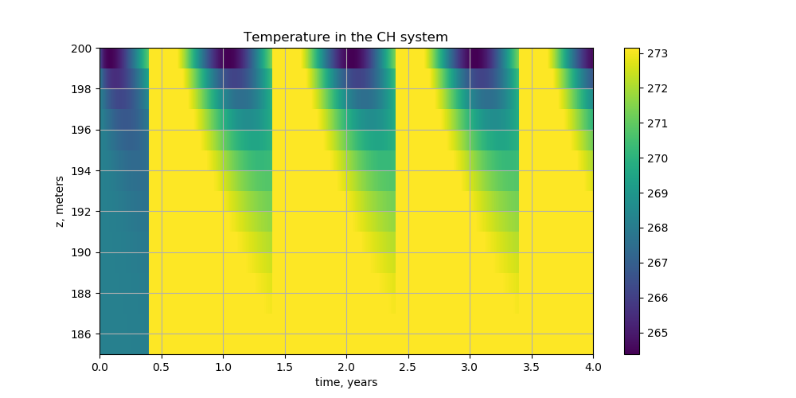
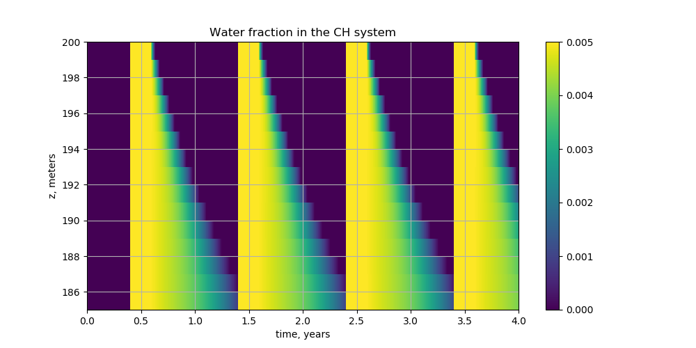

.. default-role:: math
.. |prs| replace:: *Phillips et al*
.. |chs| replace:: cryo-hydrologic system

One-column cryo-hydrologic warming setup
========================================

This directory contains a set up of the one-column cryo-hydrologic warming experiment
inspired by **Phillips, T. and Rajaram, H. and Steffen, K.**, *Cryo-hydrologic warming: A
potential mechanism for rapid thermal response of ice sheets*,
(https://doi.org/10.1029/2010GL044397).

Summary
-------

In summary: in ablation areas the water generated during the melt season drains to the
base through the channels in the |chs|. The presence of water
in the |chs| leads to warming of the ice adjacent to the channels.

The authors assume that the additional heat flux into the ice due to this mechanism is
proportional to the difference in temperature between the |chs| and the ice next to it:

.. math::

   Q = \frac{k_{i}}{R^2} (T_{CH} - T_i)

Here `k_i` is the thermal conductivity of ice and `R` is the spacing between the
channels in the |chs| (a poorly-constrained model parameter).

|prs| model `T_i` using a familiar temperature-based energy balance equation
with a parameterization of cooling due to horizontal advection. The flux `Q` defined above
appears as an additional source term:

.. math::

   \frac{\partial \rho_i C_i T_i}{\partial t} + \frac{\partial (\rho_i C_i w T_i)}{\partial z}
   - \frac{\partial}{\partial z}\left(k_i \frac{\partial T_i}{\partial z}\right)
   = - \frac{\partial \rho_i C_i u T_i}{\partial x} + Q_{s} + Q

Here `\rho_i` is the density of ice, `u` and `w` are horizontal and vertical velocity
components, `C_i` is the specific heat capacity of ice, and `Q_s` is the strain heating.

The temperature in the |chs| is modeled using an enthalpy-based energy equation omitting
advection terms:

.. math::

   \frac{\partial \bar{\rho H}}{\partial t}
   - \frac{\partial}{\partial z}\left(\bar{k} \frac{\partial T_{CH}}{\partial z}\right)
   = - Q

Here the enthalpy is defined by

.. math::
   :name: enthalpy

   \rho H = (1 - \phi_w) \rho_i C_i T_{CH} + \phi_w (\rho_w C_w T_{CH} + L),

where `\phi_w` is the water fraction, `L` is the latent heat of fusion, `\rho_w`, is the
water density, and `C_w` is the specific heat capacity of fresh water.

The thermal conductivity of the mixture, `\bar k`, is defined by

.. math::

   \bar k = (1 - \phi_w) k_i + \phi_w k_w.

The authors use Dirichlet (temperature) boundary conditions at the top boundary (assuming
that the temperature at the top of the snow or ice is equal to the near-surface air
temperature, but never exceeds the pressure melting point) and Dirichlet or Neumann
(mentioned but not specified in the paper) at the bottom boundary.

It is also mentioned that they account for *snow cover, which insulates the ice surface
from cold winter temperatures* and *temperature dependence of the thermal properties was
incorporated in the model*, but no details are provided.

During the melt season (when the water is present) the temperature in the |chs| is set to
the pressure-melting and the water fraction is set to a predetermined constant (|prs| use
`0.005`, i.e. one half of a percent) while during the winter the |chs| is allowed to cool.

Comparing to PISM's energy conservation model
---------------------------------------------

- PISM's definition of enthalpy is equivalent to the one above, with some caveats. (The
  equation in |prs| has a couple of issues that I don't need to go into here.)

  Note that in PISM's definition the temperature never exceeds `T_m(p)`, the
  pressure-melting point, while in |prs| `T_{CH} > T_m(p)` is allowed, but `T_{CH}` never
  exceeds `T_m(p)` due to the setup they use.

- PISM's energy conservation model includes all the mechanisms modeled by equations above
  *except* for the parameterization of advection-driven cooling not necessary in a 3D model.

- PISM's enthalpy-based energy conservation model can be used to model *both* the ice and
  the |chs| columns.

- PISM assumes that the specific heat capacity of ice is constant. The thermal
  conductivity can be a function of temperature, but does not depend on the water fraction
  (unlike `\bar k` above). Note, though, that for water fractions at or below `0.005` the
  value of `\bar k` is very close to `k_i`.

With default parameter values PISM "ignores" thermal conductivity of temperate ice
*without* completely removing it: this can be thought of as a *regularization*.
Specifically, the thermal conductivity of temperate ice is set to a given fraction of
`k_i` (see ``energy.enthalpy.temperate_ice_thermal_conductivity_ratio``).

This one-column setup uses ``energy.ch_warming.temperate_ice_thermal_conductivity_ratio``
(equal to `1`) to get us close to the equation modeling |chs| enthalpy evolution in
*Phillips et al*.

Technical details
-----------------

This setup models a 200-meter deep ice column using an equally-spaced vertical grid with a
1-meter resolution (201 grid points) and takes equal time steps 1 day long each.

The flux `Q` from the |chs| into the ice is added to the deformational strain heating term
in PISM's energy balance equation.

Ice velocity components are set to zero, eliminating advection terms and resulting in zero
strain heating due to ice flow.

We use a Dirichlet boundary condition at the top surface

.. math::

   \begin{aligned}
     H_{\text{surface}} &=
     \begin{cases}
     H(T_{\text{surface}}), & T_{\text{surface}} < T_m, \\
     H(T_m), & T_{\text{surface}} \ge T_m,
     \end{cases}\\
     T_{\text{surface}} &= T_{\text{mean}} + A\cdot \cos(2 \pi t - \phi_0)
   \end{aligned}

with time `t` in years. The values of `A` (`6 K`) and `T_{\text{mean}}` (`-5^{\circ} C`)
are selected to get a 9-week-long melt season.

We use a Neumann boundary condition at the bottom surface:

.. math::

   \left.\frac{\partial H}{\partial z}\right|_{z=0} = - \frac{G}{k_i},

where `G` is the upward geothermal heat flux, `W / m^2`. This setup uses `G = 0`.

Given the absence of ice flow, we use the steady-state enthalpy distribution corresponding
to the mean-annual temperature at the surface and the constant heat flux at the base of
the ice:

.. math::

   \begin{aligned}
     H_{\text{steady state}} &= H(T_{\text{steady state}}, p)\\
     T_{\text{steady state}} &= (h - z) \frac{G}{k_i}\\
   \end{aligned}

where `h` is ice thickness and `p` is the hydrostatic pressure. We assume that the mean
annual air temperature and ice thickness are low enough so that this does not result in a
layer of temperate ice near the base.

At the beginning of each time step the enthalpy in the |chs| is set to `H(T_m(p),
\omega_0)` if `T_{\text{surface}} \ge T_m` (here `\omega_0 = 0.005`), simulating the
presence of liquid water in the |chs| during the melt season.

.. note::

   One could use the surface mass balance to detect the melt season instead:
   `T_{\text{surface}}` may not capture the daily temperature variability.

Results
-------

This annual air temperature cycle results in a 9-week-long melt season.

   Air temperature

   Ice temperature in the top 15 meters of ice. Note the gradual warming with almost no
   inter-annual variability at the depth of 15 meters.

   Ice temperature evolution at different depths.

   Temperature in the |chs|. The end of the melt season can be seen
   clearly.

   Water fraction in the |chs|. Note that at higher depths the water fraction stays above
   zero all the way through the winter, so the temperature in the |chs| never drops below
   pressure-melting.

Next steps
----------

- Adjust the value of `R` and observe the changes in the evolution of ice temperature.
- Compare to **Hills et al**, *Processes influencing near-surface heat transfer in
  Greenland’s ablation zone*, (https://doi.org/10.5194/tc-2018-51).
