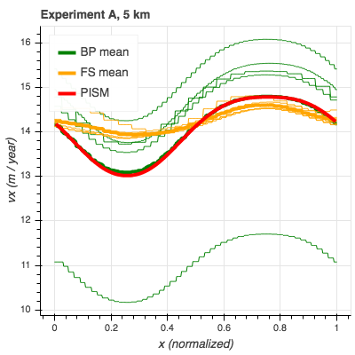

.. default-role:: literal

This directory contains scripts that run ISMIP-HOM_ experiments A-D and plot resulting
surface ice velocities at y=0.25 (in scaled coordinates).

Run

.. code::

   make all

to download and unpack the ISMIP-HOM_ supplement, run PISM, and produce ice velocity
figures (including the one below).

The script `run-ismiphom.py` uses PISM's Python bindings to run the Blatter solver in
PISM. See the top of this script for details.

The script `convert-ismiphom.py` reads submitted model results (see the supplement to
ISMIP-HOM_), samples them along the line (x, 0.25), (in scaled coordinates) and saves to
files. To run this script, place the `ismip_all` directory (or a symlink to it) in this
directory.

The script `plot-ismiphom.py` uses Bokeh_ and data processed by `convert-ismiphom.py`.

It produces interactive plots similar to the one below.

.. _Bokeh: https://bokeh.org/
.. _ISMIP-HOM: https://tc.copernicus.org/articles/2/95/2008/
